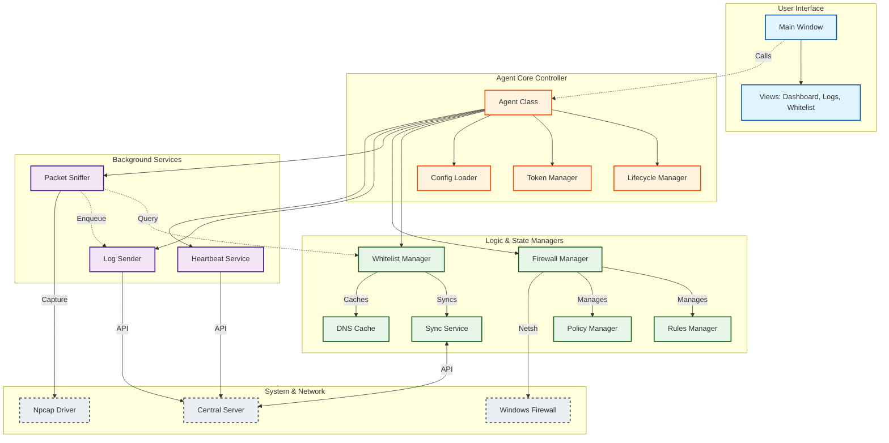

# Agent Architecture Flow Diagrams
**Firewall Controller Agent - Complete Flow Documentation**

---

## 📋 Table of Contents
- [Agent Architecture Flow Diagrams](#agent-architecture-flow-diagrams)
  - [📋 Table of Contents](#-table-of-contents)
  - [1. Agent Architecture Model](#1-agent-architecture-model)
    - [Detailed Component Diagram (Mermaid)](#detailed-component-diagram-mermaid)
  - [2. Agent Initialization \& Startup Flow](#2-agent-initialization--startup-flow)
  - [3. Registration \& Authentication Flow](#3-registration--authentication-flow)
  - [4. Heartbeat \& Token Management Flow](#4-heartbeat--token-management-flow)
    - [Heartbeat Loop (`services/heartbeat.py`)](#heartbeat-loop-servicesheartbeatpy)
    - [Token Auto-Refresh (`core/token_manager.py`)](#token-auto-refresh-coretoken_managerpy)
  - [5. Whitelist Synchronization Flow](#5-whitelist-synchronization-flow)
  - [6. Firewall Rule Management Flow](#6-firewall-rule-management-flow)
  - [7. Traffic Capture \& Analysis Flow](#7-traffic-capture--analysis-flow)
  - [8. Log Processing \& Sending Flow](#8-log-processing--sending-flow)
  - [9. GUI Interaction Flow](#9-gui-interaction-flow)
  - [Summary of Key Flows](#summary-of-key-flows)
    - [1. **Robust Startup**](#1-robust-startup)
    - [2. **Security First**](#2-security-first)
    - [3. **Firewall Integrity**](#3-firewall-integrity)
    - [4. **Resource Efficiency**](#4-resource-efficiency)

---

## 1. Agent Architecture Model

This diagram illustrates the hierarchical structure and component interactions within the Agent.

```
┌─────────────────────────────────────────────────────────────┐
│                       USER INTERFACE                         │
│  ┌──────────────────────────────────────────────────────┐   │
│  │             CustomTkinter GUI (Main Thread)          │   │
│  │  • Dashboard  • Logs  • Whitelist  • Settings        │   │
│  │      │           │          │            │           │   │
│  └──────┼───────────┼──────────┼────────────┼───────────┘   │
│         │           │          │            │               │
│         │ Callbacks │ Events   │ Updates    │ Config        │
│         ▼           ▼          ▼            ▼               │
┌─────────────────────────────────────────────────────────────┐
│                    AGENT CORE (Controller)                   │
│  ┌──────────────────────────────────────────────────────┐   │
│  │                    Core Agent                        │   │
│  │  • Lifecycle Manager    • Token Manager (JWT)        │   │
│  │  • Configuration        • Registry Service           │   │
│  └─────────────────────────┬────────────────────────────┘   │
│                            │                                │
│           ┌────────────────┼──────────────────┐             │
│           │                │                  │             │
│           ▼                ▼                  ▼             │
│  ┌────────────────┐ ┌──────────────┐ ┌────────────────┐     │
│  │ Whitelist Mgr  │ │ Firewall Mgr │ │ Services       │     │
│  │ • Sync Service │ │ • Policy     │ │ • Heartbeat    │     │
│  │ • DNS Cache    │ │ • Rules      │ │ • Sniffer      │     │
│  │ • LRU Cache    │ │ • WinPcap    │ │ • Log Sender   │     │
│  └────────────────┘ └──────────────┘ └────────────────┘     │
└────────────────────────────┬────────────────────────────────┘
                             │
            ┌────────────────┴──────────────────┐
            │                                   │
            ▼                                   ▼
┌───────────────────────────┐       ┌─────────────────────────┐
│     EXTERNAL SYSTEMS      │       │     LOCAL OS (Windows)  │
│                           │       │                         │
│  • SERVER (API/SocketIO)  │       │  • Windows Firewall     │
│  • DNS RESOLVERS          │       │  • Npcap / WinPcap      │
│                           │       │  • Registry             │
└───────────────────────────┘       └─────────────────────────┘
```

### Detailed Component Diagram (Mermaid)



---

## 2. Agent Initialization & Startup Flow

Based on `core/lifecycle.py`:

```
START AGENT
     │
     ▼
┌───────────────────────────────────────┐
│ 1. Load Configuration (agent_config)  │
│    • API Key                          │
│    • Server URLs                      │
│    • Feature flags                    │
└───────────┬───────────────────────────┘
            │
            ▼
┌───────────────────────────────────────┐
│ 2. Register with Server (Blocking)    │
│    • See Registration Flow            │
│    • Obtains Agent ID & JWT Tokens    │
└───────────┬───────────────────────────┘
     ┌──────┴──────┐
  Success       Failure
     │             │
     ▼             ▼
┌───────────┐ ┌─────────────────────────┐
│Save Config│ │ Warn & Continue Offline │
│(Tokens)   │ │ (Uses cached config)    │
└─────┬─────┘ └───────────┬─────────────┘
      │                   │
      ▼                   ▼
┌───────────────────────────────────────┐
│ 3. Init Token Manager                 │
│    • Start Auto-Refresh Thread        │
│    • Setup Expiry Callbacks           │
└───────────┬───────────────────────────┘
            │
            ▼
┌───────────────────────────────────────┐
│ 4. Init Whitelist Manager             │
│    • Load cached rules                │
│    • ⚠️ SYNC NOW (Before Firewall)   │
│      fetch latest rules to avoid      │
│      lockout                          │
└───────────┬───────────────────────────┘
            │
            ▼
┌───────────────────────────────────────┐
│ 5. Check System Capabilities          │
│    • Admin Privileges?                │
│    • WinPcap Installed? → Auto-Install│
└───────────┬───────────────────────────┘
            │
            ▼
┌───────────────────────────────────────┐
│ 6. Init Firewall Manager              │
│    • Link to Whitelist Manager        │
│    • Backup existing rules            │
│    • IF mode="whitelist_only":        │
│      Apply Default Deny Policy        │
└───────────┬───────────────────────────┘
            │
            ▼
┌───────────────────────────────────────┐
│ 7. Start Background Services          │
│    • Heartbeat Sender (Thread)        │
│    • Log Sender (Thread)              │
│    • Packet Sniffer (Thread)          │
└───────────┬───────────────────────────┘
            │
            ▼
┌───────────────────────────────────────┐
│ 8. Launch GUI (Main Thread)           │
│    • Create Window                    │
│    • Start Event Loop                 │
└───────────────────────────────────────┘
```

---

## 3. Registration & Authentication Flow

Based on `core/registry.py`:

```
AGENT                                                 SERVER
  │                                                      │
  │ 1. Gather System Info                                │
  │    • Device ID (Hardware Hash)                       │
  │    • Hostname, IP, OS                                │
  │    • Capabilities                                    │
  │                                                      │
  │ 2. POST /api/agents/register                         │
  │    Headers: { X-API-Key: "..." }                     │
  │    Body: { ...info... }                              │
  ├────────────────────────────────────────────────────> │
  │                                                      │
  │                                            ┌─────────┴─────────┐
  │                                            │ VALIDATE API KEY  │
  │                                            │ GENERATE JWT PAIR │
  │                                            └─────────┬─────────┘
  │                                                      │
  │    200 OK                                            │
  │    Body: {                                           │
  │      agent_id: "...",                                │
  │      jwt: {                                          │
  │        access_token: "...",                          │
  │        refresh_token: "...",                         │
  │        expires_at: "..."                             │
  │      }                                               │
  │    }                                                 │
  │ <────────────────────────────────────────────────────┤
  │                                                      │
  ▼                                                      ▼
┌────────────────────┐
│ SAVE TO CONFIG     │
│ agent_config.json  │
└────────────────────┘
```

---

## 4. Heartbeat & Token Management Flow

### Heartbeat Loop (`services/heartbeat.py`)

```
┌──────────────────────────┐
│ Heartbeat Thread Start   │
└────────────┬─────────────┘
             │
             ▼
        ┌────┴─────┐
        │  SLEEP   │ <────────────────┐
        │ interval │                  │
        └────┬─────┘                  │
             │                        │
             ▼                        │
┌─────────────────────────────┐       │
│ Collect Status              │       │
│ • RAM/CPU Usage             │       │
│ • Uptime                    │       │
│ • Whitelist Version         │       │
└────────────┬────────────────┘       │
             │                        │
             ▼                        │
┌─────────────────────────────┐       │
│ POST /api/agents/heartbeat  │       │
│ Auth: Bearer <Access_Token> │       │
└────────────┬────────────────┘       │
             │                        │
      ┌──────┴──────┐                 │
   Success       Failure              │
      │        (401 Unauth)           │
      │             │                 │
      │             ▼                 │
      │    ┌──────────────────┐       │
      │    │ Signal Token Mgr │       │
      │    │ "Refresh Needed" │       │
      │    └──────────────────┘       │
      │             │                 │
      └─────────────┴─────────────────┘
```

### Token Auto-Refresh (`core/token_manager.py`)

```
┌──────────────────────────┐
│ Token Refresh Thread     │
└────────────┬─────────────┘
             │
             ▼
        ┌────┴─────┐
        │  SLEEP   │ <────────────────┐
        │ 10 sec   │                  │
        └────┬─────┘                  │
             │                        │
             ▼                        │
   ┌──────────────────────┐           │
   │ Check Expiry Time    │           │
   │ (Expires < 5 mins?)  │           │
   └─────────┬────────────┘           │
             │                        │
      ┌──────┴──────┐                 │
      NO           YES                │
      │             │                 │
      │             ▼                 │
      │    ┌──────────────────┐       │
      │    │ POST /auth/refresh│      │
      │    │ Body: RefreshTok  │      │
      │    └────────┬─────────┘       │
      │             │                 │
      │      ┌──────┴──────┐          │
      │   Success       Failure       │
      │      │             │          │
      │      ▼             ▼          │
      │  ┌────────┐   ┌─────────┐     │
      │  │Update  │   │Trigger  │     │
      │  │Tokens  │   │Re-Reg   │     │
      │  └────────┘   └─────────┘     │
      │      │             │          │
      └──────┴─────────────┴──────────┘
```

---

## 5. Whitelist Synchronization Flow

Based on `whitelist/sync.py`:

```
AGENT (WhitelistManager)                             SERVER
  │                                                     │
  │ 1. Initiate Sync                                    │
  │    (Timer or Event)                                 │
  │                                                     │
  │ 2. GET /api/whitelist/agent/<id>                    │
  │    Auth: Bearer <Access_Token>                      │
  ├───────────────────────────────────────────────────> │
  │                                                     │
  │                                          ┌──────────┴──────────┐
  │                                          │ Fetch Global Rules  │
  │                                          │ Fetch Group Rules   │
  │                                          │ Merge & Dedup       │
  │                                          └──────────┬──────────┘
  │                                                     │
  │    200 OK                                           │
  │    Body: {                                          │
  │      rules: [                                       │
  │        { type: "ip", value: "8.8.8.8" },            │
  │        { type: "domain", value: "google.com" }      │
  │      ],                                             │
  │      version: 105                                   │
  │    }                                                │
  │ <───────────────────────────────────────────────────┤
  │                                                     │
  ▼                                                     
┌──────────────────────────────────────┐
│ 3. Process Rules                     │
│    • Separate IPs and Domains        │
│    • Resolve Domains -> IPs (DNS)    │
│      (Concurrent Resolver)           │
│    • Add Essential IPs (Gateway, DNS)│
└──────────────────┬───────────────────┘
                   │
                   ▼
┌──────────────────────────────────────┐
│ 4. Update Firewall                   │
│    • Calculate Diff (Old vs New)     │
│    • Apply Changes via Netsh         │
│    • Update Local State              │
└──────────────────────────────────────┘
```

---

## 6. Firewall Rule Management Flow

Based on `firewall/manager.py`:

```
┌─────────────────────────────────────────┐
│          Whitelist Update Event         │
└────────────────────┬────────────────────┘
                     │
         ┌───────────▼────────────┐
         │ Resolve Domains to IPs │
         │ (handled by Whitelist) │
         └───────────┬────────────┘
                     │
                     ▼
┌──────────────────────────────────────────────┐
│  FirewallManager.update_whitelist(ips)       │
├──────────────────────────────────────────────┤
│ 1. Validate Admin Privileges                 │
│                                              │
│ 2. Calculate Essential IPs                   │
│    • Local IP                                │
│    • Gateway                                 │
│    • DNS Servers                             │
│                                              │
│ 3. Combine Sets                              │
│    Total = Whitelisted IPs + Essential IPs   │
│                                              │
│ 4. Rules Manager Operation                   │
│    • Get existing rules (netsh)              │
│    • Identify obsolete rules                 │
│    • Identify missing rules                  │
│                                              │
│ 5. Execute Batch Updates                     │
│    • Delete obsolete rules                   │
│    • Add new rules                           │
│                                              │
│ 6. Verify Policy                             │
│    • Ensure Outbound = Block                 │
│    • Ensure Inbound = Block                  │
│    • Ensure "Core Networking" allowed        │
└──────────────────────────────────────────────┘
```

---

## 7. Traffic Capture & Analysis Flow

Based on `capture/sniffer.py`:

```
┌──────────────────────────┐
│ Packet Sniffer Thread    │
└────────────┬─────────────┘
             │
             ▼
    ┌──────────────────┐
    │  SCAPY SNIFF     │
    │  Filter:         │
    │  TCP/UDP 53,80,  │
    │  443             │
    └────────┬─────────┘
             │
    ┌────────▼─────────┐
    │ Packet Arrived   │
    └────────┬─────────┘
             │
             ▼
    ┌──────────────────┐
    │  Feature Extract │
    │  • Src/Dst IP    │
    │  • Protocol      │
    │  • DNS Query?    │
    │  • SNI/Host?     │
    └────────┬─────────┘
             │
             ▼
    ┌──────────────────┐
    │  Decision Logic  │
    │  • Is Whitelisted?│
    │  • Is in Cache?  │
    └────────┬─────────┘
             │
      ┌──────┴──────┐
   Allowed       Blocked
      │             │
      │             ▼
      │      ┌──────────────┐
      │      │ Create Log   │
      │      │ Action:BLOCK │
      │      └──────┬───────┘
      │             │
      └─────────────┤
                    │
                    ▼
          ┌───────────────────┐
          │ Queue Log Sender  │
          └───────────────────┘
```

---

## 8. Log Processing & Sending Flow

Based on `logging_module/sender.py`:

```
┌──────────────────────────┐
│ Log Sender Thread        │
└────────────┬─────────────┘
             │
             ▼
        ┌────┴─────┐
        │  SLEEP   │ <─────────────────────┐
        │ interval │                       │
        └────┬─────┘                       │
             │                             │
             ▼                             │
   ┌──────────────────────┐                │
   │ Check Queue          │                │
   │ (Size > batch_size?) │                │
   └─────────┬────────────┘                │
             │                             │
      ┌──────┴──────┐                      │
    Yes            No                      │
     │              │                      │
     ▼              └──────────────────────┘
┌─────────────────────┐
│ Dequeue Batch (100) │
└─────────┬───────────┘
          │
          ▼
┌─────────────────────────────┐
│ POST /api/logs/batch        │
│ Auth: Bearer <Access_Token> │
└─────────┬───────────────────┘
          │
      ┌───┴───┐
   Success  Failure
      │       │
      │       ▼
      │  ┌──────────┐
      │  │ Re-queue │
      │  │ (Retry)  │
      │  └──────────┘
      ▼
┌──────────────┐
│ Clear Buffer │
└──────────────┘
```

---

## 9. GUI Interaction Flow

Example: User changing settings in GUI.

```
USER                                           AGENT
 │                                               │
 │ 1. Clicks "Sync Now"                          │
 │                                               │
 ▼                                               │
┌──────────────────┐                             │
│ GUI Button Click │                             │
│ (Main Thread)    │                             │
└────────┬─────────┘                             │
         │Calls                                  │
         ▼                                       │
┌──────────────────┐                             │
│ AgentController  │                             │
│ .sync_now()      │                             │
└────────┬─────────┘                             │
         │Calls                                  │
         ▼                                       │
┌──────────────────┐   Start Thread              │
│ Agent Core       │ ──────────────────────> ┌───────────────┐
│ .whitelist.sync()│                         │ Sync Worker   │
└────────┬─────────┘                         │ Thread        │
         │Returns                            │ (See Flow #5) │
         ▼                                   └───────┬───────┘
┌──────────────────┐                                 │
│ Show "Syncin..." │                                 │
│ in Status Bar    │                                 │
└──────────────────┘                                 │
                                                     │
                            ┌────────────────────────┘
                            │ On Complete
                            ▼
                    ┌──────────────────┐
                    │ Update GUI       │
                    │ • Last Sync Time │
                    │ • Rule Count     │
                    │ • Status: OK     │
                    └──────────────────┘
```

---

## Summary of Key Flows

### 1. **Robust Startup**
- Prioritizes registration and whitelist capabilities **before** enforcing restrictions.
- Fails safe (offline mode) if server unreachable.

### 2. **Security First**
- Uses **JWT tokens** with short lifespan + auto-refresh.
- API Key used only for initial registration.
- Ensures **Default Deny** policy is only applied after rules are ready.

### 3. **Firewall Integrity**
- Auto-calculates **Essential IPs** (Gateway, Localhost, DNS) to prevent self-lockout.
- Cleans up obsolete rules automatically.

### 4. **Resource Efficiency**
- Batched log sending reduces network overhead.
- Cached DNS resolution minimizes latency.
- Threaded operations keep GUI responsive.

---

*Document generated: 2026-01-14*
*Firewall Controller Agent v2.2-Modular*
