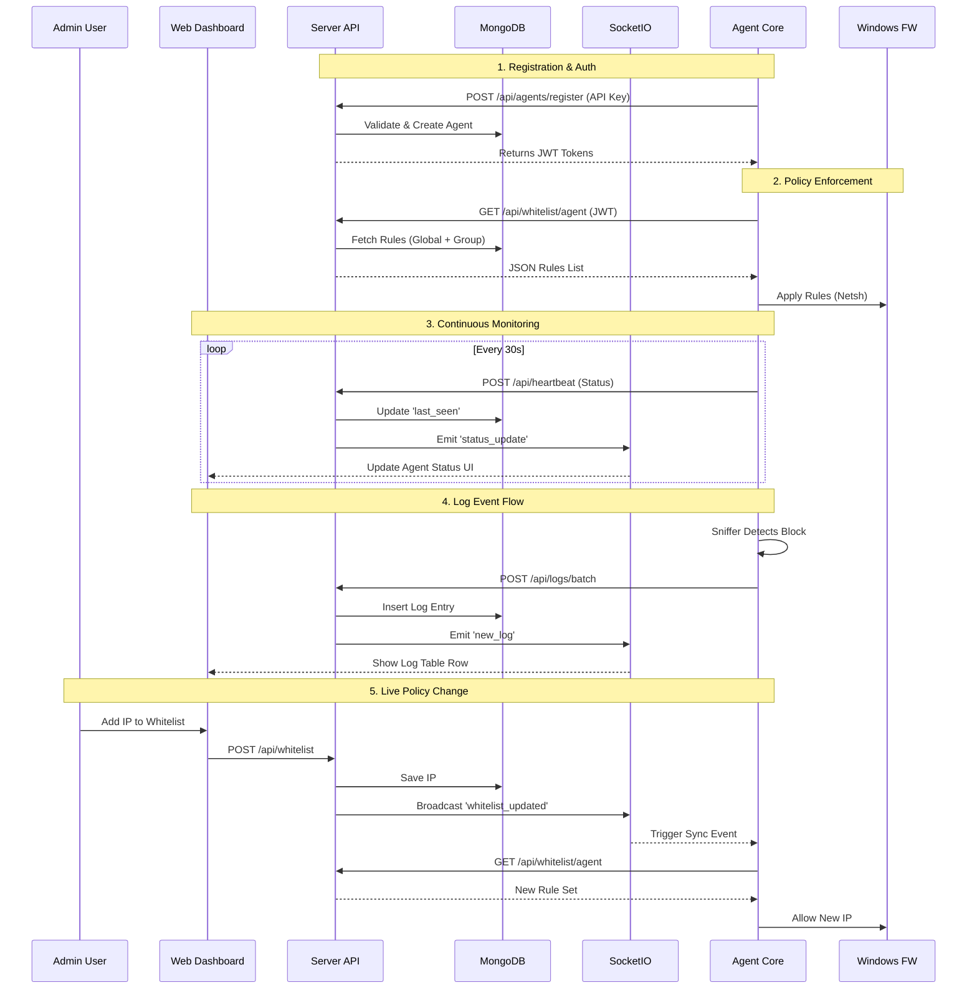
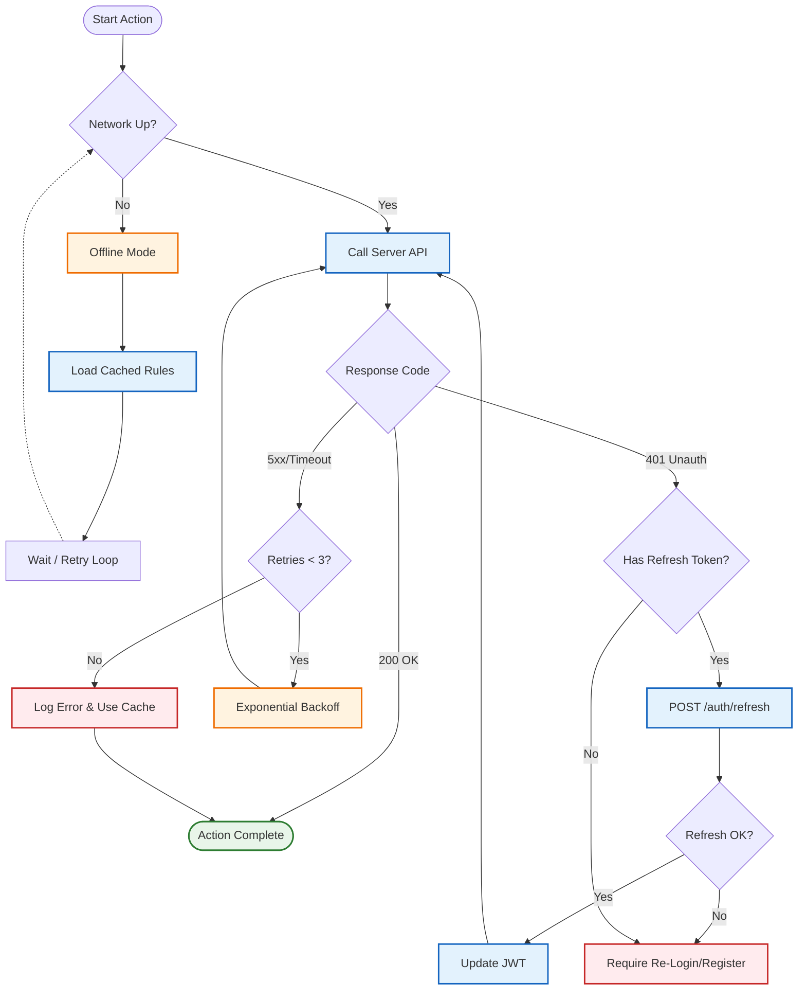

# Overall System Architecture Flow Diagrams
**Firewall Controller - Server & Agent Interaction Overview**

---

## 📋 Table of Contents
- [Overall System Architecture Flow Diagrams](#overall-system-architecture-flow-diagrams)
  - [📋 Table of Contents](#-table-of-contents)
  - [1. High-Level Integration Overview](#1-high-level-integration-overview)
  - [2. Server-Agent Communication Lifecycle](#2-server-agent-communication-lifecycle)
  - [3. End-to-End Log Process](#3-end-to-end-log-process)
  - [4. End-to-End Whitelist Update Process](#4-end-to-end-whitelist-update-process)
  - [5. Real-Time Monitoring Loop](#5-real-time-monitoring-loop)
  - [6. Data Flow Map](#6-data-flow-map)
    - [Detailed Data Flow Diagram (Mermaid)](#detailed-data-flow-diagram-mermaid)
  - [7. Error Handling \& Recovery Strategies](#7-error-handling--recovery-strategies)
  - [8. Performance \& Scalability Model](#8-performance--scalability-model)

---

## 1. High-Level Integration Overview

The system consists of a centralized **Flask Server** managing multiple distributed **Agents**.

```
┌─────────────────────────────────┐          ┌──────────────────────────────────┐
│      MANAGEMENT SERVER          │          │          ENDPOINT AGENT          │
│                                 │          │                                  │
│  ┌───────────────────────────┐  │  HTTPS   │  ┌────────────────────────────┐  │
│  │      REST API (Flask)     │◄─┼──────────┼──┤      Agent Core            │  │
│  └───────────────────────────┘  │ REST API │  └────────────────────────────┘  │
│                                 │          │                                  │
│  ┌───────────────────────────┐  │          │  ┌────────────────────────────┐  │
│  │   SocketIO (WebSockets)   │──┼──────────┼─►│      Services              │  │
│  └──────────────┬────────────┘  │ SocketIO │  │ (Heartbeat, Logs, Sniffer) │  │
│                 │               │          │  └────────────────────────────┘  │
│                 ▼               │          │                                  │
│  ┌───────────────────────────┐  │          │  ┌────────────────────────────┐  │
│  │   Web Dashboard (Admin)   │  │          │  │      GUI (User View)       │  │
│  └───────────────────────────┘  │          │  └────────────────────────────┘  │
│                                 │          │                                  │
│           MongoDB               │          │        Windows OS / Firewall     │
└─────────────────────────────────┘          └──────────────────────────────────┘
```

**Key Characteristics:**
- **Hybrid Communication:** Uses REST API for transactional data (logs, config) and WebSocket (SocketIO) for real-time status updates.
- **Agent-Initiated:** All connections are outbound from Agent to Server (firewall friendly).
- **Zero-Trust Auth:** Agents must register with API Key, then use JWT tokens with auto-refresh.

---

## 2. Server-Agent Communication Lifecycle

This diagram shows the complete lifecycle of an Agent connecting to the ecosystem.

```
      SERVER (Cloud/Central)                     AGENT (Endpoint)
             │                                       │
[1] REGISTER │ ◄──────────────── REST POST ───────── │ (API Key)
             │                                       │
     Validate│ ────────────── 200 OK + JWT ────────► │ Save Config
       & DB  │                                       │
             │                                       │
[2] SYNC     │ ◄────────── GET /whitelist/agent ──── │ (JWT Auth)
             │                                       │
     Get Rule│ ──────────── Rules JSON ────────────► │ Apply Firewall
             │                                       │
[3] HEARTBEAT│ ◄────────── POST /heartbeat ───────── │ Every 30s
             │                                       │
     Update  │                                       │
     Status  │ ──────────── SocketIO Broadcast ────► │ Dashboard updates
             │                                       │
[4] LOGS     │ ◄────────── POST /logs/batch ──────── │ Event-driven
             │                                       │
     Store   │                                       │
       &     │                                       │
     Notify  │ ──────────── SocketIO Broadcast ────► │ Dashboard shows log
             │                                       │
[5] UPDATE   │ ◄────────── Token Refresh ─────────── │ Every 7 Days
             │                                       │
             │ ──────────── New JWT ───────────────► │ Continue working
```

---

## 3. End-to-End Log Process

How a network packet becomes a visible log entry on the admin dashboard.

```
┌─────────────────┐
│  Network Packet │  (1) Arrives at Network Interface
└────────┬────────┘
         │
         ▼
┌─────────────────┐
│  Agent Sniffer  │  (2) Scapy captures packet
└────────┬────────┘
         │           (3) Checks Whitelist Cache
         ▼
 ┌──────────────┐
 │   Decision   │── Allow ──► (Ignore / Optional Log)
 └───────┬──────┘
         │ Block
         ▼
 ┌──────────────┐
 │  Log Sender  │  (4) Buffers log in memory
 └───────┬──────┘
         │           (5) Batch POST to Server (every 2s or 100 logs)
         ▼
┌─────────────────┐
│  Server API     │  (6) Validates JWT & Log Format
└────────┬────────┘
         │
         ▼
 ┌──────────────┐
 │  MongoDB     │  (7) Persists log entry
 └───────┬──────┘
         │
         ▼
 ┌──────────────┐
 │  SocketIO    │  (8) Emits 'new_log' event
 └───────┬──────┘
         │
         ▼
┌─────────────────┐
│ Admin Dashboard │  (9) JavaScript renders new row
└─────────────────┘
```

---

## 4. End-to-End Whitelist Update Process

How an admin adding an IP updates all agents.

```
  ADMIN USER                    SERVER                       AGENTS
      │                           │                             │
      │ (1) Add IP via Dashboard  │                             │
      ├──────────────────────────►│                             │
      │                           │                             │
      │                           │ (2) Update MongoDB          │
      │                           │                             │
      │                           │ (3) Broadcast 'whitelist_   │
      │                           │     updated' event          │
      │                           ├────────────────────────────►│ (SocketIO)
      │                           │                             │
      │                           │                             │ (4) Receive Event
      │                           │                             │
      │                           │                             │ (5) POST /whitelist/sync
      │                           │◄────────────────────────────┤
      │                           │                             │
      │                           │ (6) Calculate specifics     │
      │                           │ (Global + Group rules)      │
      │                           │                             │
      │                           │ (7) Return JSON             │
      │                           ├────────────────────────────►│
      │                           │                             │
      │                           │                             │ (8) Update Windows
      │                           │                             │     Firewall Rules
      │                           │                             │
      ▼                           ▼                             ▼
 CONFIRMATION                 DATABASE                    SECURE STATE
   SHOWN                      UPDATED                       UPDATED
```

---

## 5. Real-Time Monitoring Loop

The continuous feedback loop that keeps the dashboard "live".

```
┌─────────────────────┐             ┌─────────────────────────┐
│    AGENT SIDE       │             │      SERVER SIDE        │
│                     │             │                         │
│  ┌───────────────┐  │HTTPS (JSON) │  ┌───────────────────┐  │
│  │   Heartbeat   │──┼─────────────┼─►│   AgentService    │  │
│  │   Service     │  │             │  │   (Update DB)     │  │
│  └───────┬───────┘  │             │  └─────────┬─────────┘  │
│          │          │             │            │            │
│          │          │             │            ▼            │
│          │          │             │  ┌───────────────────┐  │
│          │          │WebSocket    │  │  SocketIO Server  │  │
│          │          │(Event)      │  │  (Broadcast)      │  │
│          │          │◄────────────┼──└─────────┬─────────┘  │
│          ▼          │             │            │            │
│  ┌───────────────┐  │             │            │WebSocket   │
│  │   GUI Status  │  │             │            │(Event)     │
│  │   Card        │  │             │            ▼            │
│  └───────────────┘  │             │  ┌───────────────────┐  │
│                     │             │  │  Web Dashboard    │  │
│                     │             │  │  (Update UI)      │  │
│                     │             │  └───────────────────┘  │
└─────────────────────┘             └─────────────────────────┘
```

---

## 6. Data Flow Map

Summary of data types moving between components.

| Data Type | Direction | Protocol | Frequency | Description |
|-----------|-----------|----------|-----------|-------------|
| **Registration** | Agent → Server | HTTP POST | Once | Hardware ID, Hostname, OS Info |
| **Auth Token** | Server → Agent | HTTP Resp | Weekly | JWT Access & Refresh Tokens |
| **Heartbeat** | Agent → Server | HTTP POST | 30 sec | Status, Resources (RAM/CPU), Version |
| **Logs** | Agent → Server | HTTP POST | < 2 sec | Blocked packet details (IP, Port, Proto) |
| **Whitelist** | Server → Agent | HTTP GET | On Change | List of allowed IPs and Domains |
| **Live Events** | Server → Browser | SocketIO | Real-time | Dashboard updates (New Log, Status Change) |

### Detailed Data Flow Diagram (Mermaid)



---

## 7. Error Handling & Recovery Strategies

This diagram details how the Agent recovers from network failures, authentication expiry, and server errors.



**Recovery Scenarios:**

1.  **Network Disconnection:** Agent seamlessly switches to `OfflineMode`, relying on the local JSON cache (`rules.json`) to maintain firewall security. It polls for connectivity in the background.
2.  **Token Expiry (401):** Agent automatically attempts to use the long-lived `refresh_token`. If successful, the failed request is replayed immediately with the new `access_token`.
3.  **Server Crash (500):** Requests are retried with exponential backoff (1s, 2s, 4s) before failing gracefully to ensure the agent doesn't flood the recovering server.

---

## 8. Performance & Scalability Model

This diagram illustrates how the system handles high load through distributed processing ("Edge Computing") and asynchronous I/O.

```mermaid
graph TD
    subgraph Edge_Computing [Edge Layer (Distributed Agents)]
        Agent1[Agent 1]
        Agent2[Agent 2]
        AgentN[Agent N...]
        
        %% Local Processing
        Filter[Packet Filtering]
        Cache[Local DNS/Rule Cache]
        Batch[Log Batching Buffer]
        
        Agent1 -- process locally --> Filter
        Filter --> Cache
        Filter --> Batch
    end

    subgraph Transport [Transport Layer]
        LB[Load Balancer / Nginx]
        Async[Async Event Loop (Eventlet)]
    end

    subgraph Core [Server Core]
        API[Flask API Workers]
        Socket[SocketIO Manager]
        
        LB --> API
        LB --> Socket
        API -.-> |Offload I/O| Async
    end

    subgraph Data [Data Persistence]
        Mongo[(MongoDB Cluster)]
        Index[Indexes: timestamp, agent_id]
        
        API --> |Connection Pool| Mongo
        Socket --> |Pub/Sub| Mongo
    end

    %% Flows
    Batch -- "POST /logs (Compressed Batch)" --> LB
    AgentN -- "Heartbeat (30s)" --> LB

    style Edge_Computing fill:#e3f2fd,stroke:#1565c0
    style Core fill:#fff3e0,stroke:#ef6c00
    style Data fill:#eceff1,stroke:#455a64
```

**Key Scalability Features:**

1.  **Distributed Edge Processing:**
    *   **Packet Analysis:** 100% of traffic analysis happens on the *Agent* (Edge), not the server. The server only receives "decided" events.
    *   **Local Caching:** Agents cache DNS and Rules to zero-latency decision making, reducing server Query-per-Second (QPS) load significantly.
    *   **Log Batching:** Agents buffer logs and send them in batches (e.g., every 50 items or 2 seconds) to reduce HTTP handshake overhead.

2.  **Server Concurrency:**
    *   **Eventlet:** Uses non-blocking I/O for SocketIO, allowing a single server instance to maintain thousands of open heartbeat connections.
    *   **Stateless API:** The REST API is stateless (JWT based), allowing horizontal scaling behind a Load Balancer (Nginx) if needed.

3.  **Database Optimization:**
    *   **Write-Heavy Design:** MongoDB is optimized for high ingestion rates of log data.
    *   **Time-Series Indexing:** Logs are indexed by `timestamp` and `agent_id` for fast dashboard retrieval.

---

*Document generated: 2026-01-14*

---

*Document generated: 2026-01-14*
*Firewall Controller System Architecture v1.0*
