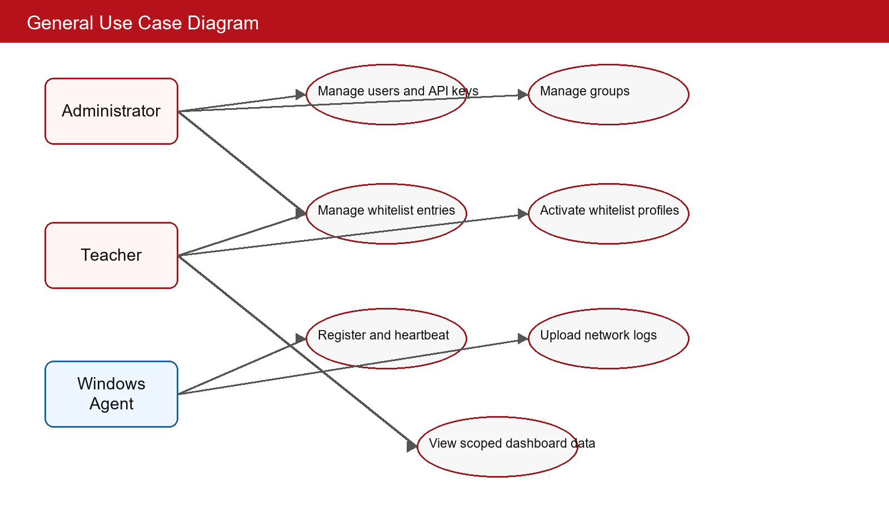
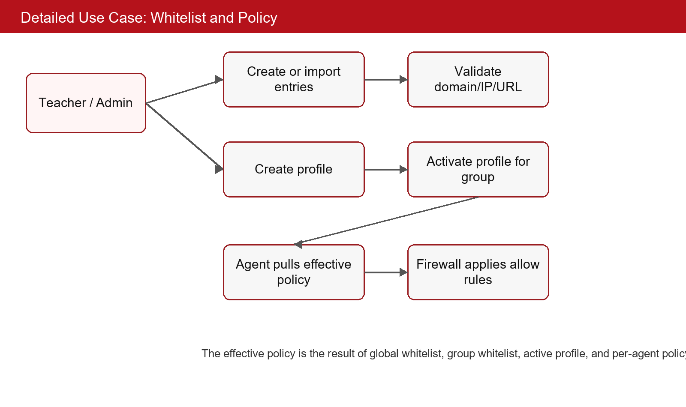
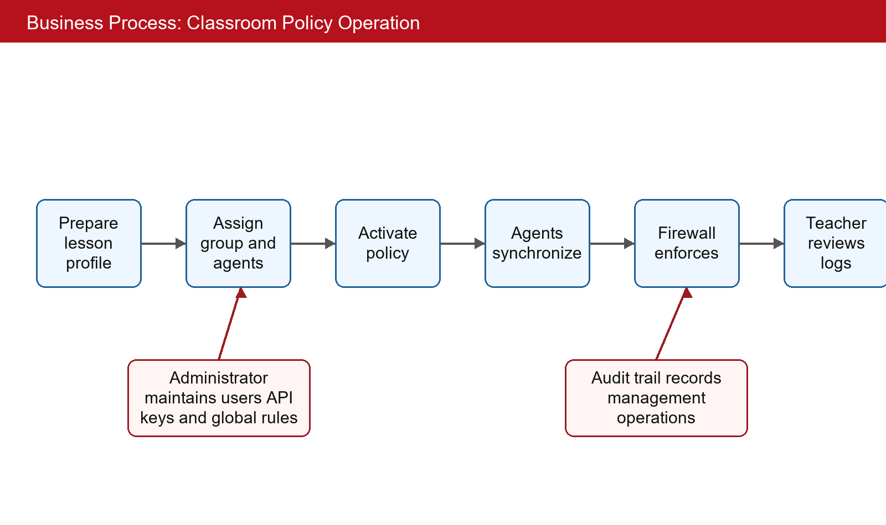
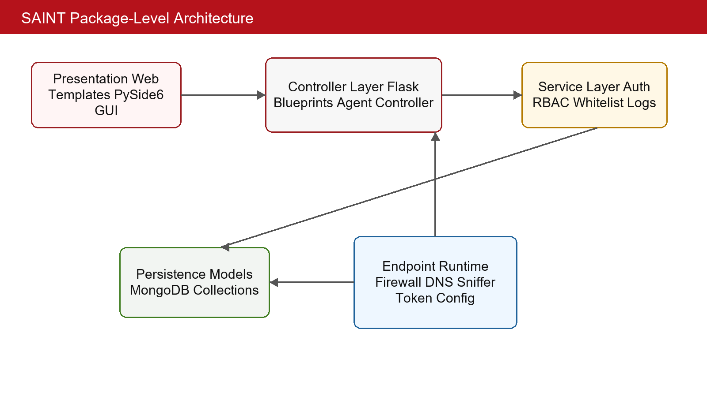
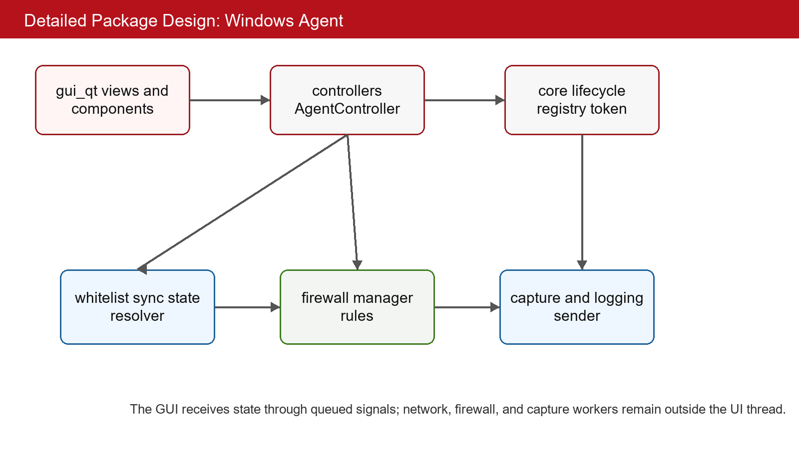
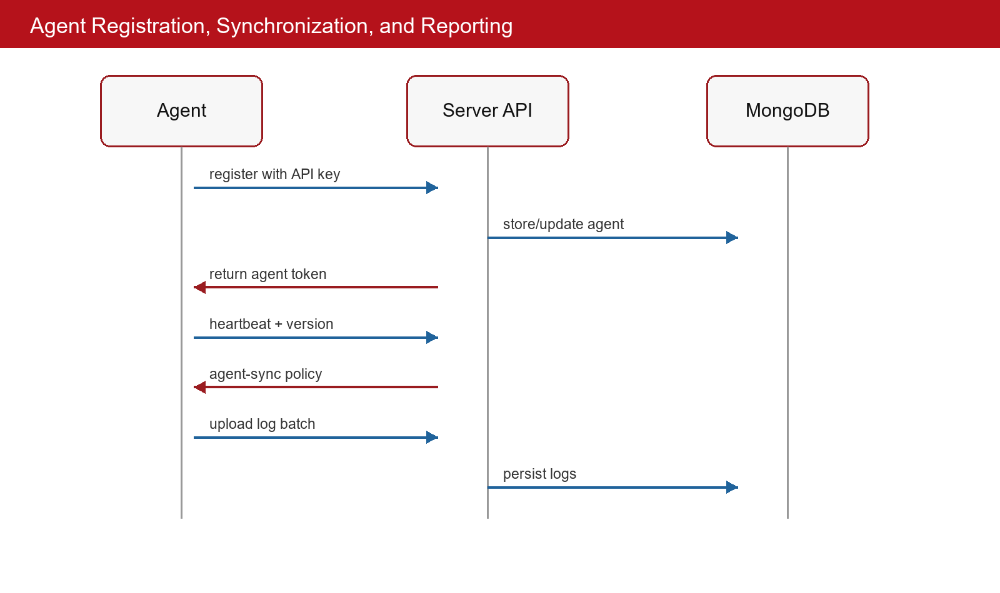
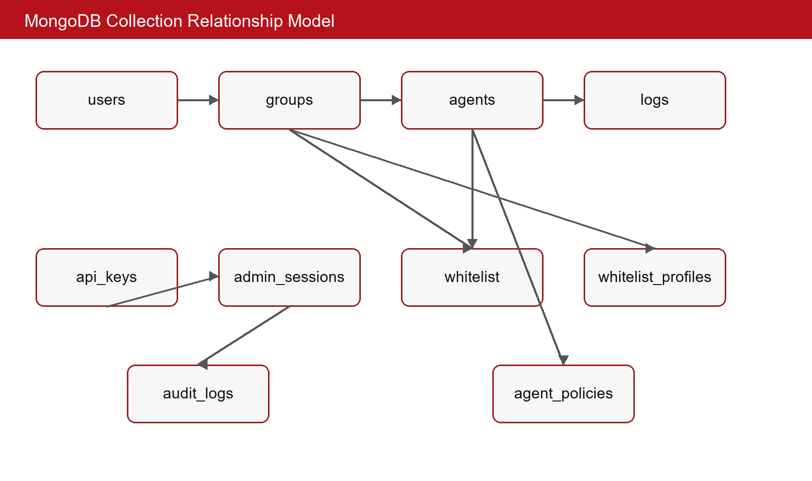
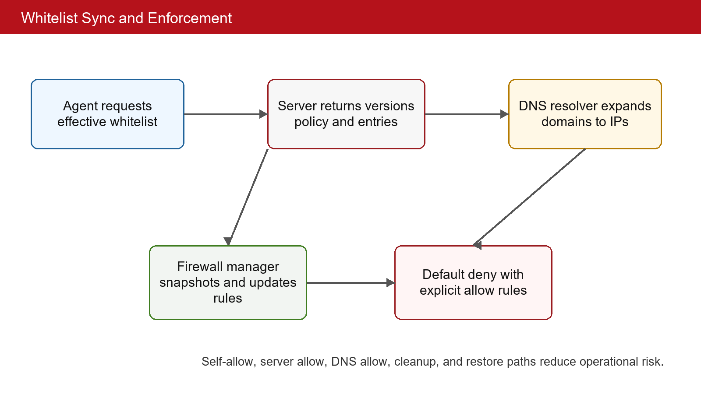
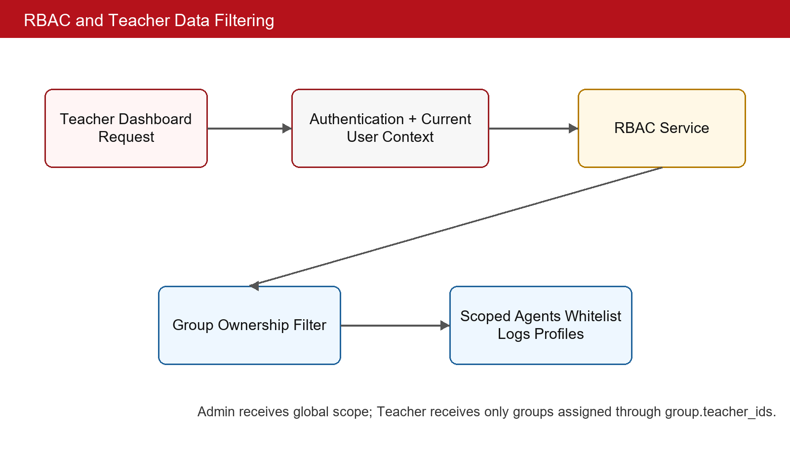

# BUILDING A DISTRIBUTED NETWORK SECURITY MANAGEMENT SYSTEM FOR EDUCATIONAL ENVIRONMENTS

**Student:** Bui Xuan Son
**Student ID:** 20225586
**Email:** [student-email]@sis.hust.edu.vn
**Program:** [Program Name]
**Supervisor:** [Supervisor Name]
**Department:** Computer Engineering
**School:** School of Information and Communications Technology

## Acknowledgements

I would like to express my sincere gratitude to my supervisor, [Supervisor Name], for the guidance, feedback, and technical orientation provided during this graduation thesis. I am also thankful to the lecturers of the School of Information and Communications Technology for the knowledge of computer networks, software engineering, databases, and information security that formed the foundation of this project. My appreciation goes to my family for their constant encouragement and to my classmates for discussions, testing suggestions, and practical comments during development. This thesis allowed me to combine distributed system design, network access control, role-based authorization, and Windows endpoint programming into a complete educational-lab management system. The experience helped me improve both implementation discipline and the ability to evaluate security risks in real deployment contexts.

## Abstract

Network access management in educational computer laboratories is difficult because many student machines must be controlled during class sessions while teachers still need flexible access to learning resources. Traditional approaches such as manual firewall configuration, proxy-only filtering, or standalone monitoring tools require considerable administrative effort and often lack a teacher-oriented workflow. This thesis follows a distributed client-server approach and builds SAINT, a centralized network security management system for educational environments. The system consists of a Flask and MongoDB server that provides REST APIs, a server-rendered web dashboard, SocketIO notifications, JWT authentication, API-key-based agent enrollment, audit logging, and role-based access control. Windows agents are implemented in Python with a PySide6 interface and background components for registration, heartbeat reporting, whitelist synchronization, DNS resolution, Windows Firewall rule management, packet capture with Scapy, domain extraction, encrypted configuration, and log delivery. The main contribution is a source-level implementation of whitelist-based network enforcement that can be managed centrally but applied locally on endpoint machines. The system also introduces versioned whitelist synchronization, teacher-scoped data filtering through RBAC, lesson-oriented whitelist profiles, and network log collection for post-session analysis. Static source inspection shows a modular server architecture with controller, service, and model layers, approximately seventy REST route declarations under the /api prefix, twelve MongoDB collections, and dedicated server tests for agents, authentication, groups, whitelist, logs, audit, and teacher data filtering. The result is a practical prototype that demonstrates how a laboratory network can be managed through a central dashboard while still applying enforcement on individual Windows endpoints.

## Table of Contents

The DOCX version contains a Word table-of-contents field. In Word, use **Update Field** to refresh page numbers after final editing.

## List of Figures

Figure 2.1. General use case diagram of the SAINT system.
Figure 2.2. Detailed use case diagram for whitelist and classroom policy management.
Figure 2.3. Business process for preparing and enforcing a classroom network policy.
Figure 4.1. Package-level architecture of the SAINT system.
Figure 4.2. Detailed package design of the Windows Agent.
Figure 4.4. Sequence of agent registration, synchronization, and reporting.
Figure 4.3. MongoDB collection relationship model.
Figure 5.1. Whitelist synchronization and enforcement flow.
Figure 5.2. RBAC-based data filtering for dashboard operations.

## List of Tables

Table 1.1. Comparison between SAINT and common network-control approaches.
Table 2.1. Survey of existing approaches and requirements extracted for SAINT.
Table 2.2. Actors and high-level responsibilities.
Table 2.4. Use case UC-01: Dashboard authentication and role initialization.
Table 2.5. Use case UC-02: Agent registration and heartbeat.
Table 2.6. Use case UC-03: Whitelist and profile management.
Table 2.7. Use case UC-04: Endpoint whitelist enforcement.
Table 2.8. Use case UC-05: Network log collection and dashboard review.
Table 2.9. Summary of non-functional requirements.
Table 3.1. Technology selection mapped to requirements.
Table 4.1. Layer design summary for important components.
Table 4.2. MongoDB collection responsibilities.
Table 4.3. Libraries and tools used to build SAINT.
Table 4.4. Implementation statistics from static source analysis.
Table 4.5. Testing scope identified from source files.
Table 5.1. Traceability of contributions to source areas.
Table B.1. Additional use case notes for implementation review.
Table C.1. Server API route catalogue extracted from the source-based report.
Table D.1. Python module inventory extracted statically without importing agent or server runtime code.
Table F.1. Recommended deployment stages for safer rollout.
Table G.1. Risk register for the SAINT prototype.
Table H.1. Suggested evaluation scenarios for the final defense.
Table I.1. Final thesis editing checklist.

## List of Abbreviations

| Abbreviation | Meaning |
| --- | --- |
| SAINT | Security Agent Integrated Network Tool |
| API | Application Programming Interface |
| CLI | Command Line Interface |
| CRUD | Create, Read, Update, Delete |
| DNS | Domain Name System |
| GUI | Graphical User Interface |
| HMAC | Hash-based Message Authentication Code |
| HTTP | Hypertext Transfer Protocol |
| JWT | JSON Web Token |
| LRU | Least Recently Used |
| MVC | Model-View-Controller |
| MVP | Model-View-Presenter |
| RBAC | Role-Based Access Control |
| REST | Representational State Transfer |
| SNI | Server Name Indication |
| TLS | Transport Layer Security |

# CHAPTER 1. INTRODUCTION

## 1.1 Motivation

Computer laboratories in schools and universities are shared learning environments where the same machines are used by many classes, subjects, and teaching styles. In a single day, one room may support introductory programming, database practice, operating-system exercises, networking labs, online examinations, or general digital-literacy activities. These activities depend on Internet access, but their acceptable access boundaries are different. A programming class may need documentation websites, repositories, online judges, and package mirrors. An examination may need only the examination portal. A networking lesson may need controlled access to selected remote services. This changing context makes network access management a concrete educational problem rather than a purely technical preference.

The problem becomes more serious because teachers usually do not have direct control over the network configuration of laboratory computers. If unrestricted access is available, students may open social networks, games, streaming services, or unrelated websites during class. If access is blocked too broadly, students may be unable to reach legitimate learning resources. Both situations reduce teaching effectiveness. The first situation distracts from the learning objective, while the second situation interrupts the lesson and forces teachers to wait for IT staff. A useful laboratory system must therefore balance access control and teaching flexibility.

Existing operational practices often depend on manual configuration. An administrator may configure router rules, gateway filters, proxy settings, or endpoint firewall rules before a lesson. This practice is fragile because lesson requirements change frequently and because a small mistake can block necessary resources. It is also difficult to maintain a consistent policy across many machines. When a laboratory contains dozens of endpoints, updating every machine manually is time-consuming and error-prone. The situation is even more difficult when different teachers use different resources for different groups.

The problem is not limited to blocking unwanted traffic. A complete educational-lab workflow also requires visibility and accountability. Teachers and administrators need to know whether endpoint agents are online, which machines belong to which group, what whitelist policy is active, and what network activity was observed during a session. Audit information is needed when administrative settings change. Without logs and role-aware visibility, network control becomes a hidden system that teachers cannot trust or explain.

For these reasons, the thesis focuses on a practical problem: how to manage network access in educational computer laboratories in a way that is centralized for administrators, usable for teachers, enforceable on Windows endpoints, and observable through logs and audit records. The motivation of the thesis is the need for a system that supports classroom-specific network control without requiring every teacher to become a firewall administrator.

## 1.2 Objectives and scope of the graduation thesis

Before defining the objective of the graduation thesis, it is necessary to compare the target problem with common existing approaches. Classroom-management products can provide screen monitoring, remote control, or activity supervision, but many of them are commercial, vendor-dependent, and difficult to adapt to a custom laboratory workflow. DNS-filtering products can block domain categories, but they often operate at the network or resolver level and do not naturally represent teacher-group ownership. Proxy-based solutions can provide centralized filtering and logging, but they require client configuration and do not cover every traffic type. Manual endpoint firewall rules use built-in operating-system mechanisms, but they are not manageable at classroom scale.

The current project is positioned between these approaches. It does not attempt to become a full classroom-management suite or a commercial secure web gateway. Instead, it focuses on a specific set of needs: central management of agents, groups, users, API keys, whitelists, logs, audit events, and lesson-oriented profiles; role-based access control for administrators and teachers; and local endpoint enforcement on Windows machines. This focus is suitable for a graduation thesis because it requires distributed-system design, backend API implementation, endpoint programming, security reasoning, and practical deployment considerations.

**Table 1.1. Comparison between SAINT and common network-control approaches.**

| Criterion | Manual firewall | DNS filter | Proxy filter | Classroom suite | SAINT prototype |
| --- | --- | --- | --- | --- | --- |
| Teacher group workflow | Weak | Weak | Medium | Medium | Strong through group and teacher RBAC |
| Endpoint-specific policy | Possible but manual | Limited | Limited | Vendor-specific | Designed through registered agents |
| Central dashboard | Usually absent | Available in some products | Available in some products | Available | Implemented through Flask dashboard |
| Whitelist-only enforcement | Possible but risky | DNS-only | Protocol-dependent | Vendor-specific | Implemented on Windows endpoint |
| Audit and logs | Weak | Product-dependent | Medium | Product-dependent | Implemented through audit and log models |
| Customizability | High but low-level | Limited | Medium | Low for closed products | High because source is project-owned |

The first objective is to design a server that can act as the authority for network policy and operational data. The server must authenticate dashboard users, authorize actions according to roles, store persistent state in a database, provide REST APIs, render dashboard pages, and notify the frontend when relevant data changes. It must also support endpoint agents that are not human users and therefore need an enrollment mechanism based on API keys and tokens.

The second objective is to design a Windows endpoint agent that can participate in this central-management model. The agent must register with the server, keep its identity and token state, send heartbeat information, synchronize whitelist data, resolve domains into addresses, update local firewall rules, capture useful network metadata, and upload logs. The agent must also provide a desktop interface so that its local status can be inspected without reading log files manually.

The third objective is to support educational authorization. The system must distinguish an administrator from a teacher. An administrator should manage global system state, while a teacher should work only with assigned groups. This objective is important because laboratory systems often serve multiple classes, and a teacher should not accidentally inspect or modify another class's data. The thesis therefore treats RBAC and group filtering as core requirements rather than as cosmetic dashboard restrictions.

The scope of the thesis is a source-level prototype. The system targets Windows endpoint agents, a Python Flask server, MongoDB persistence, and web dashboard access. The enforcement model is whitelist-based, meaning that the system is oriented toward allowing known educational resources rather than classifying all unsafe traffic. The thesis does not include HTTPS decryption, cross-platform endpoint support, commercial-grade update signing, enterprise identity federation, or large-scale production monitoring. These items are reserved for future work.

## 1.3 Tentative solution

The selected direction is a distributed client-server architecture. The server is responsible for policy authority, authentication, authorization, persistence, dashboard operations, and auditability. The endpoint agent is responsible for applying policy locally and reporting runtime state. This direction was selected because the classroom problem requires both centralized management and local enforcement. A purely central gateway does not naturally express per-machine state, while a purely local tool is difficult to manage for many machines.

The server side is implemented with Flask, Flask-SocketIO, PyMongo, Pydantic, JWT-related libraries, and bcrypt. The source code follows a controller-service-model style. Controller modules expose HTTP routes, service modules implement business logic, and model modules wrap MongoDB collections and indexes. MongoDB stores users, sessions, API keys, groups, agents, policies, whitelists, profiles, logs, audit records, and revoked tokens. SocketIO is used as a supporting real-time mechanism for the dashboard.

The agent side is implemented in Python for Windows. It uses PySide6 for the desktop interface, requests for server communication, cryptography for configuration protection, DNS-related libraries for name resolution, Scapy for packet capture, pywin32 and firewall-related modules for Windows integration, and a controller/signal architecture to keep the GUI responsive. The agent does not expose a local HTTP API. It is a client of the central server.

The main contribution of the tentative solution is the integration of five technical ideas into a coherent educational-lab prototype: whitelist-based endpoint firewall enforcement, versioned whitelist synchronization, teacher-scoped RBAC, lesson-oriented whitelist profiles, and packet metadata collection with domain extraction. The later chapters describe the requirements, technologies, detailed design, implementation, and contribution analysis of these ideas.

## 1.4 Thesis organization

The remainder of the thesis is organized according to the graduation-thesis template. Chapter 2 presents requirement survey and analysis, including status survey, functional overview, use case diagrams, business process, functional descriptions, and non-functional requirements. Chapter 3 summarizes the theoretical background and technologies used by the project, explaining why each technology is relevant to the requirements. Chapter 4 presents architecture design, detailed design, application building, testing, and deployment. Chapter 5 discusses the main solution contributions in more depth, with each contribution analyzed in terms of problem, solution, and result. Chapter 6 concludes the thesis and describes future work. The references and appendices provide source citations, writing-template compliance notes, use case details, API catalogues, and module inventory.

# CHAPTER 2. REQUIREMENT SURVEY AND ANALYSIS

Chapter 1 identified the need for a classroom-oriented network access management system. This chapter refines that need into concrete requirements. The chapter first surveys the current situation and compares typical existing approaches. It then summarizes the actors and high-level functions of the system, presents use case diagrams and a business process, specifies important use cases, and defines non-functional requirements. The goal is to make the later design decisions traceable to educational and operational needs.

## 2.1 Status survey

The status survey is based on three sources of requirements: classroom operation needs, existing categories of network-control products, and the source code of the current SAINT prototype. In the classroom context, the most important users are administrators and teachers. Administrators need maintainable system-wide control. Teachers need a limited but practical ability to prepare and activate policies for their own classes. Endpoint machines need a reliable way to receive and enforce the selected policy. These needs are narrower than a complete enterprise-security platform but broader than a simple block list.

A manual firewall approach is familiar because Windows Firewall is already present on the target operating system. However, direct manual configuration is not appropriate for frequent classroom changes. Firewall rules have low-level syntax, may require administrator permission, and can easily block important connectivity if applied incorrectly. A teacher should not need to know how to create inbound and outbound firewall rules, how to restore a firewall snapshot, or how to translate domains into IP ranges before a lesson.

DNS filtering is attractive because domain names are easier to understand than IP addresses. A DNS-based system can block or allow domains at the resolver level. However, DNS filtering has limitations in a shared laboratory. It may apply to an entire network rather than to a teacher's assigned group, and it may not provide endpoint-level information such as agent identity, local state, or packet metadata. It also cannot fully represent policy for traffic that does not use the expected resolver.

Proxy filtering can provide centralized policy and logs for web traffic. Nevertheless, a proxy solution requires client configuration, browser or operating-system settings, and careful handling of applications that do not use the proxy. It also tends to focus on HTTP or HTTPS flows, while a laboratory may need a broader endpoint view. For a graduation thesis prototype, implementing and operating a secure proxy would also shift the focus away from distributed endpoint management.

Commercial classroom-management tools often include rich classroom features such as screen monitoring, file distribution, messaging, or remote control. These products can be useful, but they may be costly, closed-source, and difficult to integrate with a custom role model. They may not expose the exact backend and agent behavior needed for research and thesis evaluation. The SAINT project instead emphasizes an inspectable implementation where the server, database models, agent runtime, and security behavior can be analyzed from source code.

From the project source, the implemented system already contains many features required by this status survey: Flask controllers under an /api prefix, server-side services and models, MongoDB collections, JWT service, API-key service, RBAC configuration, dashboard templates, SocketIO support, PySide6 agent GUI, token manager, whitelist synchronization, firewall manager, DNS resolver, packet capture, log sender, heartbeat sender, encrypted configuration support, server tests, Docker-related files, and a PyInstaller specification. The requirements in this chapter are therefore not speculative; they are aligned with a real source tree.

**Table 2.1. Survey of existing approaches and requirements extracted for SAINT.**

| Approach | Observed advantage | Observed limitation | Requirement derived for SAINT |
| --- | --- | --- | --- |
| Manual endpoint firewall | Uses built-in Windows capability | Hard to update safely across many machines | Provide centralized policy and agent-managed firewall updates |
| DNS filtering | Domain-level policy is easy to understand | Weak endpoint identity and group-specific classroom workflow | Bind effective policy to registered agents and groups |
| Proxy filtering | Central logs and web filtering | Client configuration and protocol coverage issues | Avoid requiring proxy configuration for the prototype |
| Commercial classroom suite | Rich teaching workflow | Closed, costly, and not source-inspectable | Implement project-owned modules and document source behavior |
| Standalone packet monitor | Useful visibility | No enforcement or teacher workflow | Combine monitoring with whitelist enforcement and RBAC |

The survey leads to a requirement that the project should be centralized in management but distributed in enforcement. A teacher should not manage local firewall rules directly. An administrator should not need to visit every endpoint to update the policy. An endpoint should not decide its own classroom whitelist independently of the server. These constraints motivate a model where the server stores and authorizes policy while the agent applies the effective policy locally.

The survey also shows the need for observability. A network-control system that only blocks traffic is insufficient for educational use. Administrators need to know whether agents are online, whether API keys are used, whether user actions were audited, and whether logs are arriving. Teachers need to inspect only their assigned groups. Therefore, the system must store structured data and provide role-filtered dashboard access.

## 2.2 Functional Overview

The functional overview summarizes the system at a high level before the detailed use case descriptions. SAINT has three operational actors: Administrator, Teacher, and Windows Agent. The Administrator owns system-wide resources such as users, API keys, groups, global whitelist entries, agents, audit logs, and overall settings. The Teacher owns classroom operations for assigned groups, especially whitelist profiles and scoped log review. The Windows Agent is an endpoint client that registers, synchronizes, enforces, monitors, and reports.

The system functions can be grouped into dashboard functions and agent functions. Dashboard functions include authentication, user management, group management, agent management, whitelist management, whitelist profile management, log browsing, statistics, export, API-key management, and audit review. Agent functions include registration, token management, heartbeat, effective whitelist synchronization, DNS resolution, firewall rule management, packet capture, domain extraction, configuration protection, and log upload.

The functional overview is intentionally broad. Detailed event flows, preconditions, and postconditions are specified later in Section 2.3. The overview shows that SAINT is not a single-purpose firewall utility. It is a distributed management system whose functions interact through identity, group assignment, policy state, endpoint runtime state, and stored logs.

**Table 2.2. Actors and high-level responsibilities.**

| Actor | High-level responsibility | Source-oriented implementation area |
| --- | --- | --- |
| Administrator | System-wide management of users, API keys, groups, agents, whitelist entries, policies, logs, and audit records. | server/controllers, server/services, server/models |
| Teacher | Management of assigned groups, lesson whitelist profiles, scoped agents, and scoped logs. | RBAC service, group service, whitelist profile service |
| Windows Agent | Registration, heartbeat, synchronization, firewall enforcement, packet monitoring, and log sending. | agent/core, agent/controllers, agent/whitelist, agent/firewall, agent/capture |

### 2.2.1 General use case diagram

Figure 2.1 presents the general use case diagram for the system. The diagram separates human dashboard users from the endpoint agent because they authenticate and behave differently. Administrators and teachers use the web dashboard. Agents use server APIs as machine clients. The diagram also shows that teacher operations are intentionally narrower than administrator operations.

**Figure 2.1. General use case diagram of the SAINT system.**

The Administrator actor is associated with user management, API-key management, group management, global whitelist management, agent management, log review, and audit review. These functions require broad authority because they affect the whole system. The Teacher actor is associated with scoped dashboard data, assigned groups, whitelist profile operations, and log review for classroom sessions. The Windows Agent actor is associated with registration, heartbeat, whitelist synchronization, firewall enforcement, and log upload.

This general diagram also clarifies that students are not direct dashboard users in the current prototype. Students use laboratory machines that are affected by agent enforcement. This design choice simplifies the role model. The system focuses on administrators, teachers, and endpoint agents instead of building a separate student portal.

### 2.2.2 Detailed use case diagram

Figure 2.2 decomposes the whitelist and classroom-policy use case because this is the most important functional area of the thesis. Whitelist management is not only create-read-update-delete behavior. It includes validation, import/export, profile management, activation, synchronization, DNS resolution, and local enforcement. The teacher-facing workflow and the agent-facing workflow meet at the server's effective policy calculation.

**Figure 2.2. Detailed use case diagram for whitelist and classroom policy management.**

The detailed use case starts when a teacher or administrator prepares entries. The server validates whether an entry is a domain, IP address, URL, or category-related record and stores it according to global or group scope. A profile can be created to represent a lesson or classroom scenario. When the profile is activated for a group, the effective policy for agents in that group changes. The next synchronization request can then return updated entries and metadata.

The endpoint side of the detailed use case begins when an agent pulls policy. The server returns the effective whitelist, active profile information, and version metadata. The agent resolves domain entries and updates firewall rules. This makes the policy operational on the Windows machine. The decomposition is important because it separates human-friendly policy editing from machine-level enforcement.

### 2.2.3 Business process

Figure 2.3 illustrates a typical business process for using the system in a classroom. The process combines multiple use cases and therefore differs from a single use case event flow. It begins before the lesson, when the teacher or administrator prepares a whitelist profile and ensures that agents are assigned to the correct group. The policy is then activated, agents synchronize, endpoint firewalls enforce the policy, and the teacher reviews logs after or during the session.

**Figure 2.3. Business process for preparing and enforcing a classroom network policy.**

The process also includes supporting administrative actions. The administrator must maintain users, API keys, global rules, and group assignments. Audit records should be created for important management operations. These supporting actions are not part of every classroom session, but they are necessary for a trustworthy system.

The business process shows why SAINT needs both server and agent modules. If only the server exists, the policy is visible but not enforced. If only the agent exists, local enforcement becomes difficult to manage across many machines. The process therefore motivates the distributed design that is described in Chapter 4.

## 2.3 Functional description

This section specifies five important use cases. The selected use cases cover both human dashboard operations and machine-client operations. They are Dashboard authentication, Agent registration and heartbeat, Whitelist and profile management, Endpoint whitelist enforcement, and Network log collection with dashboard review. Together, these use cases represent the main value of the project and the main risks that must be controlled.

**Table 2.4. Use case UC-01: Dashboard authentication and role initialization.**

| Item | Description |
| --- | --- |
| Primary actor | Administrator or Teacher. |
| Precondition | A valid active account exists and the server is reachable. |
| Main flow | The user submits credentials, the server validates the password hash, creates session or token context, loads role and permission information, and redirects the user to authorized dashboard pages. |
| Alternative flow | If credentials are invalid or the account is locked, the server rejects the login and does not create an authenticated context. |
| Postcondition | The server has an authenticated current-user context and subsequent requests can be checked by role, permission, and group ownership. |

**Table 2.5. Use case UC-02: Agent registration and heartbeat.**

| Item | Description |
| --- | --- |
| Primary actor | Windows Agent. |
| Precondition | The agent has a server URL and a valid API key for enrollment. |
| Main flow | The agent sends machine and runtime metadata to the registration endpoint, the server validates the API key, creates or updates the agent record, returns identity and token data, and later accepts heartbeat updates. |
| Alternative flow | If the API key is missing, revoked, expired, or lacks registration permission, the registration attempt is rejected and no trusted agent identity is issued. |
| Postcondition | The server can display the agent, update last-seen time, and decide whether synchronization is required. |

**Table 2.6. Use case UC-03: Whitelist and profile management.**

| Item | Description |
| --- | --- |
| Primary actor | Administrator or Teacher. |
| Precondition | The user is authenticated and has permission for the target global or group scope. |
| Main flow | The user creates, imports, updates, deletes, activates, or deactivates whitelist entries and profiles. The server validates input, updates MongoDB documents, and changes version metadata used by agents. |
| Alternative flow | If a teacher targets an unassigned group, RBAC filtering prevents the change. |
| Postcondition | The effective policy for affected agents changes and can be pulled through the synchronization endpoint. |

**Table 2.7. Use case UC-04: Endpoint whitelist enforcement.**

| Item | Description |
| --- | --- |
| Primary actor | Windows Agent. |
| Precondition | The agent is registered, has a valid token, and is allowed to apply firewall policy on the local machine. |
| Main flow | The agent requests the effective whitelist, resolves domains, creates self/server/DNS allow rules, snapshots current state, applies allow rules, and enables restrictive behavior when whitelist-only mode is active. |
| Alternative flow | If synchronization or DNS resolution fails, the agent keeps the previous known policy or enters a safe state depending on configuration. |
| Postcondition | Allowed destinations remain reachable and non-whitelisted traffic can be blocked by local firewall rules. |

**Table 2.8. Use case UC-05: Network log collection and dashboard review.**

| Item | Description |
| --- | --- |
| Primary actor | Windows Agent and dashboard user. |
| Precondition | Packet capture is active and the agent can authenticate with the server. |
| Main flow | The agent captures metadata, extracts domains from supported sources, batches records, uploads logs, and the dashboard user queries scoped logs and statistics. |
| Alternative flow | If upload fails, logs remain queued until retry behavior sends them later. |
| Postcondition | MongoDB stores network activity records and dashboard queries return data according to RBAC scope. |

The use case descriptions show that authentication and authorization are prerequisites for almost every important operation. Even agent operations require a trusted identity. Dashboard users are checked according to role and permission, while agents are checked according to API-key enrollment and JWT-based calls. This distinction avoids mixing human identity with machine identity.

The descriptions also show that whitelist policy is a multi-step process. A dashboard user creates policy data, the server stores and versions the policy, the agent synchronizes the effective result, and the firewall manager applies local rules. A failure at any step must be handled carefully. The system must not silently assume that a dashboard edit has already been enforced on every endpoint.

The monitoring use case is also important because logs provide feedback. Without logs, the system would only state that a policy is configured. With logs, teachers and administrators can evaluate what happened on the endpoint, whether agents are active, and whether the policy aligns with classroom expectations.

## 2.4 Non-functional requirement

Security is the first non-functional requirement. The server must protect dashboard endpoints and agent endpoints using appropriate authentication. Dashboard users require password-based login, session or token state, role checks, and permission checks. Agents require API-key enrollment and token-protected communication after registration. Passwords and sensitive keys must not be stored in plaintext. Audit logging should record important administrative actions so that system changes are accountable.

Authorization is a separate requirement from authentication. A user may be authenticated but still not authorized to operate on a particular group. The teacher role requires data filtering by group ownership. This filtering must be applied in services and controllers that return groups, agents, logs, whitelist entries, and profiles. If filtering is implemented only in the user interface, unauthorized data may still be reachable through APIs. The source code therefore treats RBAC as backend logic.

Reliability is critical because the endpoint agent can change firewall behavior. A failed firewall update can affect network access. The system must maintain self-allow rules, allow access to the server, preserve DNS reachability, clean up project-owned rules, and restore previous state when necessary. The agent should also preserve useful state across restarts, including configuration, identity, token information, and cached policy data where appropriate.

Usability is required for both teachers and endpoint operators. Teachers should interact with groups, profiles, and whitelist entries rather than low-level firewall syntax. The agent GUI should display status, logs, settings, whitelist state, and firewall information in a way that supports troubleshooting. The GUI must remain responsive even when background workers perform synchronization or packet capture.

Performance requirements are moderate but still important. The server should handle dashboard queries and agent requests without unnecessary blocking. MongoDB indexes should support common lookup fields such as agent_id, group_id, username, role, timestamp, key hash, and token identifiers. The agent should avoid excessive CPU usage during packet capture and avoid repeated firewall updates when whitelist versions have not changed.

Maintainability is addressed through modular design. The server separates controllers, services, models, middleware, configuration, views, and tests. The agent separates GUI views, controller logic, lifecycle management, token management, whitelist synchronization, firewall management, capture, logging, network utilities, and configuration. This separation makes the system easier to reason about and reduces the chance that a GUI change accidentally affects firewall behavior.

Deployability is also a requirement. The server includes requirements, Dockerfile, docker-compose, and .env-example files. The agent includes a PyInstaller specification for producing a Windows executable. However, production deployment requires additional hardening such as TLS, strong secrets, database backups, service monitoring, signed updates, and a staged rollout plan.

**Table 2.9. Summary of non-functional requirements.**

| Requirement | Concrete expectation | Design implication |
| --- | --- | --- |
| Security | Protect dashboard and agent endpoints | JWT, API keys, password hashing, token revocation, and audit logs |
| Authorization | Limit teacher access to assigned groups | Backend RBAC and group ownership filtering |
| Reliability | Avoid accidental network loss | Self-allow, server allow, DNS allow, snapshot, restore, and cleanup |
| Usability | Hide firewall complexity from teachers | Dashboard profiles and agent GUI status views |
| Performance | Avoid unnecessary sync and slow queries | Versioned sync and MongoDB indexes |
| Maintainability | Keep responsibilities separated | Controller-service-model server and signal-driven agent |
| Deployability | Support reproducible setup | Docker-related server files and PyInstaller agent spec |

This chapter has transformed the general motivation into concrete requirements. The analysis shows that SAINT must include central management, endpoint enforcement, RBAC, policy versioning, monitoring, auditability, and deployment support. Chapter 3 next presents the theoretical background and technologies used to satisfy these requirements.

# CHAPTER 3. THEORETICAL BACKGROUND AND TECHNOLOGIES

Chapter 2 defined the requirements for the system. This chapter presents the theoretical background and technologies selected to satisfy those requirements. The chapter is organized by architectural concern rather than by source folder. For each technology, the discussion explains which requirement it supports and why it is suitable for the current prototype.

## 3.1 Distributed client-server architecture

A distributed client-server architecture separates the authority that stores and decides policy from the clients that consume or enforce that policy. In SAINT, the server stores users, groups, agents, whitelist entries, profiles, logs, sessions, audit records, and API keys. Browser clients use the server for dashboard functions, while endpoint agents use the server for registration, heartbeat, synchronization, and log upload. This architecture directly supports the requirement that administrators manage policy centrally while endpoint machines enforce policy locally.

Alternative approaches include a purely local agent, a gateway-only appliance, or a peer-to-peer design. A purely local agent would be difficult to manage at laboratory scale. A gateway-only design would not provide endpoint-local state or a direct Windows firewall integration. A peer-to-peer design would add complexity without matching the classroom workflow. Therefore, the client-server model is the most appropriate architectural baseline for the thesis.

## 3.2 Flask, REST APIs, and server-rendered dashboard

Flask is used as the web framework for the server. It is lightweight, familiar in Python projects, and flexible enough to support an application factory, blueprints, middleware, templates, and extensions. REST APIs are used because most operations are resource-oriented: create a user, list agents, update a group, register an agent, send heartbeat, synchronize whitelist entries, receive logs, or revoke an API key. The REST style makes request boundaries explicit and supports authentication decorators on routes.

The project also uses server-rendered dashboard templates. This choice is pragmatic for a graduation-thesis prototype because it avoids the need for a separate frontend build system while still providing web pages for agents, groups, whitelist, logs, API keys, users, audit, login, profile, and password change. SocketIO can then be used as an additional real-time mechanism without replacing the basic HTTP workflow.

A possible alternative would be a separate single-page application with a JavaScript framework such as React or Vue. That approach could provide a richer frontend but would increase development scope. Another alternative would be a pure API server with no dashboard templates, but that would make demonstration and classroom operation harder. The selected design gives a complete but manageable web interface.

## 3.3 MongoDB and document modeling

MongoDB is selected as the persistence layer because many entities in SAINT are naturally document-shaped. Agents can contain host metadata, status, heartbeat timestamps, group identifiers, and runtime properties. Logs can contain packet metadata, domains, addresses, timestamps, and classification fields. Whitelist entries can represent domains, IP addresses, URLs, categories, active status, ownership scope, and version-related metadata. A document database can store these records without forcing every entity into a rigid relational schema.

The source code uses model classes to wrap collection access and index creation. This design keeps database operations out of controllers and allows services to express business rules at a higher level. The identified collections are agents, agent_policies, api_keys, audit_logs, groups, logs, admin_sessions, users, whitelist, whitelist_meta, whitelist_profiles, and revoked_tokens. Indexes are important for fields that are frequently queried, such as agent identifiers, device identifiers, group identifiers, usernames, roles, timestamps, API-key hashes, and token identifiers.

A relational database could also be used for this project, especially for users, groups, and permissions. However, log documents and agent metadata may evolve during development. MongoDB makes it easier to store these records during prototyping. The trade-off is that relationships and constraints must be enforced carefully in application services rather than by foreign keys alone.

## 3.4 JWT, API keys, password hashing, and RBAC

SAINT uses different authentication mechanisms for different actors. Human dashboard users authenticate with credentials and receive an authenticated context. Endpoint agents register with API keys and later call protected APIs with JWT tokens. JWT is suitable for representing identity and claims in a compact form [4]. API keys are suitable for controlled enrollment because an administrator can issue, validate, revoke, and scope them. Password hashing through bcrypt-style mechanisms protects stored user passwords [11].

RBAC is used to separate administrators and teachers. Classical role-based access control assigns permissions to roles and users to roles [5]. SAINT extends this practical role separation with group ownership filtering. A teacher can be authenticated and still be denied access to a group that is not assigned to that teacher. This distinction is necessary because classroom systems involve multiple groups and potentially many teachers.

Alternative authorization models include discretionary access control, attribute-based access control, or hard-coded route checks. Discretionary access control is not suitable because classroom ownership should not depend on arbitrary user-granted permissions. Attribute-based access control is powerful but may be too complex for this prototype. RBAC with group filtering is a practical middle ground that matches the current role set.

## 3.5 Windows Firewall, DNS, and whitelist enforcement

Windows Firewall is used as the local enforcement mechanism because the target endpoints are Windows laboratory machines and the firewall is already integrated into the operating system. The agent can create allow rules, manage project-owned rules, and support restrictive behavior. This choice satisfies the requirement that enforcement happen on the endpoint rather than only at a central dashboard.

Domain-based policy requires DNS resolution because firewall rules typically operate on IP addresses or program/network conditions. DNS is the standard naming system for resolving domain names [7]. However, DNS resolution can return multiple addresses, and addresses can change over time. The agent therefore needs a resolver component and a synchronization process that can refresh the effective policy when necessary.

Whitelist-only enforcement is safer for classroom focus than a blacklist-only approach because the teacher usually knows the resources needed for a lesson. A blacklist must predict every unwanted site, while a whitelist defines the allowed learning scope. The trade-off is operational risk. If a required service is omitted from the whitelist, the lesson may be interrupted. The agent must therefore include self-allow, server allow, DNS allow, snapshot, restore, and cleanup behavior.

## 3.6 Packet capture and domain extraction

Packet capture provides visibility into network activity. The agent uses Scapy-related functionality to inspect packet metadata [6]. The purpose is not to decrypt content but to collect useful information such as addresses, protocols, ports, timestamps, and domains when available. Domain information can come from DNS queries, HTTP Host headers, and TLS Server Name Indication. HTTP/1.1 defines the Host header [10], while TLS extensions define SNI [9].

This design supports monitoring without introducing full content inspection. It also matches the educational context, where the goal is to know whether students are reaching relevant or irrelevant domains rather than to inspect private content. The limitation is that some encrypted or privacy-preserving traffic may hide domain information. The log analysis must therefore be interpreted as metadata-based observation, not complete content visibility.

## 3.7 PySide6 and signal-driven desktop design

The agent GUI uses PySide6, the Qt binding for Python. A desktop GUI is useful because the endpoint operator may need to inspect registration state, server connectivity, firewall status, whitelist entries, logs, or settings. The source architecture separates GUI views from background worker logic through an agent controller and signal bridge. Worker threads emit state changes, and the GUI thread updates widgets through queued signals.

A signal-driven design is important for responsiveness. Packet capture, DNS resolution, heartbeat, log upload, and firewall updates should not block the interface. The agent code includes a queue and bridge mechanism so that updates can be drained on the Qt main thread. This approach is closer to an MVP-style design than a monolithic script where GUI code directly performs all network and firewall work.

**Table 3.1. Technology selection mapped to requirements.**

| Requirement | Selected technology | Reason for selection | Alternative considered |
| --- | --- | --- | --- |
| Central API and dashboard | Flask and server-rendered templates | Lightweight Python web framework and manageable thesis scope | Django or separate SPA frontend |
| Real-time dashboard updates | Flask-SocketIO with gevent dependencies | Complements REST for event-style updates | Polling-only dashboard |
| Document persistence | MongoDB with PyMongo | Flexible documents for agents, logs, whitelist, and sessions | Relational database |
| Human and agent authentication | JWT, API keys, bcrypt | Separates dashboard users from machine enrollment | Single static shared secret |
| Authorization | RBAC with group filtering | Matches administrator and teacher responsibilities | Hard-coded UI-only checks |
| Endpoint enforcement | Windows Firewall integration | Uses built-in Windows capability | Gateway-only firewall |
| Monitoring | Scapy packet capture | Captures metadata on endpoint | Passive server-only logs |
| Agent GUI | PySide6 | Native desktop interface with signal support | Command-line-only agent |

This chapter has introduced the technologies used in the project and explained how each choice supports the requirements from Chapter 2. The next chapter applies these technologies to the concrete architecture, design, implementation, testing, and deployment of SAINT.

# CHAPTER 4. DESIGN, IMPLEMENTATION, AND EVALUATION

Chapter 3 explained the technologies used by the project. This chapter presents how those technologies are assembled into the implemented system. The chapter follows the graduation-thesis template: architecture design, detailed design, application building, testing, and deployment. The descriptions are based on static source analysis and the source-generated documentation. No agent executable, GUI runtime, server runtime, Docker service, packet capture, netsh command, or firewall-changing code was executed while preparing this report.

## 4.1 Architecture design

### 4.1.1 Software architecture selection

The server uses a controller-service-model organization that is similar to MVC in spirit but adapted to a Flask API and dashboard project. Controllers define blueprints, parse requests, apply authentication or authorization decorators, and return responses. Services contain business logic such as registering agents, validating API keys, filtering teacher data, updating whitelist profiles, storing logs, and writing audit records. Models encapsulate MongoDB collections, indexes, and persistence operations. Templates and static files form the presentation layer for the web dashboard.

The agent uses a model-view-presenter-like organization. The PySide6 views display state and collect user actions. The AgentController coordinates lifecycle and worker components. The signal bridge transfers state changes from background workers to the Qt main thread. Runtime components such as the token manager, whitelist manager, firewall manager, packet sniffer, heartbeat sender, log sender, and configuration manager operate outside the view layer. This design was selected because it reduces coupling between the GUI and risky system operations.

A microservice architecture was not selected because the project is a graduation-thesis prototype and the current domain can be implemented coherently in one server process with modular packages. Splitting authentication, agent management, logs, and whitelist into separate services would increase deployment complexity without providing immediate educational value. A monolithic script was also rejected because it would make testing, source analysis, and future maintenance difficult.

### 4.1.2 Overall design

Figure 4.1 shows the package-level architecture. The top layer contains presentation components: server-rendered web templates for dashboard users and the PySide6 GUI for the Windows agent. The controller layer contains Flask blueprints on the server and the AgentController on the endpoint. The service layer contains authentication, RBAC, whitelist, log, group, API-key, audit, and agent services. The persistence layer is represented by MongoDB models and collections. Endpoint runtime packages provide firewall, DNS, capture, token, configuration, and log-sending functions.

**Figure 4.1. Package-level architecture of the SAINT system.**

The dependency direction is intentionally controlled. Server controllers depend on services, and services depend on models. Models do not depend on controllers. Dashboard templates do not directly access MongoDB. On the agent side, views depend on controller signals rather than directly invoking firewall operations. Runtime workers communicate status through the controller and signal bridge. This dependency structure makes it easier to identify where a security decision or side effect occurs.

The overall design also separates human and machine clients. The browser client is operated by an administrator or teacher and uses dashboard routes and APIs. The agent client is operated by endpoint software and uses registration, heartbeat, synchronization, and log-upload APIs. The server must handle both clients but must not confuse their authentication models.

### 4.1.3 Detailed package design

The Windows agent package design is especially important because it contains the components that can affect network access. Figure 4.2 shows the main package relationships. The GUI package contains views and reusable components. The controllers package contains the AgentController. The core package contains lifecycle, registry, handlers, and token-related logic. The whitelist package manages synchronization and state. The firewall package manages rules. The capture and logging packages observe network traffic and send records to the server.

**Figure 4.2. Detailed package design of the Windows Agent.**

The design isolates high-risk operations behind dedicated packages. Firewall changes are not scattered across GUI widgets. Whitelist synchronization is not mixed directly with packet capture. Token and configuration responsibilities are separated from the dashboard views. This separation is necessary because the agent must remain understandable and recoverable when a policy update fails or when connectivity is interrupted.

The server package design follows a similar separation. Authentication controllers call authentication services and JWT services. Agent controllers call agent services and policy services. Whitelist controllers call whitelist services and RBAC services. Log controllers call log services and RBAC services. The service layer is therefore the main location where business rules should be enforced.

## 4.2 Detailed design

### 4.2.1 User interface design

The dashboard user interface is designed for administrators and teachers who need to scan operational information quickly. The important screens include login, dashboard overview, agents, groups, whitelist, logs, API keys, user administration, audit, profile, and password change. The dashboard should use consistent table layouts for list data, clear action buttons for create-update-delete operations, and role-aware visibility so that teachers see only actions relevant to assigned groups.

The agent user interface is a Windows desktop interface implemented with PySide6. Its important views include dashboard status, firewall information, whitelist information, logs, and settings. The design goal is not a marketing-style interface but an operational tool. The user should see whether the agent is registered, whether it can reach the server, whether whitelist synchronization is current, whether firewall mode is active, and whether logs are being captured or sent.

Feedback placement is important. Network and firewall actions may fail because of permissions, invalid configuration, unavailable server, DNS failure, or local system restrictions. The UI should therefore present status and errors near the related function. A status-only design would be insufficient because a user might see that the agent is offline without knowing whether the cause is token expiration, server URL error, or network interruption.

The interface design also needs to respect background work. Packet capture and heartbeat run continuously, while the GUI must remain responsive. The signal bridge and queue mechanism support this requirement by draining worker updates on the GUI thread. This design avoids direct widget updates from worker threads and reduces unnecessary rendering through diff-skip behavior described in the source-based report.

### 4.2.2 Layer design

The first important class group is the server authentication and JWT layer. Its responsibility is to authenticate dashboard users, issue or refresh tokens, revoke tokens, track sessions, and validate current-user context. Inputs include credentials, refresh tokens, access tokens, session identifiers, and user identifiers. Outputs include authenticated identity, role information, token metadata, and error responses. Side effects include session creation, token revocation, and audit records.

The second important class group is the RBAC and group filtering layer. Its responsibility is to decide what a current user may access. Inputs include user role, user identifier, group identifiers, permission names, and requested resources. Outputs include authorization decisions or filtered query scopes. The key side effect is not database mutation but data visibility control. This layer is essential for teacher accounts because it prevents accidental access to unrelated classroom data.

The third important class group is the whitelist and profile layer. Its responsibility is to store entries, validate changes, maintain version metadata, compute effective policy, and support profile activation. Inputs include domain, IP, URL, category, group identifier, profile identifier, active state, and version fields. Outputs include stored entries, effective whitelist lists, active profile data, and synchronization responses. Side effects include version changes that trigger agent updates.

The fourth important class group is the agent firewall and synchronization layer. Its responsibility is to ask the server for policy, compare versions, resolve domains, update local firewall rules, and preserve recovery paths. Inputs include server URL, agent identity, token, known versions, whitelist entries, DNS results, and policy mode. Outputs include local rule state, synchronization status, and UI signals. Side effects include Windows Firewall changes, which is why this layer must be isolated and carefully tested.

The fifth important class group is the capture and logging layer. Its responsibility is to capture network metadata, extract domains, buffer log records, and send batches to the server. Inputs include packet metadata, DNS payloads, TLS handshakes, HTTP headers, timestamps, local endpoint state, and authentication headers. Outputs include structured log records and upload responses. Side effects include database log insertion on the server.

**Table 4.1. Layer design summary for important components.**

| Layer or class group | Main inputs | Main outputs | Important side effects |
| --- | --- | --- | --- |
| Authentication and JWT | Credentials, tokens, sessions | User identity, token metadata, auth errors | Session creation and token revocation |
| RBAC and group filtering | Role, user ID, group IDs, permission name | Authorization decision or filtered scope | Restricts visibility for teacher users |
| Whitelist and profile service | Entries, profile state, group ID, version | Stored policy and effective sync result | Updates version metadata |
| Agent sync and firewall | Token, policy mode, entries, DNS results | Local rule state and status signals | Changes Windows Firewall rules |
| Capture and logging | Packet metadata and extracted domains | Structured log batches | Inserts logs into MongoDB |

For communication between these layers, the most important sequence is agent enrollment and synchronization. Figure 4.4 shows that the agent first registers with an API key, the server stores or updates the agent record, and the server returns identity and token data. Later, the agent sends heartbeat and version information. The server can then return synchronization data or policy changes. Finally, the agent uploads captured log batches, and the server persists them in MongoDB.

**Figure 4.4. Sequence of agent registration, synchronization, and reporting.**

### 4.2.3 Database design

The database design uses MongoDB collections rather than relational tables. Figure 4.3 summarizes the logical relationship among important collections. Users and groups represent dashboard ownership. Agents belong to groups and produce logs. Whitelist entries and whitelist profiles belong to global or group scopes. API keys enroll agents. Sessions and revoked tokens manage authentication state. Audit logs record administrative actions. Agent policies store per-agent policy overrides or runtime state.

**Figure 4.3. MongoDB collection relationship model.**

**Table 4.2. MongoDB collection responsibilities.**

| Collection | Responsibility | Important relationships |
| --- | --- | --- |
| users | Stores administrator and teacher accounts, role, password hash, and lock state. | Related to groups through teacher ownership and sessions through login state. |
| groups | Stores classroom or laboratory groups and teacher assignments. | Related to agents, whitelist entries, profiles, and teacher visibility. |
| agents | Stores endpoint identity, host metadata, group assignment, and heartbeat status. | Related to groups, logs, and agent policies. |
| logs | Stores network metadata uploaded by agents. | Related to agents and filtered by group ownership. |
| whitelist | Stores global or group-scoped allow entries. | Related to groups and whitelist_meta versioning. |
| whitelist_profiles | Stores lesson-oriented profile data. | Related to groups, teachers, and active policy state. |
| api_keys | Stores enrollment keys and key metadata. | Used by agents during registration. |
| admin_sessions | Stores dashboard session and token identifiers. | Related to users and JWT lifecycle. |
| revoked_tokens | Stores revoked token identifiers. | Used by JWT validation logic. |
| audit_logs | Stores management action history. | Related to users and security accountability. |
| agent_policies | Stores per-agent policy overrides or runtime policy state. | Related to agents. |
| whitelist_meta | Stores global whitelist version metadata. | Used by synchronization logic. |

The database design must support both dashboard queries and agent operations. Dashboard queries often filter by group, role, timestamp, or search text. Agent operations often look up agent identity, token state, policy version, and group membership. Index setup in model classes is therefore an important part of the design. Without indexes, a laboratory with many logs could experience slow dashboard queries and delayed synchronization.

The design also separates audit records from network logs. Network logs describe endpoint traffic metadata. Audit logs describe administrative operations. This separation is important because these records have different audiences, retention requirements, and query patterns. A teacher may need network logs for assigned groups, while an administrator may need audit logs to investigate who changed a policy.

## 4.3 Application Building

### 4.3.1 Libraries and Tools

**Table 4.3. Libraries and tools used to build SAINT.**

| Purpose | Library or tool | Version source | Role in the project |
| --- | --- | --- | --- |
| Server framework | Flask | server/requirements.txt | REST APIs and dashboard routes |
| Realtime events | Flask-SocketIO, gevent, gevent-websocket | server/requirements.txt | SocketIO and asynchronous event support |
| Database | PyMongo, MongoDB | server/requirements.txt and model source | Document persistence and indexes |
| Validation and config | Pydantic, python-dotenv | server/requirements.txt | Configuration and structured data support |
| Security | PyJWT, bcrypt | server/requirements.txt | Token handling and password hashing |
| Agent GUI | PySide6 | agent/requirements.txt | Windows desktop user interface |
| Agent HTTP | requests, urllib3 | agent/requirements.txt | Server communication |
| DNS | dnspython, aiodns | agent/requirements.txt | Domain resolution for whitelist entries |
| Packet capture | Scapy | agent/requirements.txt | Network metadata capture |
| Windows integration | pywin32, pydivert | agent/requirements.txt | Windows system and network integration |
| System monitoring | psutil, netifaces | agent/requirements.txt | Process and network interface information |
| Configuration security | cryptography | agent/requirements.txt | Encrypted configuration support |
| Packaging | Dockerfile, docker-compose, PyInstaller spec | server and agent folders | Deployment artifacts |

### 4.3.2 Achievement

The project achievement is a complete prototype with both server and endpoint source code. Static source analysis identified sixty-four Python modules in the agent folder and forty-nine Python modules in the server folder, including tests. The server exposes approximately seventy REST route declarations under the /api prefix. The database design includes twelve MongoDB collections. The server test folder includes tests for agents, whitelist and logs, authentication, teacher data filtering, groups, and audit behavior.

The server achievement includes an application factory, controller blueprints, service classes, MongoDB models, RBAC configuration, JWT service, API-key service, dashboard templates, static frontend assets, Docker-related files, and environment example configuration. The dashboard routes support pages for core administrative workflows. The API routes support both dashboard clients and endpoint agents.

The agent achievement includes a PySide6 GUI, central agent controller, signal bridge, lifecycle initialization, registry, handlers, token manager, whitelist synchronization, firewall manager, DNS resolver, packet sniffer, domain extraction, log sender, heartbeat sender, encrypted configuration support, network utilities, cache/state modules, and packaging specification. The agent is designed as a client of the server and does not expose a local HTTP API.

A notable achievement is that the project connects several security-relevant capabilities instead of implementing only one isolated feature. Authentication, API-key enrollment, token management, RBAC, whitelist policy, firewall enforcement, packet monitoring, log storage, audit trail, and dashboard presentation are all represented in the source. This integration makes the project suitable as a graduation-thesis system.

**Table 4.4. Implementation statistics from static source analysis.**

| Metric | Observed value | Interpretation |
| --- | --- | --- |
| Agent Python modules | 64 | Agent is split into GUI, controller, lifecycle, network, firewall, capture, logging, and configuration packages. |
| Server Python modules | 49 including tests | Server includes application, controllers, services, models, middleware, config, and tests. |
| Server API routes | Approximately 70 | REST API surface covers dashboard management and agent operations. |
| MongoDB collections | 12 | Persistence covers identity, policy, logs, sessions, audit, and token lifecycle. |
| Server test files | 7 groups identified | Tests cover agents, auth, whitelist/logs, teacher filtering, groups, and audit. |
| Generated report diagrams | 9 figures in this report | Figures are source-derived and static, not runtime screenshots. |

### 4.3.3 Illustration of main functions

The first main function is agent management. The dashboard can list agents, inspect an agent, update group assignment, update display name, update position, retrieve policy, and set policy. The agent sends registration and heartbeat requests. This function connects the human view of a laboratory machine with the machine-client identity used by the endpoint agent.

The second main function is whitelist management. Dashboard users can list, create, import, export, bulk update, bulk delete, and inspect whitelist statistics. Agents can call the synchronization endpoint to receive effective whitelist data. This function is central to the thesis because it connects teacher-friendly policy editing with endpoint enforcement.

The third main function is whitelist profile management. Profiles allow lesson-specific policy sets for groups. The server includes routes to list profiles, create profiles, update profiles, delete profiles, activate profiles, deactivate profiles, and list a user's own profiles. This function supports classroom flexibility because a teacher can prepare a policy for a lesson without rewriting the base whitelist every time.

The fourth main function is logging and statistics. Agents upload log batches, while dashboard users can list logs, clear logs, export logs, and view statistics. The log feature supports accountability and lesson review. It also provides feedback for future policy refinement because administrators can see whether important educational domains were blocked or whether irrelevant domains appeared during a session.

The fifth main function is authentication and RBAC. Human users log in, update profile information, change password, refresh tokens, and log out. API keys manage agent enrollment. RBAC filters data for teachers. This function is essential because a system that controls network access must also control who can change policies.

## 4.4 Testing

The source tree includes server-side tests that represent the most important backend behaviors. The tests were not executed while preparing this report because the report-generation task explicitly avoids running the server or any component that could interact with networking. The testing description is therefore based on static inspection of the test files. In a final evaluation environment, these tests should be executed with a controlled test database and isolated configuration.

The first testing area is agent behavior. Tests for agent registration and heartbeat verify that the server can accept machine-client enrollment and update agent state. These tests are important because all endpoint functions depend on trusted agent identity. If registration fails or heartbeat state is wrong, the dashboard cannot reliably represent laboratory endpoints.

The second testing area is whitelist and log behavior. These tests verify that whitelist operations and log receiving work through the server API. They are important because whitelist synchronization and log collection are the main server-agent workflows. A bug in these areas could result in stale policy or missing observation data.

The third testing area is authentication and teacher data filtering. These tests verify that user authentication works and that teachers receive scoped data. This is one of the highest-risk backend features because a broken filter could expose another class's agents or logs. Testing RBAC behavior is therefore more important than testing visual dashboard layout.

The fourth testing area is groups and audit. Group tests verify classroom organization and assignment behavior. Audit tests verify that management operations can be recorded. These functions support accountability and system maintenance.

**Table 4.5. Testing scope identified from source files.**

| Test area | Representative behavior | Reason it matters |
| --- | --- | --- |
| Agent tests | Registration, heartbeat, agent APIs | Endpoint identity is the basis for synchronization and logs |
| Whitelist and log tests | Whitelist CRUD, sync, log receiving | Policy and monitoring are central workflows |
| Authentication tests | User login and token behavior | Dashboard operations require trusted identity |
| Teacher filtering tests | Scoped data access | Teachers must not see unrelated groups |
| Group tests | Group CRUD and assignment | Group ownership drives policy and RBAC |
| Audit tests | Audit record behavior | Administrative changes need traceability |

## 4.5 Deployment

The server deployment artifacts include a Dockerfile, docker-compose file, requirements file, and .env-example. These files indicate that the server can be deployed in a container-oriented environment with external configuration. The report does not include secret values and does not read the real server .env file. A production deployment should define MongoDB connection settings, JWT secrets, CORS policy, TLS termination, log retention, and administrator account initialization securely.

The agent deployment artifact is a PyInstaller specification for building a Windows executable. The packaged agent is intended to run on laboratory endpoints without requiring users to install Python manually. However, endpoint deployment requires careful operational preparation because the agent can modify firewall behavior. A staged rollout should begin on non-critical machines, with a recovery plan, local administrator access, and clear instructions for restoring network access.

A safe deployment model would include three phases. In the first phase, the server is deployed with test data and the agent is run in a non-enforcing or dry-run mode. In the second phase, a small number of endpoints are assigned to a test group and whitelist synchronization is validated. In the third phase, whitelist-only enforcement is enabled only after required server, DNS, and learning-resource allow rules are confirmed. This staged process reduces the risk of accidentally interrupting a classroom network.

The current prototype provides the source-level basis for deployment, but production hardening remains future work. Important additions include TLS everywhere, signed agent updates, better observability, backup procedures, policy simulation, automatic rollback, and a formal incident procedure for firewall misconfiguration.

This chapter has presented the architecture, detailed design, application-building results, testing scope, and deployment considerations of SAINT. It shows how the requirements from Chapter 2 and technologies from Chapter 3 are realized in a modular server and Windows endpoint agent. Chapter 5 next focuses on the main technical contributions and explains why they are important.

# CHAPTER 5. SOLUTION AND CONTRIBUTION

Chapter 4 described the full design and implementation. This chapter focuses on the technical contributions that are most important for evaluating the thesis. Each contribution is presented through three aspects: the problem that motivated it, the solution implemented in the source, and the result or value achieved by the prototype.

## 5.1 Whitelist-based endpoint firewall enforcement

(i) Problem. A classroom whitelist is useful only if it can be enforced. If a teacher prepares a list of allowed resources but endpoint machines remain unrestricted, the whitelist is merely documentation. At the same time, enforcement is risky because a wrong firewall rule can interrupt the agent's own connectivity or block resources needed during class.

(ii) Solution. The solution is to make the Windows agent responsible for translating effective server policy into local firewall behavior. The agent synchronizes whitelist entries, resolves domains, prepares allow rules, protects access to the server and DNS, and applies restrictive behavior when whitelist-only mode is enabled. The firewall-related logic is isolated in dedicated packages so that GUI code does not directly manipulate system rules.

(iii) Result. The result is a prototype that demonstrates endpoint-level policy enforcement controlled from a central server. The design is source-inspectable and includes risk-reduction mechanisms such as self-allow rules, server allow rules, snapshot/restore concepts, cleanup routines, and status reporting. This contribution is the security core of the project.

## 5.2 Versioned whitelist synchronization

(i) Problem. Endpoint agents should not repeatedly download and reapply policy when nothing has changed. Reapplying firewall rules unnecessarily can waste time, increase failure risk, and make troubleshooting difficult. In a classroom setting, policy changes should be timely but not noisy.

(ii) Solution. The solution is version-aware synchronization. The server maintains whitelist and group-related version metadata, and the agent sends known version information when requesting policy. The server can return the effective whitelist, policy mode, active profile, and version data. The agent can then decide whether local updates are needed.

(iii) Result. The result is a cleaner synchronization model. It supports global policy, group policy, and active profile behavior while keeping endpoint updates controlled. This contribution also creates a foundation for future scheduling, simulation, and rollback features.

## 5.3 Teacher-scoped RBAC and group ownership filtering

(i) Problem. A multi-class laboratory system must prevent teachers from seeing or modifying unrelated classroom data. Basic login is not enough because an authenticated teacher may still request data outside the assigned group. UI-only restrictions are also insufficient because APIs could be called directly.

(ii) Solution. The solution is backend RBAC combined with group ownership filtering. The server distinguishes administrator and teacher roles. Services and controllers apply current-user context and group assignment rules when returning groups, agents, logs, whitelist data, and profiles. Permissions are therefore enforced at the data layer rather than only in the visual interface.

(iii) Result. The result is a system that models realistic educational responsibility. Administrators retain global authority, while teachers operate within assigned groups. The source also includes tests for teacher data filtering, indicating that the project treats this as a behavioral requirement rather than a presentation detail.

## 5.4 Lesson-oriented whitelist profiles

(i) Problem. A static whitelist is not flexible enough for different lessons. A teacher may need one policy for a programming exercise, another for an online quiz, and another for a network experiment. Editing the base whitelist for every lesson is error-prone and makes it difficult to return to a previous configuration.

(ii) Solution. The solution is the whitelist profile feature. Profiles can represent lesson-specific allow lists for groups. The server provides profile operations such as listing, creating, updating, deleting, activating, and deactivating. The active profile is included in effective policy information used by agents.

(iii) Result. The result is a classroom-oriented policy mechanism. Teachers can prepare and activate profiles without rewriting all whitelist data. This contribution connects technical policy management to real teaching workflow and prepares the system for future scheduled or exam-mode profiles.

## 5.5 Packet metadata capture and domain extraction

(i) Problem. Network enforcement should be accompanied by visibility. A teacher or administrator needs to know what traffic was observed, which domains appeared, and whether endpoint activity matches the lesson. Raw IP addresses alone are often difficult to interpret.

(ii) Solution. The solution is endpoint packet capture with domain extraction where possible. The agent captures network metadata and extracts domain information from DNS, HTTP Host headers, and TLS SNI. The log sender batches records and uploads them to the server, where logs are stored in MongoDB and shown through scoped dashboard routes.

(iii) Result. The result is an observation layer that complements enforcement. The system does not decrypt application content, but it collects useful metadata for classroom supervision and policy refinement. This contribution helps administrators and teachers understand the effect of whitelist policies.

**Figure 5.1. Whitelist synchronization and enforcement flow.**

**Figure 5.2. RBAC-based data filtering for dashboard operations.**

**Table 5.1. Traceability of contributions to source areas.**

| Contribution | Representative source area | Evaluation perspective |
| --- | --- | --- |
| Whitelist-based enforcement | agent/firewall, agent/whitelist, agent/network | Does the endpoint apply central policy safely? |
| Versioned synchronization | server whitelist service/model and agent whitelist sync | Does the agent avoid unnecessary policy reapplication? |
| Teacher-scoped RBAC | server RBAC config, group service, log service, whitelist service | Does the backend restrict teacher visibility? |
| Whitelist profiles | whitelist profile controller, service, and model | Can a lesson-specific policy be prepared and activated? |
| Packet monitoring | agent/capture and logging_module, server log controller/model | Can observed traffic metadata be collected and reviewed? |

The contributions are connected. Versioned synchronization improves firewall enforcement. RBAC protects whitelist profiles and logs. Packet monitoring gives feedback about enforced policy. These interactions are the main reason the project is treated as a distributed network security management system rather than as a single firewall script.

This chapter has presented the main solutions and contributions of the thesis. The next chapter summarizes the outcome, compares the prototype with similar approaches, and describes future work needed before broader deployment.

# CHAPTER 6. CONCLUSION AND FUTURE WORK

## 6.1 Conclusion

The thesis has designed and implemented SAINT, a distributed network security management system for educational computer laboratories. The system contains a Flask and MongoDB server, a server-rendered dashboard, REST APIs, SocketIO support, JWT and API-key authentication, RBAC, audit logging, and a Windows endpoint agent. The agent registers with the server, sends heartbeat information, synchronizes whitelist policy, resolves domains, manages firewall rules, captures packet metadata, extracts domains, and uploads logs.

Compared with manual firewall configuration, SAINT provides central policy management and classroom workflow. Compared with DNS-only filtering, it binds policy to registered endpoint agents and group ownership. Compared with proxy-only approaches, it focuses on endpoint firewall enforcement and packet metadata rather than proxy configuration. Compared with commercial classroom suites, it is source-inspectable and specialized for the thesis problem, although it lacks the maturity and hardening of production products.

The main achievements are the integrated design and implementation of server and agent components, approximately seventy API routes, twelve MongoDB collections, modular source packages, server-side tests for major backend behavior, static diagrams, and a reportable architecture. The main contributions are whitelist-based endpoint enforcement, versioned whitelist synchronization, teacher-scoped RBAC, whitelist profiles, and packet metadata logging.

The work also reveals limitations. The prototype targets Windows endpoints and depends on local privileges for firewall operations. It does not implement full HTTPS content inspection, enterprise identity integration, signed auto-updates, large-scale performance testing, or advanced policy simulation. It should therefore be viewed as a strong educational prototype and research artifact, not yet as a production-ready security product.

An important lesson from the project is that network security management is not only about blocking traffic. It requires identity, authorization, policy modeling, safe enforcement, monitoring, recovery, and maintainable software structure. A useful educational-lab system must let teachers express classroom intent while preserving administrator control and endpoint safety.

## 6.2 Future work

The first future direction is operational safety. The agent should include an explicit dry-run mode, policy simulation, pre-apply validation, stronger restore workflows, emergency local disable mechanisms, and clearer status messages. Before enabling whitelist-only mode in a real laboratory, the system should prove that server access, DNS access, and required educational resources remain reachable.

The second future direction is policy expressiveness. Whitelist profiles should support schedules, temporary overrides, exam mode, conflict detection, import validation, and approval workflow. Teachers should be able to preview which resources will be allowed before activating a profile. Administrators should be able to define global baseline rules that cannot be accidentally removed by group-level edits.

The third future direction is deployment hardening. Production use should include TLS configuration, secure secret management, database backups, monitoring, centralized log retention, signed agent packages, versioned agent updates, and migration scripts. The server should provide health endpoints and observability metrics so that administrators can detect failures early.

The fourth future direction is evaluation. The system should be tested with multiple endpoints, realistic traffic, intentional DNS failures, expired tokens, invalid whitelist entries, server downtime, and accidental firewall misconfiguration. Performance tests should measure synchronization latency, dashboard query response time, log ingestion throughput, and agent resource usage.

The fifth future direction is privacy and compliance. Network logs should be minimized, retained for a defined duration, and presented only to authorized users. The system should document which metadata is collected and provide configuration for retention and export. This is important because educational environments involve student activity and institutional policies.

With these improvements, SAINT can evolve from a graduation-thesis prototype into a more robust laboratory network management platform. The current source code provides a foundation for that path by separating server authority, dashboard workflow, endpoint enforcement, monitoring, and security controls.

# REFERENCE

[1] L. L. Peterson and B. S. Davie, Computer Networks: A Systems Approach, 6th ed. Morgan Kaufmann, 2021.

[2] M. Grinberg, Flask Web Development: Developing Web Applications with Python, 2nd ed. O'Reilly Media, 2018.

[3] K. Chodorow, MongoDB: The Definitive Guide, 3rd ed. O'Reilly Media, 2019.

[4] M. Jones, J. Bradley, and N. Sakimura, JSON Web Token (JWT), RFC 7519, IETF, 2015.

[5] D. F. Ferraiolo and D. R. Kuhn, "Role-Based Access Controls," in Proc. 15th National Computer Security Conference, 1992, pp. 554-563.

[6] P. Biondi and the Scapy community, Scapy Documentation, https://scapy.readthedocs.io/, accessed May 26, 2026.

[7] P. Mockapetris, Domain Names - Implementation and Specification, RFC 1035, IETF, 1987.

[8] E. Rescorla, The Transport Layer Security (TLS) Protocol Version 1.3, RFC 8446, IETF, 2018.

[9] D. Eastlake, Transport Layer Security (TLS) Extensions: Extension Definitions, RFC 6066, IETF, 2011.

[10] R. Fielding and J. Reschke, Hypertext Transfer Protocol (HTTP/1.1): Message Syntax and Routing, RFC 7230, IETF, 2014.

[11] N. Provos and D. Mazieres, "A Future-Adaptable Password Scheme," in Proc. USENIX Annual Technical Conference, 1999, pp. 81-91.

[12] Microsoft, "netsh advfirewall firewall context," Microsoft Learn, https://learn.microsoft.com/windows-server/administration/windows-commands/netsh-advfirewall, accessed May 26, 2026.

[13] Pallets Projects, Flask Documentation, https://flask.palletsprojects.com/, accessed May 26, 2026.

[14] MongoDB Inc., MongoDB Manual, https://www.mongodb.com/docs/manual/, accessed May 26, 2026.

[15] Qt Company, Qt for Python Documentation, https://doc.qt.io/qtforpython/, accessed May 26, 2026.

[16] Python Software Foundation, Python Documentation, https://docs.python.org/3/, accessed May 26, 2026.

# APPENDIX

# A. THESIS WRITING GUIDELINE

The official SOICT graduation-thesis template already contains a writing guideline appendix. In the final editable template, this appendix should be kept according to the school format. This generated draft includes a short compliance note only to document how the draft was prepared. The main chapters follow the template order: Introduction, Requirement Survey and Analysis, Theoretical Background and Technologies, Design, Implementation, and Evaluation, Solution and Contribution, and Conclusion and Future Work.

The report avoids bullet-heavy writing in the main chapters and uses paragraphs for explanation. Tables and figures are referenced from body text. The abstract is written as one paragraph between 200 and 350 words. The acknowledgements section is between 100 and 150 words. References are listed in numbered IEEE-like format and exclude informal sources such as Wikipedia or lecture slides.

# B. USE CASE DESCRIPTIONS

**Table B.1. Additional use case notes for implementation review.**

| Use case | Implementation note | Risk to verify |
| --- | --- | --- |
| User login | Implemented through dashboard authentication service and session/token state. | Account lock, password hash, and logout behavior should be tested. |
| API-key creation | API keys support agent enrollment and can be revoked. | Key permissions and expiry should be verified before production use. |
| Agent heartbeat | Agent sends status and metadata to the server. | Offline detection threshold should match classroom expectations. |
| Whitelist import | Bulk import supports faster policy preparation. | Input validation should reject malformed domains or IP addresses. |
| Profile activation | Active profile changes effective group policy. | Activation conflicts should be handled clearly. |
| Log export | Dashboard can export scoped log data. | Export should respect RBAC and retention policy. |
| Firewall cleanup | Agent should remove project-owned rules when appropriate. | Cleanup must not delete unrelated user or system rules. |

# C. SERVER API CATALOGUE

This appendix records the server API surface that was identified from the source-based report. The catalogue is included in the appendix rather than in the main body because the main thesis chapters should explain architecture and design decisions, while the full endpoint list is a technical reference. The route list is still important because it proves that the system contains a broad backend surface rather than a small demonstration script.

The API catalogue can be read by group. Authentication routes support login, logout, refresh, verification, token information, and profile-related operations. User and audit routes support administrator accountability. Agent routes support enrollment, heartbeat, metadata update, group assignment, policy retrieval, and statistics. Whitelist routes support CRUD operations, import, export, bulk changes, statistics, and agent synchronization. Log routes support agent uploads, dashboard listing, clearing, export, and statistics. API-key routes support the lifecycle of enrollment credentials.

The route list also shows the distinction between human-client endpoints and machine-client endpoints. Dashboard endpoints are protected by login sessions, role checks, or permission checks. Agent endpoints are protected by API keys during registration and JWT-based authentication after registration. This distinction is essential because the system should not grant a human dashboard session to an endpoint process and should not allow an endpoint token to perform administrative dashboard operations.

In the final submission, the route catalogue can be shortened if the supervisor prefers a more compact report. However, keeping it in the appendix is useful for source traceability. It allows readers to map high-level functions from Chapter 2 and Chapter 4 to concrete HTTP routes in the implementation.

**Table C.1. Server API route catalogue extracted from the source-based report.**

| Method | Path | Handler | Authentication or RBAC | Service or model |
| --- | --- | --- | --- | --- |
| GET | /api/admin/audit | list_logs | Login + permission audit:read | AuditService, AuditModel |
| GET | /api/admin/audit/user/<user_id> | user_activity | Login + permission audit:read | AuditService, AuditModel |
| PUT | /api/admin/auth/change-password | change_password | Login session | AdminAuthService, UserModel, SessionModel, JWTService |
| POST | /api/admin/auth/login | login | Public username/password | AdminAuthService, UserModel, SessionModel, JWTService |
| POST | /api/admin/auth/logout | logout | Login session | AdminAuthService, UserModel, SessionModel, JWTService |
| GET | /api/admin/auth/me | get_profile | Login session | AdminAuthService, UserModel, SessionModel, JWTService |
| PUT | /api/admin/auth/profile | update_profile | Login session | AdminAuthService, UserModel, SessionModel, JWTService |
| POST | /api/admin/auth/refresh | refresh_token | Login session | AdminAuthService, UserModel, SessionModel, JWTService |
| GET | /api/admin/users | list_users | Login + Admin | UserService, UserModel, AuditService |
| POST | /api/admin/users | create_user | Login + Admin | UserService, UserModel, AuditService |
| DELETE | /api/admin/users/<user_id> | delete_user | Login + Admin | UserService, UserModel, AuditService |
| GET | /api/admin/users/<user_id> | get_user | Login + Admin | UserService, UserModel, AuditService |
| PATCH | /api/admin/users/<user_id> | update_user | Login + Admin | UserService, UserModel, AuditService |
| POST | /api/admin/users/<user_id>/reset-password | reset_password | Login + Admin | UserService, UserModel, AuditService |
| GET | /api/admin/users/statistics | get_statistics | Login + Admin | UserService, UserModel, AuditService |
| GET | /api/agents | list_agents | Login session | AgentService, AgentModel, AgentPolicyService, JWTService |
| DELETE | /api/agents/<agent_id> | delete_agent | Login session | AgentService, AgentModel, AgentPolicyService, JWTService |
| GET | /api/agents/<agent_id> | get_agent | Login session | AgentService, AgentModel, AgentPolicyService, JWTService |
| PATCH | /api/agents/<agent_id>/display-name | update_display_name | Login session | AgentService, AgentModel, AgentPolicyService, JWTService |
| PATCH | /api/agents/<agent_id>/group | update_group | Login session | AgentService, AgentModel, AgentPolicyService, JWTService |
| GET | /api/agents/<agent_id>/policy | get_agent_policy | Login session | AgentService, AgentModel, AgentPolicyService, JWTService |
| PATCH | /api/agents/<agent_id>/policy | set_agent_policy | Login session | AgentService, AgentModel, AgentPolicyService, JWTService |
| PATCH | /api/agents/<agent_id>/position | update_position | Login session | AgentService, AgentModel, AgentPolicyService, JWTService |
| GET | /api/agents/debug/direct | debug_direct_call | Login session + `ENABLE_DEBUG_ENDPOINTS=True` (off in prod → 404) | AgentService, AgentModel, AgentPolicyService, JWTService |
| GET | /api/agents/debug/status | debug_status | Login session + `ENABLE_DEBUG_ENDPOINTS=True` (off in prod → 404) | AgentService, AgentModel, AgentPolicyService, JWTService |
| POST | /api/agents/heartbeat | heartbeat | JWT Agent | AgentService, AgentModel, AgentPolicyService, JWTService |
| POST | /api/agents/register | register_agent | API Key (agent_register) | AgentService, AgentModel, AgentPolicyService, JWTService |
| GET | /api/agents/statistics | get_statistics | Login session | AgentService, AgentModel, AgentPolicyService, JWTService |
| GET | /api/api-keys | list_api_keys | Login session | APIKeyService, APIKeyModel |
| POST | /api/api-keys | create_api_key | Login session | APIKeyService, APIKeyModel |
| DELETE | /api/api-keys/<key_id> | delete_api_key | Login session | APIKeyService, APIKeyModel |
| GET | /api/api-keys/<key_id> | get_api_key | Login session | APIKeyService, APIKeyModel |
| PATCH | /api/api-keys/<key_id> | update_api_key | Login session | APIKeyService, APIKeyModel |
| PUT | /api/api-keys/<key_id> | update_api_key | Login session | APIKeyService, APIKeyModel |
| POST | /api/api-keys/<key_id>/revoke | revoke_api_key | Login session | APIKeyService, APIKeyModel |
| GET | /api/api-keys/stats | get_stats | Login session | APIKeyService, APIKeyModel |
| POST | /api/api-keys/validate | validate_key | Login session | APIKeyService, APIKeyModel |
| POST | /api/auth/logout | logout | Bearer access token and/or refresh token | JWTService |
| POST | /api/auth/refresh | refresh_token | Refresh token trong JSON body | JWTService |
| GET | /api/auth/token-info | token_info | Token in JSON body or Authorization header | JWTService |
| POST | /api/auth/verify | verify_token | Token in JSON body or Authorization header | JWTService |
| GET | /api/groups | list_groups | Login/current_user + RBAC filter | GroupService, GroupModel, RBACService |
| POST | /api/groups | create_group | Login + Admin | GroupService, GroupModel, RBACService |
| DELETE | /api/groups/<group_id> | delete_group | Login/current_user + RBAC filter | GroupService, GroupModel, RBACService |
| GET | /api/groups/<group_id> | get_group | Login/current_user + RBAC filter | GroupService, GroupModel, RBACService |
| PATCH | /api/groups/<group_id> | update_group | Login/current_user + RBAC filter | GroupService, GroupModel, RBACService |
| GET | /api/groups/<group_id>/profiles | list_profiles | Login session | WhitelistProfileService, WhitelistProfileModel, GroupModel |
| POST | /api/groups/<group_id>/profiles | create_profile | Login + permission whitelist_profile:create | WhitelistProfileService, WhitelistProfileModel, GroupModel |
| DELETE | /api/groups/<group_id>/profiles/<profile_id> | delete_profile | Login + permission whitelist_profile:delete | WhitelistProfileService, WhitelistProfileModel, GroupModel |
| PATCH | /api/groups/<group_id>/profiles/<profile_id> | update_profile | Login + permission whitelist_profile:update | WhitelistProfileService, WhitelistProfileModel, GroupModel |
| POST | /api/groups/<group_id>/profiles/<profile_id>/activate | activate_profile | Login + permission whitelist_profile:activate | WhitelistProfileService, WhitelistProfileModel, GroupModel |
| POST | /api/groups/<group_id>/profiles/<profile_id>/deactivate | deactivate_profile | Login + permission whitelist_profile:activate | WhitelistProfileService, WhitelistProfileModel, GroupModel |
| POST | /api/groups/<group_id>/teachers | set_teachers | Login/current_user + RBAC filter | GroupService, GroupModel, RBACService |
| DELETE | /api/logs | clear_logs | Login/current_user + RBAC filter | LogService, LogModel, RBACService |
| GET | /api/logs | list_logs | Login/current_user + RBAC filter | LogService, LogModel, RBACService |
| POST | /api/logs | receive_logs | JWT Agent | LogService, LogModel, RBACService |
| DELETE | /api/logs/clear | clear_logs | Login/current_user + RBAC filter | LogService, LogModel, RBACService |
| GET | /api/logs/export | export_logs | Login/current_user + RBAC filter | LogService, LogModel, RBACService |
| GET | /api/logs/stats | get_statistics | Login/current_user + RBAC filter | LogService, LogModel, RBACService |
| GET | /api/my-profiles | my_profiles | Login session | WhitelistProfileService, WhitelistProfileModel, GroupModel |
| GET | /api/whitelist | list_domains | Login session | WhitelistService, WhitelistModel, RBACService |
| POST | /api/whitelist | add_domain | Login session | WhitelistService, WhitelistModel, RBACService |
| DELETE | /api/whitelist/<domain_id> | delete_domain | Login session | WhitelistService, WhitelistModel, RBACService |
| GET | /api/whitelist/agent-sync | agent_sync | JWT Agent | WhitelistService, WhitelistModel, RBACService |
| POST | /api/whitelist/bulk | bulk_add_entries | Login session | WhitelistService, WhitelistModel, RBACService |
| POST | /api/whitelist/bulk-delete | bulk_delete_entries | Login session | WhitelistService, WhitelistModel, RBACService |
| POST | /api/whitelist/bulk-update | bulk_update_entries | Login session | WhitelistService, WhitelistModel, RBACService |
| GET | /api/whitelist/export | export_domains | Login session | WhitelistService, WhitelistModel, RBACService |
| POST | /api/whitelist/import | import_domains | Login session | WhitelistService, WhitelistModel, RBACService |
| GET | /api/whitelist/statistics | get_statistics | Login session | WhitelistService, WhitelistModel, RBACService |

# D. SOURCE MODULE INVENTORY

This appendix lists Python modules discovered through static AST parsing. The generator reads Python source files but does not import them. This matters because importing the agent or server could trigger runtime initialization, configuration loading, network access, or side effects. Static parsing is sufficient for a module inventory because it can identify top-level classes and functions without executing application code.

The module inventory supports maintainability evaluation. A project with separate modules for controllers, services, models, middleware, GUI views, lifecycle, whitelist, firewall, capture, logging, and configuration is easier to inspect than a single script. The inventory also helps identify ownership boundaries. Server modules generally belong to web, business, persistence, and testing concerns, while agent modules generally belong to desktop UI, endpoint lifecycle, network policy, capture, and runtime state concerns.

The inventory is not intended to replace source code. It is a report-level overview that helps readers understand the size and organization of the project. Detailed class diagrams can be produced from the same source if the final report needs more UML-style documentation.

**Table D.1. Python module inventory extracted statically without importing agent or server runtime code.**

| Area | Module | Top-level classes | Top-level functions |
| --- | --- | --- | --- |
| agent | agent/agent_gui.py |  | main |
| agent | agent/cache/__init__.py |  |  |
| agent | agent/cache/lru_cache.py | DNSRecord, CacheValue, LRUCache |  |
| agent | agent/capture/__init__.py |  |  |
| agent | agent/capture/extractors.py | DomainExtractor |  |
| agent | agent/capture/scapy_config.py |  | configure_scapy, ensure_pcap_driver, apply_scapy_config |
| agent | agent/capture/sniffer.py | PacketSniffer |  |
| agent | agent/capture/winpcap_installer.py |  | is_admin, is_winpcap_installed, download_winpcap, install_winpcap_silent, uninstall_winpcap_silent, cleanup_winpcap, ensure_winpcap_available, was_installed_by_us ... |
| agent | agent/config/__init__.py |  |  |
| agent | agent/config/crypto.py |  | _get_machine_key, encrypt_config, decrypt_config, migrate_plaintext_to_encrypted |
| agent | agent/config/defaults.py |  |  |
| agent | agent/config/loader.py |  | load_config, get_config, reload_config, _load_from_file, _load_from_env, _convert_value, _deep_copy, _deep_update ... |
| agent | agent/config/validator.py |  | validate_config, _validate_server_config, _validate_firewall_config, _validate_logging_config, _validate_whitelist_config, _validate_heartbeat_config, _has_admin_privileges |
| agent | agent/controllers/__init__.py |  |  |
| agent | agent/controllers/agent_controller.py | AgentStatus, AgentEvent, AgentSignals, AgentController | get_agent_controller |
| agent | agent/controllers/whitelist_controller.py | WhitelistController | get_whitelist_controller |
| agent | agent/core/__init__.py |  |  |
| agent | agent/core/agent.py | Agent | _hash_ids, _windows_hardware_ids, generate_device_id, get_agent |
| agent | agent/core/handlers.py |  | create_domain_handler, handle_domain_detection |
| agent | agent/core/lifecycle.py | ComponentStatus, InitResult | initialize_components, _missing_server_creds, _log_init_summary, cleanup, build_lifecycle_log |
| agent | agent/core/registry.py |  | _collect_server_urls, register_agent, try_register_with_server |
| agent | agent/core/token_manager.py | TokenManager | init_token_manager, get_token_manager, get_auth_headers |
| agent | agent/firewall/__init__.py |  |  |
| agent | agent/firewall/manager.py | FirewallManager | _resolve_snapshot_path |
| agent | agent/firewall/policy.py | PolicyManager |  |
| agent | agent/firewall/rules.py | RulesManager |  |
| agent | agent/firewall/utils.py | FirewallUtils |  |
| agent | agent/gui_qt/__init__.py |  |  |
| agent | agent/gui_qt/app.py |  | run |
| agent | agent/gui_qt/components/__init__.py |  |  |
| agent | agent/gui_qt/components/data_table.py | DictTableModel, DataTable |  |
| agent | agent/gui_qt/components/log_console.py | _LogSignals, LogConsole, GUILogHandler |  |
| agent | agent/gui_qt/components/sparkline.py | Sparkline |  |
| agent | agent/gui_qt/components/status_card.py | StatusCard |  |
| agent | agent/gui_qt/main_window.py | MainWindow |  |
| agent | agent/gui_qt/signal_bridge.py | QtSignalBridge |  |
| agent | agent/gui_qt/styles.py |  |  |
| agent | agent/gui_qt/views/__init__.py |  |  |
| agent | agent/gui_qt/views/dashboard.py | StatusPill, _StackedField, _MetricCell, DashboardView | _tint, _html_escape |
| agent | agent/gui_qt/views/firewall.py | _LoadSignals, FirewallView |  |
| agent | agent/gui_qt/views/logs.py | LogsView |  |
| agent | agent/gui_qt/views/settings.py | SettingsView |  |
| agent | agent/gui_qt/views/whitelist.py | _ResolveSignals, WhitelistView |  |
| agent | agent/logging_module/__init__.py |  |  |
| agent | agent/logging_module/sender.py | LogSender |  |
| agent | agent/network/__init__.py |  |  |
| agent | agent/network/dns_resolver.py | OptimizedDNSResolver | _min_ttl_dnspython |
| agent | agent/services/__init__.py |  |  |
| agent | agent/services/heartbeat.py | HeartbeatSender |  |
| agent | agent/shared/__init__.py |  |  |
| agent | agent/shared/os_info.py |  | _detect_windows_info, get_os_details |
| agent | agent/shared/time_utils.py |  | _load_vietnam_timezone, now, now_vietnam, now_iso, now_server_compatible, sleep, is_cache_valid, cache_age ... |
| agent | agent/utils/__init__.py |  |  |
| agent | agent/utils/error_handler.py | CriticalErrorHandler |  |
| agent | agent/utils/ip_detector.py | IPDetector | get_local_ip, check_admin_privileges, get_ip_detector |
| agent | agent/utils/validators.py |  | validate_configuration, _validate_server_config, _validate_firewall_config, _validate_logging_config, _validate_whitelist_config, _validate_heartbeat_config |
| agent | agent/whitelist/__init__.py |  |  |
| agent | agent/whitelist/manager.py | WhitelistManager |  |
| agent | agent/whitelist/monitor.py | WhitelistMonitor |  |
| agent | agent/whitelist/state.py | WhitelistState |  |
| agent | agent/whitelist/sync.py | WhitelistSyncer |  |
| server | server/app.py |  | create_app, initialize_database_indexes, register_controllers, register_main_routes, register_error_handlers, register_socketio_events |
| server | server/config/__init__.py |  |  |
| server | server/config/rbac_config.py |  | get_all_permissions, check_permission, can_access_group, is_admin |
| server | server/controllers/web_auth_controller.py | WebAuthController (canonical; alias `AdminAuthController` kept for backwards-compat) |  |
| server | server/controllers/admin_auth_controller.py | (shim re-exporting `WebAuthController` + alias `AdminAuthController`) |  |
| server | server/controllers/agent_controller.py | AgentController |  |
| server | server/controllers/api_key_controller.py | APIKeyController |  |
| server | server/controllers/audit_controller.py | AuditController |  |
| server | server/controllers/auth_controller.py | AgentAuthController (alias `AuthController` kept for backwards-compat) |  |
| server | server/controllers/group_controller.py | GroupController |  |
| server | server/controllers/log_controller.py | LogController |  |
| server | server/controllers/user_controller.py | UserController |  |
| server | server/controllers/whitelist_controller.py | WhitelistController |  |
| server | server/controllers/whitelist_profile_controller.py | WhitelistProfileController |  |
| server | server/database/config.py | Config, DevelopmentConfig, ProductionConfig, TestingConfig | get_env, get_mongo_client, close_mongo_client, get_config, get_database, get_config_by_name, validate_config, get_connection_info ... |
| server | server/middleware/__init__.py |  |  |
| server | server/middleware/auth.py | APIKeyMiddleware | init_auth_middleware, get_api_key_from_request, require_api_key, optional_api_key, get_jwt_from_request, require_jwt, optional_jwt, require_jwt_or_api_key |
| server | server/middleware/rbac.py |  | init_rbac_middleware, get_rbac_service, _extract_token, _validate_admin_token, require_login, require_admin, require_permission, inject_current_user ... |
| server | server/models/agent_model.py | AgentModel |  |
| server | server/models/agent_policy_model.py | AgentPolicyModel |  |
| server | server/models/api_key_model.py | APIKeyModel |  |
| server | server/models/audit_model.py | AuditModel |  |
| server | server/models/group_model.py | GroupModel |  |
| server | server/models/log_model.py | LogModel |  |
| server | server/models/session_model.py | SessionModel |  |
| server | server/models/user_model.py | UserModel |  |
| server | server/models/whitelist_model.py | WhitelistModel |  |
| server | server/models/whitelist_profile_model.py | WhitelistProfileModel |  |
| server | server/scripts/seed_rbac.py |  | seed_rbac |
| server | server/services/admin_auth_service.py | AdminAuthService |  |
| server | server/services/agent_policy_service.py | AgentPolicyService |  |
| server | server/services/agent_service.py | AgentService |  |
| server | server/services/api_key_service.py | APIKeyService |  |
| server | server/services/audit_service.py | AuditService |  |
| server | server/services/group_service.py | GroupService |  |
| server | server/services/jwt_service.py | JWTService | init_jwt_service, get_jwt_service |
| server | server/services/log_service.py | LogService |  |
| server | server/services/rbac_service.py | RBACService |  |
| server | server/services/user_service.py | UserService |  |
| server | server/services/whitelist_profile_service.py | WhitelistProfileService |  |
| server | server/services/whitelist_service.py | WhitelistService |  |
| server | server/tests/__init__.py |  |  |
| server | server/tests/test_agent_full.py | _set_current_user, TestAgentModel, TestAgentService, TestAgentPolicyModel, TestAgentPolicyService, TestAgentController ... | mongo_client, db, agent_model, group_model, policy_model, agent_service, policy_service, rbac_service ... |
| server | server/tests/test_agents.py | TestAgentModel, TestAgentServiceRegistration, TestAgentServiceHeartbeat, TestAgentServiceStatus, TestAgentServiceGroupMove, TestCrossTeacherIsolation ... | mongo_client, db, agent_model, group_model, agent_service, rbac_service, admin_user, teacher_a ... |
| server | server/tests/test_audit.py | TestAuditModel, TestAuditService, TestAuditController | mongo_client, db, audit_model, audit_service, make_admin, make_teacher, _mock_auth |
| server | server/tests/test_groups.py | TestGroupModel, TestGroupService, TestGroupController, TestRBACGroupFiltering, TestGroupIntegration | mongo_client, db, group_model, agent_model, group_service, rbac_service, admin_user, teacher_a ... |
| server | server/tests/test_teacher_data_filtering.py | TestRBACServiceGetTeacherGroupIds, TestRBACServiceGetGroupQueryFilter, TestRBACServiceGetLogQueryFilter, TestRBACServiceGetWhitelistQueryFilter, TestRBACServiceCanTeacherAccessAgent, TestRBACServiceCanAccessGroup ... | app, admin_user, teacher_user, teacher_user_2, mock_group_model, mock_agent_model, sample_groups, sample_agents |
| server | server/tests/test_users_auth.py | TestUserModel, TestUserService, TestSessionModel, TestAdminAuthService, TestUserController, TestAdminAuthController (test class name retained for backwards-compat; covers `WebAuthController`) | mongo_client, db, user_model, session_model, audit_model, audit_service, jwt_service, user_service ... |
| server | server/tests/test_whitelist_and_logs.py | TestWhitelistModel, TestWhitelistService, TestLogModel, TestLogService, TestWhitelistController, TestLogController ... | mongo_client, db, whitelist_model, log_model, agent_model, group_model, rbac_service, whitelist_service ... |
| server | server/time_utils.py |  | now_vietnam, now_iso, to_vietnam, _normalise_future_timestamp, _parse_with_known_formats, parse_agent_timestamp, format_datetime, calculate_age_seconds ... |

# E. API GROUP EXPLANATION

The authentication API group is the entry point for dashboard security. It includes login, logout, token refresh, token verification, token information, profile update, and password change behavior. The main design concern is separating authentication from authorization. Authentication proves who the user is, while authorization determines what that user can do. In SAINT, an authenticated teacher still needs group filtering before data is returned. This prevents a common implementation mistake where the application checks login state but forgets resource ownership.

The user-management API group is administrator-oriented. It supports listing, creating, reading, updating, deleting, resetting passwords, and viewing statistics for dashboard accounts. This group is sensitive because account changes can affect all other security controls. For that reason, the implementation should use administrator checks, password hashing, audit records, and validation. A production version should also add stronger password policies, multi-factor authentication, and administrative approval workflows.

The API-key group manages machine enrollment. API keys are not the same as dashboard passwords. They are credentials used by endpoint agents to prove that they are allowed to register. The design should store only hashes or protected forms of keys, support revocation, support expiration, and record usage metadata. This makes it possible to recover from a leaked enrollment key without changing all dashboard user passwords.

The agent API group connects endpoint machines to the server. Registration creates or updates identity. Heartbeat updates online status and can indicate whether policy synchronization is needed. Agent detail and policy endpoints allow the dashboard to manage individual endpoints. The main design challenge is consistency: the server must know which group an agent belongs to, what policy applies to it, and when it last communicated.

The group API group represents classroom organization. Groups connect teachers, agents, whitelist entries, profiles, and logs. A group is therefore more than a label. It is the unit of educational ownership used by RBAC filtering. Group APIs must be careful when assigning teachers or agents because an incorrect assignment can either hide needed data or expose data to the wrong teacher.

The whitelist API group is the policy-management center. It includes basic operations, bulk operations, import/export, statistics, and the agent synchronization endpoint. The synchronization endpoint is special because it is consumed by agents rather than dashboard users. It must compute an effective policy from global entries, group entries, active profiles, and policy mode. This computation should be deterministic and version-aware so that agents can apply updates safely.

The whitelist-profile API group adds classroom workflow on top of base whitelist entries. Profiles let a teacher prepare a lesson-specific policy and activate it for a group. This avoids repeated manual editing of the base whitelist. The design should prevent conflicting active profiles and should record which user activated a profile. In future work, profiles can support schedules, exam mode, and approval workflow.

The log API group supports observation and review. Agents upload batches of network metadata, and dashboard users query logs, statistics, exports, or clear operations. Log routes must respect RBAC because logs can reveal student activity or class-specific behavior. The project therefore treats log access as a security-sensitive operation rather than a simple data table.

The audit API group supports accountability. Audit logs are different from network logs because they record management actions rather than endpoint traffic. Audit records help answer questions such as who changed a whitelist, who revoked an API key, or who updated a user account. This distinction is important in a system that can change endpoint network behavior.

# F. OPERATIONAL SAFETY AND DEPLOYMENT PLAN

Operational safety is especially important for SAINT because the agent can enable default-deny firewall behavior. A normal web application bug may cause an error message or failed request, but a firewall bug can prevent a machine from reaching the server or the Internet. For this reason, deployment must be treated as a staged process. The report-generation process intentionally does not run the agent, the server, Docker compose, packet capture, netsh, or firewall code.

The first deployment stage should be source and configuration review. Administrators should review .env-example, required environment variables, server URL format, allowed DNS servers, and default policy mode. Real secrets should be created outside the repository. The server should be configured with strong JWT secrets, secure database credentials, and TLS termination. The agent should be configured with a test server URL and a controlled enrollment API key.

The second stage should be server-only testing. The server can be tested with a temporary database, seeded users, seeded groups, and test API keys. Administrators should verify login, role separation, group filtering, whitelist operations, profile activation, log routes, and audit records. During this stage, no endpoint firewall behavior is enabled. The goal is to prove that the policy authority behaves correctly before any endpoint consumes policy.

The third stage should be agent dry-run testing. A small number of non-critical Windows machines should run the agent without enabling whitelist-only enforcement. The test should verify registration, heartbeat, token refresh, whitelist download, DNS resolution, status display, and log upload. If the agent supports a dry-run or observe-only mode, that mode should be used first. The purpose is to validate communication and visibility before allowing firewall changes.

The fourth stage should be limited enforcement testing. One test group and one or two endpoints should be selected. The whitelist should include the server address, DNS resolver, required Windows services if needed, and a small set of learning resources. Administrators should confirm that the agent can still reach the server after policy application. A local recovery account and manual firewall restore procedure should be prepared before the test starts.

The fifth stage should be classroom pilot operation. A teacher should prepare a real lesson profile, activate it for a small group, and observe whether students can access required resources. Logs should be reviewed after the session to identify missing whitelist entries or unexpected traffic. The pilot should be considered successful only if policy activation, synchronization, enforcement, logging, and recovery procedures are all understood by the operator.

The final stage is broader rollout. At this stage, administrators should define retention policies, backup schedules, agent update procedures, monitoring dashboards, incident response steps, and user training material. The deployment should still allow quick rollback. The system should never depend on a single teacher knowing how to recover blocked network access.

**Table F.1. Recommended deployment stages for safer rollout.**

| Stage | Main activity | Exit condition |
| --- | --- | --- |
| Configuration review | Prepare secrets, server URL, API keys, TLS, and database settings | No real secret is stored in source and all required variables are documented |
| Server-only test | Run backend tests and validate dashboard workflows with test data | Authentication, RBAC, whitelist, logs, groups, and audit behave as expected |
| Agent dry-run | Register endpoint and verify communication without enforcement | Heartbeat, token refresh, sync, DNS resolution, and log upload work |
| Limited enforcement | Enable whitelist-only mode on one or two test machines | Server, DNS, and learning resources remain reachable and rollback works |
| Classroom pilot | Use a lesson profile with a small group | Teacher can activate policy and review logs without IT intervention |
| Broader rollout | Expand to more machines with monitoring and backup | Support team can operate and recover the system consistently |

# G. LIMITATIONS AND RISK REGISTER

A thesis report should not only describe what works; it should also document known limitations. The first limitation is platform scope. The agent targets Windows endpoints and depends on Windows-specific integration for firewall behavior. This is appropriate for many computer laboratories, but it does not cover Linux, macOS, tablets, or browser-only environments. Cross-platform support would require a different enforcement abstraction.

The second limitation is network complexity. Modern websites use content delivery networks, multiple IP addresses, encrypted protocols, DNS caching, and sometimes privacy-preserving name resolution. A domain whitelist may resolve to many addresses, and those addresses may change. The agent must therefore refresh resolution results and avoid assuming that a single DNS lookup is permanent. Some traffic may not expose useful domain metadata through DNS, HTTP Host, or TLS SNI.

The third limitation is policy completeness. A teacher may forget to include a required dependency such as a package repository, authentication domain, CDN domain, certificate validation endpoint, or learning-platform subdomain. In whitelist-only mode, this omission can interrupt the lesson. Policy simulation and profile templates would reduce this risk, but they are not complete in the current prototype.

The fourth limitation is privilege and trust. A firewall-enforcing agent requires local privileges and must be trusted by the endpoint. If the agent is misconfigured, tampered with, or stopped, enforcement may fail. A production system should include service-mode installation, integrity protection, signed updates, and tamper-resistant configuration.

The fifth limitation is scalability. The source structure supports a useful prototype, but broad deployment would require load testing, database retention planning, log ingestion benchmarks, and monitoring. Logs can grow quickly if packet capture is verbose. Indexes and retention policies must be tuned before a large laboratory rollout.

The sixth limitation is privacy. Network metadata can reveal user behavior. Even when content is not decrypted, domains and timestamps can be sensitive. The system should define who can see logs, how long logs are retained, how exports are protected, and how students are informed about monitoring policies. RBAC is a necessary foundation but not a complete privacy policy.

The seventh limitation is template integration. This generated report is a DOCX draft based on the PDF template outline. If the school provides an editable Word or LaTeX template, the content should be copied into that official file so that page styles, captions, page numbering, and the fixed Appendix A match school requirements exactly.

**Table G.1. Risk register for the SAINT prototype.**

| Risk | Impact | Mitigation in current design | Future improvement |
| --- | --- | --- | --- |
| Default-deny rule blocks connectivity | Agent or student machine loses network access | Self-allow, server allow, DNS allow, snapshot, restore, cleanup | Dry-run mode and automatic rollback |
| Teacher sees unrelated data | Privacy and operational boundary violation | RBAC and group filtering | More systematic authorization tests |
| API key is leaked | Unauthorized agent enrollment | API-key service, validation, revocation | Short-lived enrollment windows and approval workflow |
| Whitelist misses required dependency | Lesson interruption | Profiles and import/export support | Policy simulation and dependency suggestions |
| Logs grow too quickly | Storage and query performance issues | Indexes and log models | Retention policies and aggregation pipeline |
| Agent package is tampered with | Endpoint trust is broken | Source-controlled packaging spec | Signed updates and integrity verification |
| Server secret is misconfigured | Token or database compromise | .env-example separates configuration | Secret manager integration and deployment checklist |

# H. EVALUATION PLAN FOR FINAL DEFENSE

The current report is based on static source analysis and document generation. For the final defense, the project should be evaluated through a controlled experiment that does not risk the student's primary network connection. The purpose of the evaluation is to demonstrate that the architecture described in the thesis is not only a code organization but also a working security-management workflow. The evaluation should be prepared in a separate laboratory network or virtualized test environment whenever possible.

The first evaluation scenario is administrator setup. The evaluator creates or verifies administrator access, creates teacher accounts, creates groups, creates API keys, imports or adds whitelist entries, and checks audit logs. The expected result is that all administrative actions succeed and are recorded where appropriate. This scenario demonstrates dashboard completeness, persistence, and accountability.

The second evaluation scenario is teacher group operation. A teacher logs in and views only assigned groups. The teacher prepares a whitelist profile for a lesson, activates it, reviews scoped agents, and inspects scoped logs. The expected result is that the teacher cannot access unrelated groups or logs. This scenario demonstrates that RBAC and group filtering are not only theoretical claims but visible behavior.

The third evaluation scenario is agent enrollment. A test endpoint agent uses an API key to register with the server and receives identity and token material. The server displays the agent, records last-seen status after heartbeat, and associates the agent with a group. The expected result is that the dashboard reflects endpoint identity and runtime state. This scenario demonstrates the machine-client side of the architecture.

The fourth evaluation scenario is whitelist synchronization without enforcement. The agent pulls the effective whitelist and reports synchronization status while firewall enforcement remains disabled or in dry-run mode. The expected result is that the agent receives the correct global, group, and profile-derived entries and does not reapply policy when versions are unchanged. This scenario validates synchronization logic without risking connectivity.

The fifth evaluation scenario is limited enforcement. A carefully prepared whitelist is applied on a disposable or test endpoint. The whitelist must include the server, DNS, and required learning resources. The evaluator checks that allowed resources remain reachable and non-whitelisted resources are blocked when whitelist-only mode is active. The expected result is correct local enforcement and successful restoration after the test. This scenario should be performed only after the previous scenarios pass.

The sixth evaluation scenario is log collection. The endpoint generates controlled traffic to allowed and disallowed destinations. The agent captures metadata and uploads logs. The dashboard shows logs and statistics according to role. The expected result is that log entries include useful metadata such as timestamp, agent identity, address, protocol, and domain when extractable. This scenario validates the monitoring contribution.

The seventh evaluation scenario is failure handling. The evaluator tests expired token behavior, unavailable server behavior, invalid API key behavior, invalid whitelist entry behavior, DNS resolution failure, and policy rollback behavior. The expected result is that the system fails visibly and safely. A security management system should not hide errors that affect policy enforcement.

The evaluation should record both successful and unsuccessful outcomes. If a test fails, the report should explain whether the failure is a bug, a known limitation, a configuration problem, or an out-of-scope feature. This is important because the graduation thesis is evaluated not only by positive demonstrations but also by the student's ability to reason about limitations and engineering trade-offs.

**Table H.1. Suggested evaluation scenarios for the final defense.**

| Scenario | Observed function | Expected evidence |
| --- | --- | --- |
| Administrator setup | Users, groups, API keys, whitelist, audit | Dashboard operations and audit records |
| Teacher operation | RBAC and group ownership | Teacher sees only assigned groups and logs |
| Agent enrollment | API-key registration and heartbeat | Agent appears online in dashboard |
| Dry-run synchronization | Effective whitelist and version metadata | Agent receives expected policy without enforcement |
| Limited enforcement | Windows Firewall allow/default-deny behavior | Allowed resources work and blocked resources fail |
| Log collection | Packet metadata capture and upload | Dashboard shows scoped log records and statistics |
| Failure handling | Token, API key, DNS, server, rollback behavior | Errors are visible and recovery path is documented |

# I. FINAL EDITING CHECKLIST

Before submitting the thesis, the content should be copied into the official editable template if the school provides one. The PDF template used for this task is not directly editable. The generated DOCX follows the template outline, but final formatting such as page numbers, caption numbering, section breaks, and institutional front-page details should be checked in Microsoft Word or the official LaTeX source.

The first editing task is metadata completion. The student name and student ID are already filled with Bui Xuan Son and 20225586. The supervisor name, student email, and program name remain placeholders because they were not reliably present in the project source. These fields must be completed before submission. The cover page and signature page should match the school template exactly.

The second editing task is table-of-contents update. The DOCX contains a Word TOC field. After opening the document in Word, the student should update the table of contents and check that Chapter 1 begins after the front matter. The lists of figures and tables are generated as text lists and may be converted to Word fields if strict formatting is required.

The third editing task is figure review. The figures in this draft are source-derived static diagrams, not runtime screenshots. They are appropriate for architecture and design explanation. If the supervisor requires real UI screenshots, those screenshots should be captured in a safe environment that does not enable accidental network blocking. Screenshots should not contain secrets, database credentials, or private student data.

The fourth editing task is language consistency. The main report is written in English because the template is an English thesis template. Vietnamese notes from the original school template should not remain in the final body unless they are part of the unchanged official appendix. Technical terms should be used consistently: Administrator, Teacher, Windows Agent, Server, Dashboard, Whitelist, Group, Profile, RBAC, JWT, API key, and MongoDB collection.

The fifth editing task is source alignment. If the code changes after this report is generated, the script should be rerun and the changed sections should be reviewed. The most likely sections to become outdated are API catalogue, module inventory, technology table, database collections, and deployment artifacts. The thesis should not claim features that are no longer present in source code.

The sixth editing task is final evidence insertion. The final report may include additional test results, screenshots, performance measurements, or deployment logs. These should be inserted into Chapter 4 or Appendix H depending on their importance. Evidence should be concise and should support the thesis claims rather than simply increasing page count.

The seventh editing task is reference verification. Internet references should be official sources and should include access dates. Informal blogs, Wikipedia pages, lecture slides, and unverified tutorials should be avoided. The current reference list uses books, RFCs, official documentation, and a classic RBAC paper, which is consistent with the school guideline.

The final editing task is safety review. Any instruction that could run the agent, change firewall rules, start packet capture, or run network-affecting commands should be clearly separated from normal document editing. Report generation must remain a static process. Practical demonstrations should be done only in an isolated test environment with a recovery plan.

After these edits are complete, the student should export a final PDF from the official template and compare the exported page order against the school checklist. This final pass should also check that every table and figure is referenced from the surrounding text.

**Table I.1. Final thesis editing checklist.**

| Checklist item | Action required before submission |
| --- | --- |
| Supervisor and program metadata | Replace placeholders on both cover pages |
| Table of contents | Open in Word and update the TOC field |
| Lists of figures and tables | Check numbering and formatting after edits |
| Figures | Replace or supplement diagrams with safe screenshots if required |
| Source alignment | Rerun generator after code changes and review affected sections |
| Test evidence | Add controlled test results from final evaluation |
| References | Verify official sources and access dates |
| Safety | Do not run firewall-affecting agent behavior outside a prepared environment |
