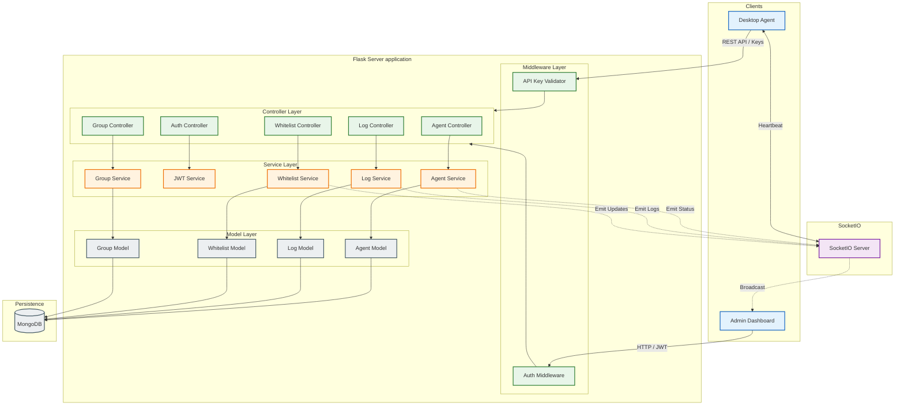

# Server Architecture Flow Diagrams
**Firewall Controller Server - Complete Flow Documentation**

---

## 📋 Table of Contents
1. [System Architecture Overview](#1-system-architecture-overview)
2. [Application Startup Flow](#2-application-startup-flow)
3. [Agent Registration Flow](#3-agent-registration-flow)
4. [Agent Heartbeat Flow](#4-agent-heartbeat-flow)
5. [Authentication Flow (API Key & JWT)](#5-authentication-flow-api-key--jwt)
6. [Whitelist Sync Flow](#6-whitelist-sync-flow)
7. [Log Collection Flow](#7-log-collection-flow)
8. [Web Dashboard Flow](#8-web-dashboard-flow)
9. [Group Management Flow](#9-group-management-flow)
10. [Real-time Communication Flow (SocketIO)](#10-real-time-communication-flow-socketio)

---

## 1. System Architecture Overview

### Layer Architecture (MVC Pattern)

```
┌─────────────────────────────────────────────────────────────┐
│                      CLIENT LAYER                            │
│  ┌──────────────┐  ┌──────────────┐  ┌──────────────┐      │
│  │ Agent Client │  │ Web Browser  │  │ API Client   │      │
│  └──────┬───────┘  └──────┬───────┘  └──────┬───────┘      │
└─────────┼──────────────────┼──────────────────┼─────────────┘
          │                  │                  │
          │ HTTP/HTTPS       │ HTTP/WS          │ HTTP
          └──────────────────┴──────────────────┘
                             │
┌─────────────────────────────┴───────────────────────────────┐
│                    FLASK APPLICATION                         │
│  ┌────────────────────────────────────────────────────┐     │
│  │              MIDDLEWARE LAYER                      │     │
│  │  ┌──────────────┐  ┌────────────┐  ┌────────────┐ │     │
│  │  │ Auth (API    │  │ Auth (JWT) │  │    CORS    │ │     │
│  │  │ Key)         │  │            │  │            │ │     │
│  │  └──────────────┘  └────────────┘  └────────────┘ │     │
│  └────────────────────────────────────────────────────┘     │
│                             │                                │
│  ┌────────────────────────────────────────────────────┐     │
│  │              CONTROLLER LAYER                      │     │
│  │  ┌────────────┐ ┌──────────┐ ┌──────────────┐     │     │
│  │  │  Agent     │ │  Auth    │ │ Whitelist    │     │     │
│  │  │Controller  │ │Controller│ │Controller    │ ... │     │
│  │  └─────┬──────┘ └────┬─────┘ └──────┬───────┘     │     │
│  └────────┼─────────────┼───────────────┼─────────────┘     │
│           │             │               │                    │
│  ┌────────┼─────────────┼───────────────┼─────────────┐     │
│  │        │  SERVICE LAYER              │             │     │
│  │  ┌─────▼─────┐ ┌─────▼──────┐ ┌─────▼────────┐   │     │
│  │  │  Agent    │ │    JWT     │ │  Whitelist   │   │     │
│  │  │ Service   │ │  Service   │ │   Service    │...│     │
│  │  └─────┬─────┘ └─────┬──────┘ └──────┬───────┘   │     │
│  └────────┼─────────────┼────────────────┼───────────┘     │
│           │             │                │                  │
│  ┌────────┼─────────────┼────────────────┼───────────┐     │
│  │        │   MODEL LAYER               │            │     │
│  │  ┌─────▼─────┐ ┌─────▼──────┐ ┌──────▼───────┐   │     │
│  │  │  Agent    │ │  API Key   │ │  Whitelist   │   │     │
│  │  │  Model    │ │   Model    │ │    Model     │...│     │
│  │  └─────┬─────┘ └─────┬──────┘ └──────┬───────┘   │     │
│  └────────┼─────────────┼────────────────┼───────────┘     │
│           └─────────────┴────────────────┘                  │
└─────────────────────────┬───────────────────────────────────┘
                          │
┌─────────────────────────▼───────────────────────────────────┐
│                   DATABASE LAYER                             │
│  ┌──────────────────────────────────────────────────────┐   │
│  │              MongoDB Database                        │   │
│  │  ┌──────────┐ ┌──────────┐ ┌──────────┐ ┌─────────┐│   │
│  │  │  agents  │ │  logs    │ │whitelist │ │ groups  ││   │
│  │  │collection│ │collection│ │collection│ │collection│   │
│  │  └──────────┘ └──────────┘ └──────────┘ └─────────┘│   │
│  └──────────────────────────────────────────────────────┘   │
└─────────────────────────────────────────────────────────────┘

┌─────────────────────────────────────────────────────────────┐
│              REAL-TIME COMMUNICATION                         │
│  ┌──────────────────────────────────────────────────────┐   │
│  │      SocketIO Server (Eventlet)                      │   │
│  │  • Agent status updates                              │   │
│  │  • Whitelist changes                                 │   │
│  │  • New logs broadcast                                │   │
│  └──────────────────────────────────────────────────────┘   │
└─────────────────────────────────────────────────────────────┘
```

### Component Relationships

```
Controllers ──uses──> Services ──uses──> Models ──uses──> MongoDB
     │                    │
     └────────────────────┴──uses──> Middleware (Auth)
     
SocketIO ──emits events──> All connected clients
     ▲
     │
Services ──notify──> SocketIO (status changes, updates)
```

### Detailed Component Diagram (Mermaid)



---

## 2. Application Startup Flow

```
START APPLICATION
      │
      ▼
┌───────────────────────────────────────┐
│ 1. Load Configuration                 │
│    • MongoDB connection string        │
│    • Server host & port               │
│    • JWT secret key                   │
│    • Timezone (Vietnam/Asia)          │
└───────────┬───────────────────────────┘
            │
            ▼
┌───────────────────────────────────────┐
│ 2. Create Flask App                   │
│    • Set template folder              │
│    • Set static folder                │
│    • Load config                      │
└───────────┬───────────────────────────┘
            │
            ▼
┌───────────────────────────────────────┐
│ 3. Initialize CORS                    │
│    • Allow /api/* endpoints           │
│    • Configure allowed origins        │
└───────────┬───────────────────────────┘
            │
            ▼
┌───────────────────────────────────────┐
│ 4. Initialize SocketIO                │
│    • Use Eventlet async mode          │
│    • Enable CORS for WebSocket        │
└───────────┬───────────────────────────┘
            │
            ▼
┌───────────────────────────────────────┐
│ 5. Connect to MongoDB                 │
│    • Test connection                  │
│    • Get database instance            │
└───────────┬───────────────────────────┘
            │
            ▼
┌───────────────────────────────────────┐
│ 6. Initialize Database Indexes        │
│    • Agent indexes                    │
│    • Log indexes                      │
│    • Whitelist indexes                │
│    • Group indexes                    │
└───────────┬───────────────────────────┘
            │
            ▼
┌───────────────────────────────────────┐
│ 7. Initialize Models                  │
│    • AgentModel(db)                   │
│    • LogModel(db)                     │
│    • WhitelistModel(db)               │
│    • GroupModel(db)                   │
│    • APIKeyModel(db)                  │
└───────────┬───────────────────────────┘
            │
            ▼
┌───────────────────────────────────────┐
│ 8. Initialize JWT Service             │
│    • Set JWT secret                   │
│    • Configure token expiry           │
└───────────┬───────────────────────────┘
            │
            ▼
┌───────────────────────────────────────┐
│ 9. Initialize Services                │
│    • GroupService                     │
│    • AgentService (with JWT)          │
│    • WhitelistService                 │
│    • LogService                       │
│    • APIKeyService                    │
└───────────┬───────────────────────────┘
            │
            ▼
┌───────────────────────────────────────┐
│ 10. Initialize Auth Middleware        │
│     • Set API Key Service             │
│     • Set JWT Service                 │
└───────────┬───────────────────────────┘
            │
            ▼
┌───────────────────────────────────────┐
│ 11. Create Default API Key            │
│     (if none exists)                  │
│     • Generate secure key             │
│     • Display in console (ONCE)       │
└───────────┬───────────────────────────┘
            │
            ▼
┌───────────────────────────────────────┐
│ 12. Initialize Controllers            │
│     • AgentController                 │
│     • AuthController                  │
│     • WhitelistController             │
│     • LogController                   │
│     • GroupController                 │
│     • APIKeyController                │
└───────────┬───────────────────────────┘
            │
            ▼
┌───────────────────────────────────────┐
│ 13. Register Blueprints               │
│     • /api/agents/*                   │
│     • /api/auth/*                     │
│     • /api/whitelist/*                │
│     • /api/logs/*                     │
│     • /api/groups/*                   │
│     • /api/api-keys/*                 │
└───────────┬───────────────────────────┘
            │
            ▼
┌───────────────────────────────────────┐
│ 14. Register Web Routes               │
│     • GET /                           │
│     • GET /agents                     │
│     • GET /groups                     │
│     • GET /whitelist                  │
│     • GET /logs                       │
│     • GET /api-keys                   │
└───────────┬───────────────────────────┘
            │
            ▼
┌───────────────────────────────────────┐
│ 15. Register Error Handlers           │
│     • 404 Not Found                   │
│     • 500 Server Error                │
└───────────┬───────────────────────────┘
            │
            ▼
┌───────────────────────────────────────┐
│ 16. Register SocketIO Events          │
│     • connect                         │
│     • disconnect                      │
│     • ping/pong                       │
└───────────┬───────────────────────────┘
            │
            ▼
┌───────────────────────────────────────┐
│ 17. Start Server                      │
│     • Listen on configured port       │
│     • Ready to accept requests        │
└───────────────────────────────────────┘
      │
      ▼
  SERVER RUNNING
```

---

## 3. Agent Registration Flow

### Phase 1: Initial Registration (API Key Required)

```
AGENT CLIENT                                                 SERVER
     │                                                          │
     │  POST /api/agents/register                              │
     │  Headers:                                               │
     │    X-API-Key: <api_key>                                │
     │  Body: {                                                │
     │    hostname, ip_address, os_type,                      │
     │    device_id, os_version, ...                          │
     │  }                                                      │
     ├────────────────────────────────────────────────────────>│
     │                                                          │
     │                                    ┌─────────────────────┤
     │                                    │ 1. Auth Middleware  │
     │                                    │    @require_api_key │
     │                                    │    - Extract API key│
     │                                    │    - Validate key   │
     │                                    │    - Check perms    │
     │                                    └─────────────────────┤
     │                                                          │
     │                         API Key Invalid?                │
     │<─────────────────────────────────────────────────────────┤
     │  401 Unauthorized                                        │
     │  { error: "Invalid API key" }                           │
     │                                                          │
     │                                    ┌─────────────────────┤
     │                                    │ 2. AgentController  │
     │                                    │    register_agent() │
     │                                    │    - Validate JSON  │
     │                                    │    - Extract data   │
     │                                    └─────────────────────┤
     │                                                          │
     │                                    ┌─────────────────────┤
     │                                    │ 3. AgentService     │
     │                                    │    register_agent() │
     │                                    │                     │
     │                                    │ 3a. Check existing  │
     │                                    │     by device_id    │
     │                                    │                     │
     │                                    │ 3b. If exists:      │
     │                                    │     - Update info   │
     │                                    │     - Return agent  │
     │                                    │                     │
     │                                    │ 3c. If new:         │
     │                                    │     - Generate ID   │
     │                                    │     - Set pending   │
     │                                    │     - Parse times   │
     │                                    │     - Save to DB    │
     │                                    └─────────────────────┤
     │                                                          │
     │                                    ┌─────────────────────┤
     │                                    │ 4. Generate JWT     │
     │                                    │    JWTService       │
     │                                    │    - Create token   │
     │                                    │    - Set expiry     │
     │                                    │      (7 days)       │
     │                                    └─────────────────────┤
     │                                                          │
     │                                    ┌─────────────────────┤
     │                                    │ 5. Emit SocketIO    │
     │                                    │    'agent_updated'  │
     │                                    │    - Notify clients │
     │                                    └─────────────────────┤
     │                                                          │
     │<─────────────────────────────────────────────────────────┤
     │  200 OK                                                  │
     │  {                                                       │
     │    success: true,                                        │
     │    data: {                                               │
     │      agent_id: "...",                                    │
     │      jwt_token: "eyJ...",                               │
     │      token_expires_at: "2026-01-21T...",                │
     │      status: "pending",                                  │
     │      ...                                                 │
     │    }                                                     │
     │  }                                                       │
     │                                                          │
     ▼                                                          ▼
STORE JWT TOKEN                                      AGENT REGISTERED
FOR FUTURE REQUESTS                                  IN DATABASE
```

### Decision Flow in AgentService.register_agent()

```
┌──────────────────────────┐
│ Receive registration     │
│ data from controller     │
└────────────┬─────────────┘
             │
             ▼
┌────────────────────────────────────┐
│ Extract hostname, IP, device_id    │
└────────────┬───────────────────────┘
             │
             ▼
        ┌────────┐
        │device_id│
        │ exists? │
        └────┬───┘
             │
      ┌──────┴──────┐
      │             │
     YES           NO
      │             │
      ▼             ▼
┌───────────┐  ┌──────────────────┐
│Find by    │  │Search by         │
│device_id  │  │hostname + IP     │
└─────┬─────┘  └────────┬─────────┘
      │                 │
      ▼                 ▼
   ┌──────┐        ┌──────┐
   │Found?│        │Found?│
   └──┬───┘        └──┬───┘
      │               │
   ┌──┴──┐         ┌──┴──┐
  YES   NO        YES   NO
   │     │         │     │
   ▼     │         ▼     │
┌─────────┴─┐   ┌────────┴──┐
│UPDATE     │   │CREATE NEW │
│EXISTING   │   │AGENT      │
│           │   │           │
│• Update   │   │• Gen ID   │
│  info     │   │• Pending  │
│• Keep ID  │   │  group    │
│• Status   │   │• Parse    │
│  calc     │   │  times    │
└─────┬─────┘   └─────┬─────┘
      │               │
      └───────┬───────┘
              │
              ▼
     ┌────────────────┐
     │ Generate JWT   │
     │ Token (7 days) │
     └────────┬───────┘
              │
              ▼
     ┌────────────────┐
     │ Emit SocketIO  │
     │'agent_updated' │
     └────────┬───────┘
              │
              ▼
        ┌──────────┐
        │  RETURN  │
        │ RESPONSE │
        └──────────┘
```

---

## 4. Agent Heartbeat Flow

### Phase 2: Heartbeat with JWT Token

```
AGENT CLIENT                                                 SERVER
     │                                                          │
     │  POST /api/agents/heartbeat                             │
     │  Headers:                                               │
     │    Authorization: Bearer <jwt_token>                    │
     │  Body: {                                                │
     │    agent_id: "...",                                     │
     │    timestamp: "2026-01-14T10:30:00",                   │
     │    status: "active",                                    │
     │    system_info: {...}                                   │
     │  }                                                      │
     ├────────────────────────────────────────────────────────>│
     │                                                          │
     │                                    ┌─────────────────────┤
     │                                    │ 1. Auth Middleware  │
     │                                    │    @require_jwt     │
     │                                    │    - Extract JWT    │
     │                                    │    - Verify token   │
     │                                    │    - Check expiry   │
     │                                    │    - Decode claims  │
     │                                    └─────────────────────┤
     │                                                          │
     │                         JWT Invalid/Expired?            │
     │<─────────────────────────────────────────────────────────┤
     │  401 Unauthorized                                        │
     │  { error: "Invalid or expired token" }                  │
     │                                                          │
     │  [Agent must re-register with API key]                  │
     │                                                          │
     │                                    ┌─────────────────────┤
     │                                    │ 2. AgentController  │
     │                                    │    heartbeat()      │
     │                                    │    - g.jwt_payload  │
     │                                    │    - Validate data  │
     │                                    └─────────────────────┤
     │                                                          │
     │                                    ┌─────────────────────┤
     │                                    │ 3. AgentService     │
     │                                    │    update_heartbeat │
     │                                    │                     │
     │                                    │ 3a. Parse timestamp │
     │                                    │     (Vietnam TZ)    │
     │                                    │                     │
     │                                    │ 3b. Update DB:      │
     │                                    │     - last_heartbeat│
     │                                    │     - system_info   │
     │                                    │     - Updated_at    │
     │                                    │                     │
     │                                    │ 3c. Calculate status│
     │                                    │     Active < 5min   │
     │                                    │     Inactive < 30min│
     │                                    │     Offline > 30min │
     │                                    └─────────────────────┤
     │                                                          │
     │                                    ┌─────────────────────┤
     │                                    │ 4. Check whitelist  │
     │                                    │    needs sync       │
     │                                    │    - Compare        │
     │                                    │      versions       │
     │                                    └─────────────────────┤
     │                                                          │
     │                                    ┌─────────────────────┤
     │                                    │ 5. Emit SocketIO    │
     │                                    │    'agent_status'   │
     │                                    │    - Broadcast      │
     │                                    │      to dashboard   │
     │                                    └─────────────────────┤
     │                                                          │
     │<─────────────────────────────────────────────────────────┤
     │  200 OK                                                  │
     │  {                                                       │
     │    success: true,                                        │
     │    data: {                                               │
     │      status: "active",                                   │
     │      last_heartbeat: "2026-01-14T10:30:00+07:00",       │
     │      whitelist_sync_required: false,                    │
     │      server_time: "2026-01-14T10:30:05+07:00"           │
     │    }                                                     │
     │  }                                                       │
     │                                                          │
     ▼                                                          ▼
CONTINUE NORMAL                                    STATUS UPDATED
OPERATION                                          DASHBOARD NOTIFIED
```

### Status Calculation Logic

```
┌──────────────────────────┐
│ Receive heartbeat        │
│ timestamp from agent     │
└────────────┬─────────────┘
             │
             ▼
┌────────────────────────────────────┐
│ Parse timestamp to Vietnam TZ      │
│ (normalize any timezone)           │
└────────────┬───────────────────────┘
             │
             ▼
┌────────────────────────────────────┐
│ Calculate age:                     │
│ now_vietnam() - last_heartbeat     │
└────────────┬───────────────────────┘
             │
             ▼
        ┌────────┐
        │  AGE   │
        │seconds │
        └────┬───┘
             │
      ┌──────┴──────┬──────────┐
      │             │          │
   Age ≤ 300    300 < Age  Age > 1800
   (5 min)      ≤ 1800      (30 min)
      │          (30 min)       │
      │             │           │
      ▼             ▼           ▼
 ┌────────┐   ┌─────────┐  ┌─────────┐
 │ ACTIVE │   │INACTIVE │  │ OFFLINE │
 └────────┘   └─────────┘  └─────────┘
      │             │           │
      └─────────────┴───────────┘
                    │
                    ▼
         ┌──────────────────┐
         │ Update status    │
         │ in database      │
         └──────────────────┘
```

---

## 5. Authentication Flow (API Key & JWT)

### Two-Phase Authentication System

```
┌─────────────────────────────────────────────────────────────┐
│                    PHASE 1: Registration                     │
│                  (API Key Authentication)                    │
├─────────────────────────────────────────────────────────────┤
│                                                              │
│  Agent  ─────┐                                              │
│              │ POST /api/agents/register                    │
│              │ X-API-Key: abc123...                         │
│              │                                              │
│              ▼                                              │
│      ┌───────────────┐                                      │
│      │ require_api_  │ Validates API key                   │
│      │ key decorator │ against api_keys collection         │
│      └───────┬───────┘                                      │
│              │                                              │
│              ▼                                              │
│      ┌───────────────┐                                      │
│      │ Agent Service │ Registers agent                     │
│      │               │ Generates JWT token                 │
│      └───────┬───────┘                                      │
│              │                                              │
│              ▼                                              │
│  Agent  <─── Returns: {                                     │
│                agent_id,                                    │
│                jwt_token,  ◄──── STORE THIS                │
│                expires_at                                   │
│              }                                              │
└─────────────────────────────────────────────────────────────┘

┌─────────────────────────────────────────────────────────────┐
│                  PHASE 2: Operations                         │
│                  (JWT Authentication)                        │
├─────────────────────────────────────────────────────────────┤
│                                                              │
│  Agent  ─────┐                                              │
│              │ POST /api/agents/heartbeat                   │
│              │ Authorization: Bearer eyJ...                 │
│              │                                              │
│              ▼                                              │
│      ┌───────────────┐                                      │
│      │ require_jwt   │ Validates JWT token                 │
│      │ decorator     │ Checks expiry (7 days)              │
│      └───────┬───────┘                                      │
│              │                                              │
│              │ Valid?                                       │
│        ┌─────┴─────┐                                        │
│       YES          NO                                       │
│        │            │                                       │
│        │            ▼                                       │
│        │     ┌──────────────┐                              │
│        │     │ 401 Error    │                              │
│        │     │ Must re-     │                              │
│        │     │ register     │                              │
│        │     └──────────────┘                              │
│        │                                                    │
│        ▼                                                    │
│  ┌──────────────┐                                           │
│  │ g.jwt_payload│ Contains: {                              │
│  │ available in │   agent_id,                              │
│  │ request      │   hostname,                              │
│  └──────────────┘   exp: timestamp                         │
│        │         }                                          │
│        ▼                                                    │
│  Process request                                            │
│  (heartbeat, sync, etc.)                                   │
│                                                              │
└─────────────────────────────────────────────────────────────┘
```

### API Key Structure & Validation

```
┌──────────────────────────────────────────────────────┐
│              API Key Document (MongoDB)              │
├──────────────────────────────────────────────────────┤
│ {                                                    │
│   _id: ObjectId("..."),                             │
│   key_name: "Default API Key",                      │
│   api_key: "fwc_abc123def456...",  ◄─── Hashed      │
│   permissions: [                                     │
│     "agent_register",   ◄── Required for /register  │
│     "whitelist_sync",                               │
│     "log_upload"                                    │
│   ],                                                │
│   is_active: true,                                  │
│   created_at: ISODate("..."),                       │
│   last_used: ISODate("...")                         │
│ }                                                   │
└──────────────────────────────────────────────────────┘

Validation Process:
1. Extract key from request (X-API-Key header)
2. Hash the received key
3. Find matching key in database
4. Check is_active = true
5. Check required permission exists
6. Update last_used timestamp
7. Allow request to proceed
```

### JWT Token Structure

```
┌──────────────────────────────────────────────────────┐
│              JWT Token Structure                     │
├──────────────────────────────────────────────────────┤
│ Header: {                                            │
│   "alg": "HS256",                                   │
│   "typ": "JWT"                                      │
│ }                                                    │
├──────────────────────────────────────────────────────┤
│ Payload: {                                           │
│   "agent_id": "uuid-here",                          │
│   "hostname": "DESKTOP-PC01",                       │
│   "device_id": "unique-device-uuid",                │
│   "iat": 1705234800,  ◄── Issued at                │
│   "exp": 1705839600   ◄── Expires (7 days later)   │
│ }                                                    │
├──────────────────────────────────────────────────────┤
│ Signature: HMACSHA256(                               │
│   base64UrlEncode(header) + "." +                   │
│   base64UrlEncode(payload),                         │
│   SECRET_KEY                                         │
│ )                                                    │
└──────────────────────────────────────────────────────┘

Token Lifecycle:
1. Generated during registration (7 day expiry)
2. Stored by agent client
3. Sent in Authorization header for all operations
4. Server validates signature & expiry
5. If expired: Agent must re-register with API key
6. If valid: Request proceeds with g.jwt_payload set
```

---

## 6. Whitelist Sync Flow

```
AGENT CLIENT                                                 SERVER
     │                                                          │
     │  GET /api/whitelist/agent/<agent_id>                    │
     │  Authorization: Bearer <jwt_token>                      │
     ├────────────────────────────────────────────────────────>│
     │                                                          │
     │                                    ┌─────────────────────┤
     │                                    │ 1. Auth (JWT)       │
     │                                    └─────────────────────┤
     │                                                          │
     │                                    ┌─────────────────────┤
     │                                    │ 2. WhitelistCtrl    │
     │                                    │    get_for_agent()  │
     │                                    └─────────────────────┤
     │                                                          │
     │                                    ┌─────────────────────┤
     │                                    │ 3. WhitelistService │
     │                                    │    get_for_agent()  │
     │                                    │                     │
     │                                    │ 3a. Get agent       │
     │                                    │     from DB         │
     │                                    │                     │
     │                                    │ 3b. Get agent's     │
     │                                    │     group_id        │
     │                                    │                     │
     │                                    │ 3c. Query whitelist │
     │                                    │     - global items  │
     │                                    │     - group items   │
     │                                    │                     │
     │                                    │ 3d. Merge & format  │
     │                                    │     deduplicate     │
     │                                    └─────────────────────┤
     │                                                          │
     │<─────────────────────────────────────────────────────────┤
     │  200 OK                                                  │
     │  {                                                       │
     │    success: true,                                        │
     │    data: {                                               │
     │      rules: [                                            │
     │        { ip: "8.8.8.8", scope: "global" },             │
     │        { ip: "192.168.1.0/24", scope: "group" }        │
     │      ],                                                  │
     │      version: 12345,                                     │
     │      last_updated: "..."                                │
     │    }                                                     │
     │  }                                                       │
     │                                                          │
     ▼                                                          ▼
APPLY RULES TO                                       WHITELIST DELIVERED
FIREWALL                                            
```

### Whitelist Scope Resolution

```
┌─────────────────────────┐
│ Agent requests          │
│ whitelist for agent_id  │
└───────────┬─────────────┘
            │
            ▼
┌───────────────────────────────┐
│ Get agent record from DB      │
│ Extract: group_id             │
└───────────┬───────────────────┘
            │
            ▼
┌───────────────────────────────────────────────┐
│ Query whitelist collection:                   │
│                                               │
│ Find where:                                   │
│   scope = "global"                            │
│      OR                                       │
│   (scope = "group" AND group_id = agent's)   │
└───────────┬───────────────────────────────────┘
            │
            ▼
┌───────────────────────────────┐
│ Merge results:                │
│ • Remove duplicates           │
│ • Format for agent            │
│ • Add metadata (version)      │
└───────────┬───────────────────┘
            │
            ▼
      ┌──────────┐
      │ RETURN   │
      │ TO AGENT │
      └──────────┘

Example Result:
[
  { ip: "8.8.8.8", scope: "global", reason: "DNS" },
  { ip: "1.1.1.1", scope: "global", reason: "DNS" },
  { ip: "192.168.1.0/24", scope: "group", reason: "Local" }
]
```

---

## 7. Log Collection Flow

```
AGENT CLIENT                                                 SERVER
     │                                                          │
     │  POST /api/logs/batch                                   │
     │  Authorization: Bearer <jwt_token>                      │
     │  Body: {                                                │
     │    agent_id: "...",                                     │
     │    logs: [                                              │
     │      {                                                  │
     │        timestamp: "...",                                │
     │        action: "BLOCKED",                               │
     │        src_ip: "1.2.3.4",                              │
     │        dst_ip: "5.6.7.8",                              │
     │        protocol: "TCP",                                 │
     │        ...                                              │
     │      }, ...                                             │
     │    ]                                                    │
     │  }                                                      │
     ├────────────────────────────────────────────────────────>│
     │                                                          │
     │                                    ┌─────────────────────┤
     │                                    │ 1. Auth (JWT)       │
     │                                    └─────────────────────┤
     │                                                          │
     │                                    ┌─────────────────────┤
     │                                    │ 2. LogController    │
     │                                    │    create_batch()   │
     │                                    │    - Validate JSON  │
     │                                    └─────────────────────┤
     │                                                          │
     │                                    ┌─────────────────────┤
     │                                    │ 3. LogService       │
     │                                    │    create_batch()   │
     │                                    │                     │
     │                                    │ For each log:       │
     │                                    │ 3a. Validate data   │
     │                                    │ 3b. Parse timestamp │
     │                                    │     (Vietnam TZ)    │
     │                                    │ 3c. Enrich with     │
     │                                    │     agent info      │
     │                                    │ 3d. Insert to DB    │
     │                                    └─────────────────────┤
     │                                                          │
     │                                    ┌─────────────────────┤
     │                                    │ 4. Emit SocketIO    │
     │                                    │    'new_log'        │
     │                                    │    - Broadcast to   │
     │                                    │      dashboard      │
     │                                    └─────────────────────┤
     │                                                          │
     │<─────────────────────────────────────────────────────────┤
     │  201 Created                                             │
     │  {                                                       │
     │    success: true,                                        │
     │    data: {                                               │
     │      inserted: 15,                                       │
     │      failed: 0,                                          │
     │      total: 15                                           │
     │    }                                                     │
     │  }                                                       │
     │                                                          │
     ▼                                                          ▼
LOGS SENT                                          LOGS STORED
CLEAR LOCAL BUFFER                                 DASHBOARD UPDATED
```

### Log Processing Pipeline

```
┌──────────────────────┐
│ Receive batch of     │
│ logs from agent      │
└──────────┬───────────┘
           │
           ▼
┌──────────────────────────────┐
│ For each log in batch:       │
└──────────┬───────────────────┘
           │
           ▼
    ┌──────────────┐
    │ Validate     │
    │ required     │
    │ fields       │
    └──────┬───────┘
           │
      Valid?
     ┌─────┴─────┐
    NO          YES
     │            │
     ▼            ▼
┌────────┐  ┌──────────────────┐
│ Skip   │  │ Parse timestamp  │
│ log    │  │ to Vietnam TZ    │
└────────┘  └────────┬─────────┘
                     │
                     ▼
            ┌─────────────────┐
            │ Enrich with:    │
            │ • hostname      │
            │ • group_id      │
            │ • agent_id      │
            └────────┬────────┘
                     │
                     ▼
            ┌─────────────────┐
            │ Insert to       │
            │ logs collection │
            └────────┬────────┘
                     │
                     ▼
            ┌─────────────────┐
            │ Emit SocketIO   │
            │ 'new_log' event │
            └─────────────────┘
                     │
                     ▼
              ┌──────────┐
              │  NEXT    │
              │   LOG    │
              └──────────┘
```

---

## 8. Web Dashboard Flow

### Dashboard Page Load

```
WEB BROWSER                                                  SERVER
     │                                                          │
     │  GET /                                                  │
     ├────────────────────────────────────────────────────────>│
     │                                                          │
     │                                    ┌─────────────────────┤
     │                                    │ 1. Main Route       │
     │                                    │    index()          │
     │                                    └─────────────────────┤
     │                                                          │
     │                                    ┌─────────────────────┤
     │                                    │ 2. Gather Stats     │
     │                                    │                     │
     │                                    │ • total_logs        │
     │                                    │ • allowed_count     │
     │                                    │ • blocked_count     │
     │                                    │ • active_agents     │
     │                                    └─────────────────────┤
     │                                                          │
     │                                    ┌─────────────────────┤
     │                                    │ 3. Get recent logs  │
     │                                    │    (last 10)        │
     │                                    └─────────────────────┤
     │                                                          │
     │<─────────────────────────────────────────────────────────┤
     │  200 OK - HTML rendered from dashboard.html             │
     │  with stats & recent_logs data                          │
     │                                                          │
     ▼                                                          │
┌─────────────────┐                                            │
│ Browser renders │                                            │
│ dashboard.html  │                                            │
└────────┬────────┘                                            │
         │                                                      │
         ▼                                                      │
┌─────────────────┐                                            │
│ Load base.js    │                                            │
│ Initialize      │                                            │
│ SocketIO client │                                            │
└────────┬────────┘                                            │
         │                                                      │
         │  WebSocket connection request                       │
         ├────────────────────────────────────────────────────>│
         │                                                      │
         │                                    ┌─────────────────┤
         │                                    │ SocketIO Server │
         │                                    │ handle_connect()│
         │                                    └─────────────────┤
         │                                                      │
         │<─────────────────────────────────────────────────────┤
         │  WebSocket connected                                 │
         │  Receive 'server_message' welcome event             │
         │                                                      │
         ▼                                                      │
┌──────────────────┐                                           │
│ Dashboard ready  │                                           │
│ Listening for:   │                                           │
│ • agent_status   │                                           │
│ • new_log        │                                           │
│ • whitelist_     │                                           │
│   updated        │                                           │
└──────────────────┘                                           │
```

### Real-time Dashboard Updates

```
SERVER EVENT                           DASHBOARD BROWSER
     │                                        │
     │  (Agent sends heartbeat)               │
     ▼                                        │
┌──────────────┐                             │
│AgentService  │                             │
│update_       │                             │
│heartbeat()   │                             │
└──────┬───────┘                             │
       │                                      │
       ▼                                      │
┌──────────────────┐                         │
│SocketIO.emit(    │                         │
│  'agent_status', │                         │
│  agent_data      │                         │
│)                 │                         │
└──────┬───────────┘                         │
       │                                      │
       │      WebSocket broadcast             │
       ├─────────────────────────────────────>│
       │                                      ▼
       │                            ┌──────────────────┐
       │                            │ dashboard.js     │
       │                            │ receives event   │
       │                            └────────┬─────────┘
       │                                     │
       │                                     ▼
       │                            ┌──────────────────┐
       │                            │ Update agent row │
       │                            │ • Status badge   │
       │                            │ • Last heartbeat │
       │                            │ • System info    │
       │                            └──────────────────┘
       │                                     │
       │  (New log arrives)                  │
       ▼                                     │
┌──────────────┐                            │
│LogService    │                            │
│create_batch()│                            │
└──────┬───────┘                            │
       │                                     │
       ▼                                     │
┌──────────────────┐                        │
│SocketIO.emit(    │                        │
│  'new_log',      │                        │
│  log_data        │                        │
│)                 │                        │
└──────┬───────────┘                        │
       │                                     │
       │      WebSocket broadcast            │
       ├─────────────────────────────────────>
       │                                     ▼
       │                            ┌──────────────────┐
       │                            │ dashboard.js     │
       │                            │ receives event   │
       │                            └────────┬─────────┘
       │                                     │
       │                                     ▼
       │                            ┌──────────────────┐
       │                            │ Add log to table │
       │                            │ • Prepend row    │
       │                            │ • Update counter │
       │                            │ • Show notif     │
       │                            └──────────────────┘
```

---

## 9. Group Management Flow

### Creating a New Group

```
WEB BROWSER                                                  SERVER
     │                                                          │
     │  POST /api/groups                                       │
     │  Body: {                                                │
     │    name: "Production Servers",                         │
     │    description: "All production machines"              │
     │  }                                                      │
     ├────────────────────────────────────────────────────────>│
     │                                                          │
     │                                    ┌─────────────────────┤
     │                                    │ 1. GroupController  │
     │                                    │    create_group()   │
     │                                    └─────────────────────┤
     │                                                          │
     │                                    ┌─────────────────────┤
     │                                    │ 2. GroupService     │
     │                                    │    create_group()   │
     │                                    │                     │
     │                                    │ • Generate UUID     │
     │                                    │ • Set timestamps    │
     │                                    │ • Insert to DB      │
     │                                    └─────────────────────┤
     │                                                          │
     │<─────────────────────────────────────────────────────────┤
     │  201 Created                                             │
     │  {                                                       │
     │    success: true,                                        │
     │    data: {                                               │
     │      group_id: "uuid-here",                             │
     │      name: "Production Servers",                        │
     │      agent_count: 0,                                    │
     │      ...                                                 │
     │    }                                                     │
     │  }                                                       │
     │                                                          │
     ▼                                                          ▼
REFRESH GROUP LIST                                   GROUP CREATED
```

### Assigning Agent to Group

```
WEB BROWSER                                                  SERVER
     │                                                          │
     │  PATCH /api/agents/<agent_id>/group                     │
     │  Body: {                                                │
     │    group_id: "uuid-of-group"                           │
     │  }                                                      │
     ├────────────────────────────────────────────────────────>│
     │                                                          │
     │                                    ┌─────────────────────┤
     │                                    │ 1. AgentController  │
     │                                    │    update_group()   │
     │                                    └─────────────────────┤
     │                                                          │
     │                                    ┌─────────────────────┤
     │                                    │ 2. AgentService     │
     │                                    │    update_group()   │
     │                                    │                     │
     │                                    │ 2a. Validate group  │
     │                                    │     exists          │
     │                                    │                     │
     │                                    │ 2b. Update agent    │
     │                                    │     group_id        │
     │                                    │                     │
     │                                    │ 2c. Update group    │
     │                                    │     agent_count     │
     │                                    └─────────────────────┤
     │                                                          │
     │                                    ┌─────────────────────┤
     │                                    │ 3. Emit SocketIO    │
     │                                    │    'agent_updated'  │
     │                                    │    'group_updated'  │
     │                                    └─────────────────────┤
     │                                                          │
     │<─────────────────────────────────────────────────────────┤
     │  200 OK                                                  │
     │  {                                                       │
     │    success: true,                                        │
     │    data: {                                               │
     │      agent_id: "...",                                   │
     │      group_id: "uuid-of-group",                         │
     │      group_name: "Production Servers"                   │
     │    }                                                     │
     │  }                                                       │
     │                                                          │
     ▼                                                          ▼
REFRESH DISPLAYS                                    GROUP ASSIGNMENT
                                                    COMPLETE
```

---

## 10. Real-time Communication Flow (SocketIO)

### SocketIO Event Architecture

```
┌─────────────────────────────────────────────────────────────┐
│                    SERVER SIDE EVENTS                        │
├─────────────────────────────────────────────────────────────┤
│                                                              │
│  SERVICE LAYER                  SOCKETIO SERVER             │
│                                                              │
│  AgentService ──┐                                           │
│    .update_     │                                           │
│     heartbeat() │                                           │
│                 └──> socketio.emit(                         │
│                          'agent_status',                    │
│                          {...},                             │
│                          broadcast=True                     │
│                      )                                       │
│                                                              │
│  LogService ────┐                                           │
│    .create_     │                                           │
│     batch()     │                                           │
│                 └──> socketio.emit(                         │
│                          'new_log',                         │
│                          {...},                             │
│                          broadcast=True                     │
│                      )                                       │
│                                                              │
│  WhitelistSvc ──┐                                           │
│    .update()    │                                           │
│                 └──> socketio.emit(                         │
│                          'whitelist_updated',               │
│                          {...},                             │
│                          broadcast=True                     │
│                      )                                       │
│                                                              │
│  GroupService ──┐                                           │
│    .update()    │                                           │
│                 └──> socketio.emit(                         │
│                          'group_updated',                   │
│                          {...},                             │
│                          broadcast=True                     │
│                      )                                       │
│                                                              │
└─────────────────────────────────────────────────────────────┘
                            │
                            │ WebSocket
                            │
                            ▼
┌─────────────────────────────────────────────────────────────┐
│                    CLIENT SIDE HANDLERS                      │
├─────────────────────────────────────────────────────────────┤
│                                                              │
│  DASHBOARD (dashboard.js)                                   │
│                                                              │
│  socket.on('agent_status', (data) => {                      │
│      updateAgentRow(data);                                  │
│      updateStatistics();                                    │
│  });                                                         │
│                                                              │
│  socket.on('new_log', (data) => {                           │
│      prependLogToTable(data);                               │
│      updateLogCount();                                      │
│      showNotification('New log received');                  │
│  });                                                         │
│                                                              │
│  AGENTS PAGE (agents.js)                                    │
│                                                              │
│  socket.on('agent_updated', (data) => {                     │
│      refreshAgentList();                                    │
│  });                                                         │
│                                                              │
│  WHITELIST PAGE (whitelist.js)                              │
│                                                              │
│  socket.on('whitelist_updated', (data) => {                 │
│      refreshWhitelistTable();                               │
│      showNotification('Whitelist updated');                 │
│  });                                                         │
│                                                              │
│  GROUPS PAGE (groups.js)                                    │
│                                                              │
│  socket.on('group_updated', (data) => {                     │
│      refreshGroupList();                                    │
│  });                                                         │
│                                                              │
└─────────────────────────────────────────────────────────────┘
```

### Event Flow Example: Agent Status Update

```
TIMELINE                                   COMPONENTS INVOLVED

T=0ms
Agent sends                    ┌─────────────────────┐
heartbeat ──────────────────> │ AgentController     │
                               │ .heartbeat()        │
                               └──────────┬──────────┘
T=10ms                                    │
                               ┌──────────▼──────────┐
                               │ AgentService        │
                               │ .update_heartbeat() │
                               └──────────┬──────────┘
T=20ms                                    │
                                          │
                               ┌──────────▼──────────┐
                               │ Update MongoDB      │
                               │ • last_heartbeat    │
                               │ • status            │
                               └──────────┬──────────┘
T=30ms                                    │
                                          │
                               ┌──────────▼──────────┐
                               │ socketio.emit(      │
                               │   'agent_status',   │
                               │   agent_data,       │
                               │   broadcast=True    │
                               │ )                   │
                               └──────────┬──────────┘
T=35ms                                    │
                          ┌───────────────┼───────────────┐
                          │               │               │
              ┌───────────▼──┐  ┌────────▼───┐  ┌───────▼────────┐
              │ Dashboard    │  │ Agents     │  │ Any other      │
              │ browser tab  │  │ page tab   │  │ connected tab  │
              └───────────┬──┘  └────────┬───┘  └───────┬────────┘
T=40ms                    │              │              │
              ┌───────────▼──────────────▼──────────────▼────────┐
              │ All tabs update their agent displays             │
              │ • Status badge color                             │
              │ • Last heartbeat time                            │
              │ • Active/Inactive/Offline indicator              │
              └──────────────────────────────────────────────────┘
T=50ms
              User sees updated
              status in real-time
              (no page refresh needed)
```

---

## Summary of Key Flows

### 1. **MVC Pattern Enforcement**
- **Controller**: Handles HTTP requests, validation, response formatting
- **Service**: Business logic, data transformation, status calculations
- **Model**: Database operations, queries, CRUD operations

### 2. **Authentication Layers**
- **Phase 1**: API Key for registration (one-time)
- **Phase 2**: JWT Token for all subsequent operations (7-day expiry)

### 3. **Real-time Updates**
- SocketIO broadcasts changes immediately
- No polling required
- All connected clients stay synchronized

### 4. **Time Management**
- All timestamps use Vietnam timezone (Asia/Ho_Chi_Minh)
- Consistent parsing using `time_utils.py`
- Handles timezone conversion from agents

### 5. **Data Flow Direction**
```
Agent → API Key Auth → Registration → JWT Token
Agent → JWT Auth → Heartbeat/Logs/Sync → Database → SocketIO → Dashboard
```

---

## Technology Stack

| Layer | Technology |
|-------|-----------|
| **Web Framework** | Flask |
| **Real-time** | SocketIO (Eventlet) |
| **Database** | MongoDB |
| **Authentication** | JWT + API Keys |
| **Frontend** | Bootstrap 5 + Vanilla JS |
| **Time Management** | Python zoneinfo (Vietnam TZ) |

---

*Document generated: 2026-01-14*
*Firewall Controller Server v1.0.0*
