# 🎯 COMPLETE USE CASE DIAGRAM - Firewall Controller System

## Hệ thống Firewall Controller - Use Case Diagram Hoàn Chỉnh

```mermaid
flowchart TB
    subgraph ACTORS["👥 ACTORS"]
        Admin["👨‍💼 Administrator<br/>Quản trị viên hệ thống"]
        EndUser["👤 End User<br/>Người dùng cuối"]
        Agent["🤖 Agent<br/>Phần mềm trên máy client"]
        System["⚙️ System<br/>Tác vụ tự động"]
    end

    subgraph SERVER_SYSTEM["🖥️ SERVER SYSTEM"]
        
        subgraph AUTH["🔐 Authentication & Authorization"]
            UC_S1["UC-S1: Quản lý API Key"]
            UC_S2["UC-S2: Xác thực JWT Token"]
            UC_S3["UC-S3: Phân quyền truy cập"]
        end
        
        subgraph AGENT_MGMT["📡 Agent Management"]
            UC_S4["UC-S4: Đăng ký Agent mới"]
            UC_S5["UC-S5: Xem danh sách Agents"]
            UC_S6["UC-S6: Xem chi tiết Agent"]
            UC_S7["UC-S7: Cập nhật thông tin Agent"]
            UC_S8["UC-S8: Xóa/Vô hiệu hóa Agent"]
            UC_S9["UC-S9: Nhận Heartbeat"]
        end
        
        subgraph WHITELIST_MGMT["📋 Whitelist Management"]
            UC_S10["UC-S10: Tạo Whitelist Entry"]
            UC_S11["UC-S11: Xem Whitelist"]
            UC_S12["UC-S12: Cập nhật Whitelist"]
            UC_S13["UC-S13: Xóa Whitelist Entry"]
            UC_S14["UC-S14: Đồng bộ Whitelist cho Agent"]
        end
        
        subgraph GROUP_MGMT["👥 Group Management"]
            UC_S15["UC-S15: Tạo Group"]
            UC_S16["UC-S16: Gán Agent vào Group"]
            UC_S17["UC-S17: Gán Whitelist cho Group"]
            UC_S18["UC-S18: Xem/Xóa Group"]
        end
        
        subgraph LOG_MGMT["📊 Log Management"]
            UC_S19["UC-S19: Nhận Logs từ Agent"]
            UC_S20["UC-S20: Xem Logs"]
            UC_S21["UC-S21: Lọc/Tìm kiếm Logs"]
            UC_S22["UC-S22: Xuất Logs"]
            UC_S23["UC-S23: Xem Dashboard thống kê"]
        end
        
        subgraph REALTIME["⚡ Real-time Updates"]
            UC_S24["UC-S24: Phát sự kiện Socket.IO"]
            UC_S25["UC-S25: Cập nhật Dashboard live"]
        end
    end

    subgraph AGENT_SYSTEM["🖥️ AGENT SYSTEM"]
        
        subgraph LIFECYCLE["🔄 Agent Lifecycle"]
            UC_A1["UC-A1: Khởi động Agent"]
            UC_A2["UC-A2: Đăng ký với Server"]
            UC_A3["UC-A3: Dừng Agent"]
            UC_A4["UC-A4: Gửi Heartbeat"]
        end
        
        subgraph NETWORK_MON["🌐 Network Monitoring"]
            UC_A5["UC-A5: Bắt gói tin mạng"]
            UC_A6["UC-A6: Trích xuất Domain/IP"]
            UC_A7["UC-A7: Phân giải DNS"]
        end
        
        subgraph FIREWALL_CTRL["🛡️ Firewall Control"]
            UC_A8["UC-A8: Kiểm tra Whitelist"]
            UC_A9["UC-A9: Áp dụng Firewall Mode"]
            UC_A10["UC-A10: Tạo Rule cho phép"]
            UC_A11["UC-A11: Chặn kết nối"]
            UC_A12["UC-A12: Bật Default Deny Policy"]
        end
        
        subgraph SYNC_OPS["🔄 Synchronization"]
            UC_A13["UC-A13: Đồng bộ Whitelist"]
            UC_A14["UC-A14: Gửi Logs lên Server"]
            UC_A15["UC-A15: Cập nhật cấu hình"]
        end
        
        subgraph GUI_OPS["🖼️ GUI Operations"]
            UC_A16["UC-A16: Xem trạng thái Agent"]
            UC_A17["UC-A17: Thay đổi Firewall Mode"]
            UC_A18["UC-A18: Xem Logs local"]
            UC_A19["UC-A19: Cấu hình kết nối Server"]
        end
    end

    %% Admin interactions with Server
    Admin --> UC_S1
    Admin --> UC_S5
    Admin --> UC_S6
    Admin --> UC_S7
    Admin --> UC_S8
    Admin --> UC_S10
    Admin --> UC_S11
    Admin --> UC_S12
    Admin --> UC_S13
    Admin --> UC_S15
    Admin --> UC_S16
    Admin --> UC_S17
    Admin --> UC_S18
    Admin --> UC_S20
    Admin --> UC_S21
    Admin --> UC_S22
    Admin --> UC_S23

    %% End User interactions with Agent GUI
    EndUser --> UC_A16
    EndUser --> UC_A17
    EndUser --> UC_A18
    EndUser --> UC_A19

    %% Agent interactions with Server
    Agent --> UC_S4
    Agent --> UC_S9
    Agent --> UC_S14
    Agent --> UC_S19

    %% System automatic interactions
    System --> UC_S24
    System --> UC_S25
    System --> UC_A4
    System --> UC_A5
    System --> UC_A13
    System --> UC_A14

    %% Internal relationships
    UC_S4 -.->|includes| UC_S2
    UC_S9 -.->|includes| UC_S2
    UC_S14 -.->|includes| UC_S2
    UC_S19 -.->|includes| UC_S2
    
    UC_A1 -.->|includes| UC_A2
    UC_A2 -.->|includes| UC_A13
    UC_A5 -.->|includes| UC_A6
    UC_A6 -.->|includes| UC_A7
    UC_A6 -.->|includes| UC_A8
    UC_A8 -.->|includes| UC_A9
    UC_A9 -.->|extends| UC_A10
    UC_A9 -.->|extends| UC_A11

    classDef actorStyle fill:#E1F5FE,stroke:#01579B,stroke-width:2px
    classDef serverStyle fill:#E8F5E9,stroke:#2E7D32,stroke-width:2px
    classDef agentStyle fill:#FFF3E0,stroke:#E65100,stroke-width:2px
    classDef authStyle fill:#FCE4EC,stroke:#880E4F,stroke-width:2px
    
    class Admin,EndUser,Agent,System actorStyle
    class UC_S1,UC_S2,UC_S3 authStyle
```

---

## 📋 Chi tiết từng Use Case

### 🖥️ SERVER USE CASES

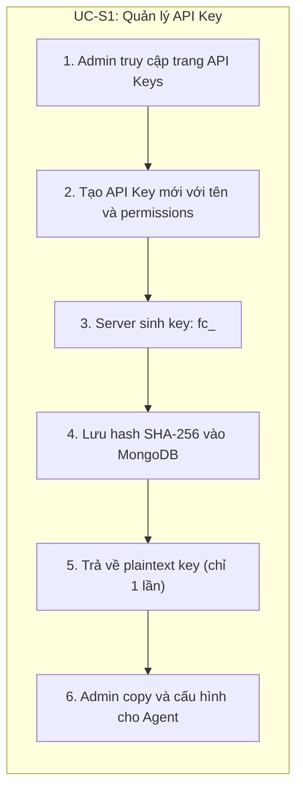

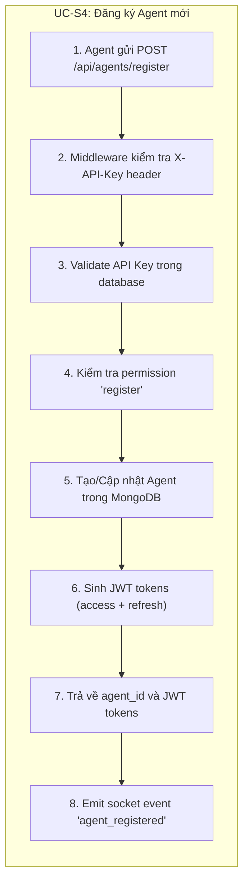

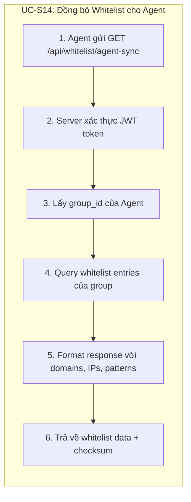

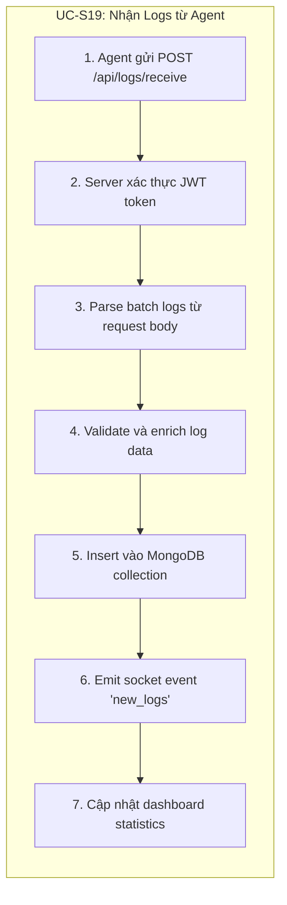

---

### 🤖 AGENT USE CASES

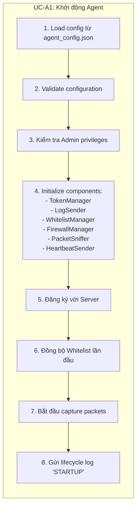

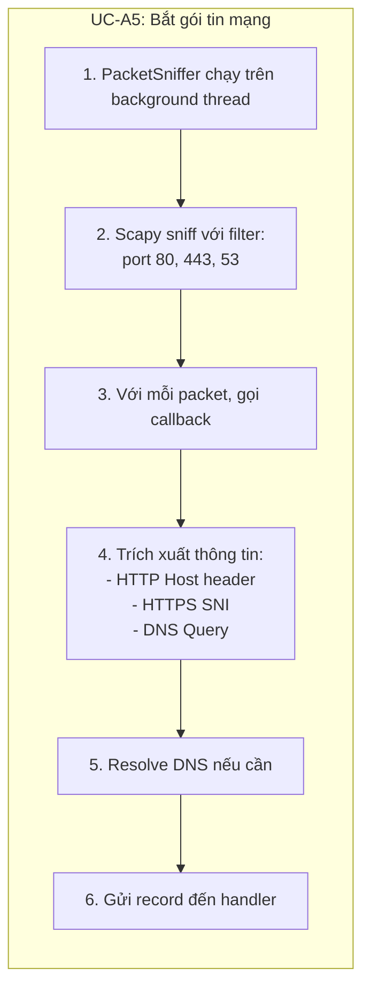

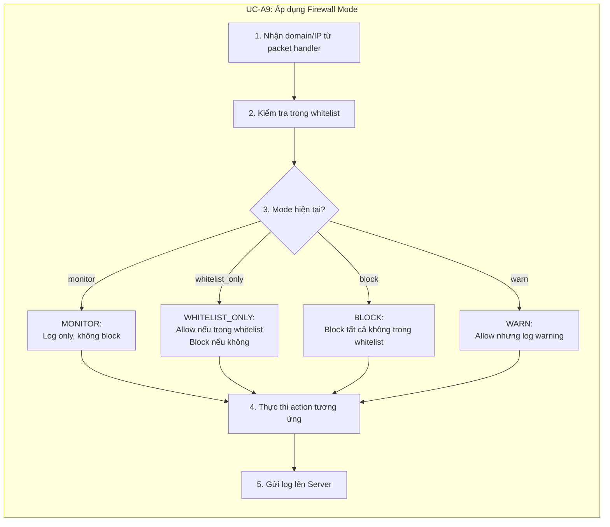

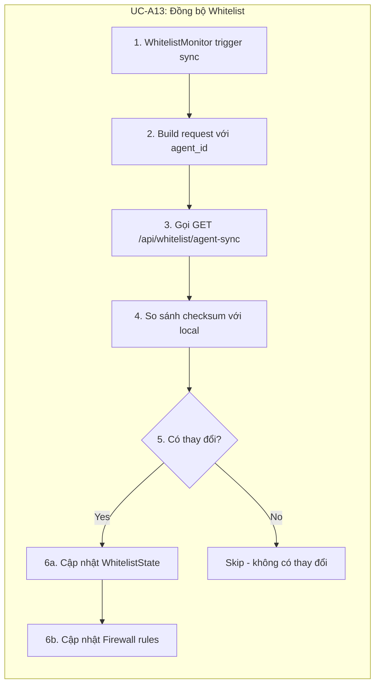

---

## 🔄 Complete Interaction Flow

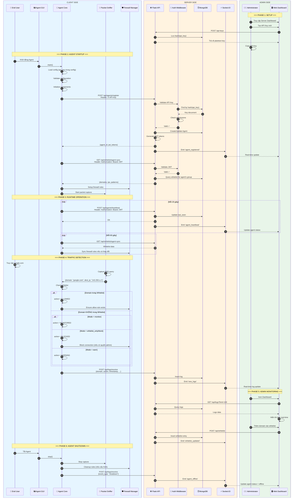

---

## 📊 Use Case Matrix

| ID | Use Case | Actor | Server/Agent | Priority |
|----|----------|-------|--------------|----------|
| **UC-S1** | Quản lý API Key | Admin | Server | High |
| **UC-S2** | Xác thực JWT Token | System | Server | High |
| **UC-S3** | Phân quyền truy cập | System | Server | High |
| **UC-S4** | Đăng ký Agent mới | Agent | Server | High |
| **UC-S5** | Xem danh sách Agents | Admin | Server | Medium |
| **UC-S6** | Xem chi tiết Agent | Admin | Server | Medium |
| **UC-S7** | Cập nhật thông tin Agent | Admin | Server | Low |
| **UC-S8** | Xóa/Vô hiệu hóa Agent | Admin | Server | Low |
| **UC-S9** | Nhận Heartbeat | Agent | Server | High |
| **UC-S10** | Tạo Whitelist Entry | Admin | Server | High |
| **UC-S11** | Xem Whitelist | Admin | Server | Medium |
| **UC-S12** | Cập nhật Whitelist | Admin | Server | Medium |
| **UC-S13** | Xóa Whitelist Entry | Admin | Server | Medium |
| **UC-S14** | Đồng bộ Whitelist cho Agent | Agent | Server | High |
| **UC-S15** | Tạo Group | Admin | Server | Medium |
| **UC-S16** | Gán Agent vào Group | Admin | Server | Medium |
| **UC-S17** | Gán Whitelist cho Group | Admin | Server | Medium |
| **UC-S18** | Xem/Xóa Group | Admin | Server | Low |
| **UC-S19** | Nhận Logs từ Agent | Agent | Server | High |
| **UC-S20** | Xem Logs | Admin | Server | High |
| **UC-S21** | Lọc/Tìm kiếm Logs | Admin | Server | Medium |
| **UC-S22** | Xuất Logs | Admin | Server | Low |
| **UC-S23** | Xem Dashboard thống kê | Admin | Server | High |
| **UC-S24** | Phát sự kiện Socket.IO | System | Server | High |
| **UC-S25** | Cập nhật Dashboard live | System | Server | Medium |
| **UC-A1** | Khởi động Agent | User/System | Agent | High |
| **UC-A2** | Đăng ký với Server | Agent | Agent | High |
| **UC-A3** | Dừng Agent | User | Agent | High |
| **UC-A4** | Gửi Heartbeat | System | Agent | High |
| **UC-A5** | Bắt gói tin mạng | System | Agent | High |
| **UC-A6** | Trích xuất Domain/IP | System | Agent | High |
| **UC-A7** | Phân giải DNS | System | Agent | Medium |
| **UC-A8** | Kiểm tra Whitelist | System | Agent | High |
| **UC-A9** | Áp dụng Firewall Mode | System | Agent | High |
| **UC-A10** | Tạo Rule cho phép | System | Agent | High |
| **UC-A11** | Chặn kết nối | System | Agent | High |
| **UC-A12** | Bật Default Deny Policy | System | Agent | Medium |
| **UC-A13** | Đồng bộ Whitelist | System | Agent | High |
| **UC-A14** | Gửi Logs lên Server | System | Agent | High |
| **UC-A15** | Cập nhật cấu hình | User | Agent | Low |
| **UC-A16** | Xem trạng thái Agent | User | Agent | Medium |
| **UC-A17** | Thay đổi Firewall Mode | User | Agent | Medium |
| **UC-A18** | Xem Logs local | User | Agent | Medium |
| **UC-A19** | Cấu hình kết nối Server | User | Agent | Medium |

---

## 🎯 Actor Descriptions

| Actor | Type | Description |
|-------|------|-------------|
| **👨‍💼 Administrator** | Human | Quản trị viên hệ thống, truy cập Server Dashboard để quản lý agents, whitelist, xem logs |
| **👤 End User** | Human | Người dùng cuối sử dụng máy tính có cài Agent, tương tác qua Agent GUI |
| **🤖 Agent** | System | Phần mềm chạy trên máy client, tự động thực hiện các tác vụ bảo mật |
| **⚙️ System** | System | Các tác vụ tự động chạy theo lịch (heartbeat, sync, packet capture) |

---

## 🔗 Use Case Relationships

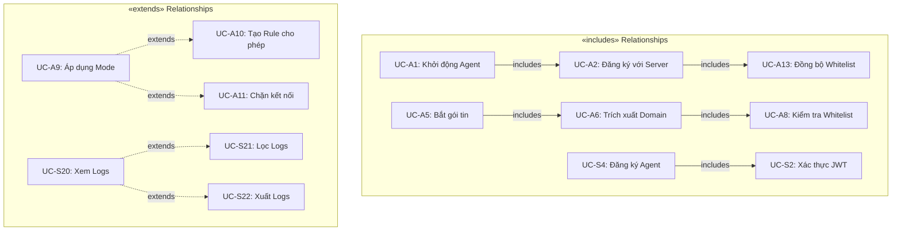

---

## 📝 Preconditions & Postconditions

### UC-S4: Đăng ký Agent mới

| Aspect | Description |
|--------|-------------|
| **Preconditions** | - Server đang chạy - API Key hợp lệ đã được tạo - Agent có kết nối mạng đến Server |
| **Main Flow** | 1. Agent gửi thông tin đăng ký 2. Server xác thực API Key 3. Server tạo/cập nhật Agent record 4. Server trả về JWT tokens |
| **Postconditions** | - Agent có agent_id và JWT tokens - Agent hiển thị trong danh sách trên Server - Agent có thể gọi các API khác |
| **Exceptions** | - API Key không hợp lệ → 401 Unauthorized - Server không khả dụng → Retry với exponential backoff |

### UC-A9: Áp dụng Firewall Mode

| Aspect | Description |
|--------|-------------|
| **Preconditions** | - Agent đã khởi động thành công - Whitelist đã được đồng bộ - Firewall mode đã được cấu hình |
| **Main Flow** | 1. Nhận domain/IP từ packet 2. Kiểm tra trong whitelist 3. Xác định action theo mode 4. Thực thi action 5. Gửi log |
| **Postconditions** | - Traffic được xử lý theo policy - Log được gửi lên Server - Firewall rules được cập nhật (nếu cần) |
| **Exceptions** | - Không có quyền admin → Chỉ log, không block - Server không khả dụng → Queue logs locally |

---

*Document generated: December 2025*
*System: Firewall Controller Enhanced v2.2*
