# 🎯 COMPLETE USE CASE DIAGRAM - Firewall Controller System
## Multi-Tenant Ready Architecture

## 🌐 Unified UML Use Case Overview

Biểu đồ dưới đây thiết kế cho kiến trúc **Multi-Tenant**, chuẩn bị sẵn cho mở rộng. Các actor được phân tầng theo Organization/Tenant để dễ dàng scale. Hệ thống hiện tại (single-tenant) có thể migration sang multi-tenant chỉ bằng cách thêm `tenant_id`/`organization_id` vào các collections.

```mermaid
graph TB
    subgraph ACTORS["👥 ACTORS - Multi-Tenant Ready"]
        SuperAdmin["🔱 Super Admin<br/>(Platform Owner)"]
        TenantAdmin["👨‍💼 Tenant Admin<br/>(Organization Admin)"]
        GroupManager["👔 Group Manager<br/>(Team Lead)"]
        EndUser["👤 End User<br/>(Workstation User)"]
        AgentService["🤖 Agent Service<br/>(Client Daemon)"]
        SystemScheduler["⚙️ System Scheduler<br/>(Background Tasks)"]
    end

    subgraph PLATFORM["🏢 PLATFORM LAYER - Multi-Tenant Core"]
        subgraph TENANT_MGMT["🏛️ Tenant Management"]
            UC_P1["UC-P1: Tạo/Quản lý Organization"]
            UC_P2["UC-P2: Quản lý Subscription Plan"]
            UC_P3["UC-P3: Tenant Isolation & Quota"]
            UC_P4["UC-P4: Cross-Tenant Reporting"]
        end
        
        subgraph AUTH_CORE["🔐 Authentication & Authorization Core"]
            UC_P5["UC-P5: Multi-Tenant SSO/SAML"]
            UC_P6["UC-P6: Role-Based Access Control (RBAC)"]
            UC_P7["UC-P7: API Key Management per Tenant"]
            UC_P8["UC-P8: JWT Token Generation & Validation"]
            UC_P9["UC-P9: Tenant Context Validation"]
        end
    end

    subgraph SERVER["🖥️ SERVER SYSTEM - Tenant-Scoped"]
        subgraph AGENT_MGMT["📡 Agent Management"]
            UC_S1["UC-S1: Đăng ký Agent (with tenant_id)"]
            UC_S2["UC-S2: Xem Agents của Tenant"]
            UC_S3["UC-S3: Xem chi tiết Agent"]
            UC_S4["UC-S4: Cập nhật Agent Metadata"]
            UC_S5["UC-S5: Vô hiệu hóa/Xóa Agent"]
            UC_S6["UC-S6: Nhận Heartbeat (tenant-scoped)"]
            UC_S7["UC-S7: Agent Status Monitoring"]
        end
        
        subgraph GROUP_MGMT["👥 Group Management - Hierarchical"]
            UC_S8["UC-S8: Tạo Group (tenant-scoped)"]
            UC_S9["UC-S9: Gán Agent vào Group"]
            UC_S10["UC-S10: Quản lý Group Hierarchy"]
            UC_S11["UC-S11: Group Whitelist Inheritance"]
            UC_S12["UC-S12: Xem/Xóa Group"]
        end
        
        subgraph WHITELIST_MGMT["Whitelist Management - Multi-Level"]
            UC_S13["UC-S13: Quản lý Global Whitelist"]
            UC_S14["UC-S14: Quản lý Tenant Whitelist"]
            UC_S15["UC-S15: Quản lý Group Whitelist"]
            UC_S16["UC-S16: Whitelist Priority & Merge"]
            UC_S17["UC-S17: Đồng bộ Whitelist cho Agent"]
            UC_S18["UC-S18: Whitelist Version Control"]
        end
        
        subgraph LOG_MGMT["📊 Log Management - Tenant-Isolated"]
            UC_S19["UC-S19: Nhận Logs từ Agent"]
            UC_S20["UC-S20: Xem Logs (tenant-scoped)"]
            UC_S21["UC-S21: Lọc/Tìm kiếm Logs"]
            UC_S22["UC-S22: Xuất Logs (với Data Privacy)"]
            UC_S23["UC-S23: Log Retention Policy"]
            UC_S24["UC-S24: Dashboard Tenant Analytics"]
        end
        
        subgraph POLICY_ENGINE["🛡️ Policy Engine"]
            UC_S25["UC-S25: Quản lý Firewall Policy Template"]
            UC_S26["UC-S26: Policy Compliance Check"]
            UC_S27["UC-S27: Policy Propagation"]
        end
        
        subgraph REALTIME["Real-time Communication"]
            UC_S28["UC-S28: Socket.IO Events (tenant-channel)"]
            UC_S29["UC-S29: Dashboard Live Updates"]
            UC_S30["UC-S30: Notification System"]
        end
    end

    subgraph AGENT["🖥️ AGENT SYSTEM - Tenant-Aware"]
        subgraph LIFECYCLE["Agent Lifecycle"]
            UC_A1["UC-A1: Khởi động Agent"]
            UC_A2["UC-A2: Đăng ký với Server (tenant context)"]
            UC_A3["UC-A3: Token Auto-Refresh"]
            UC_A4["UC-A4: Dừng Agent & Cleanup"]
            UC_A5["UC-A5: Gửi Heartbeat"]
        end
        
        subgraph NETWORK_MON["🌐 Network Monitoring"]
            UC_A6["UC-A6: Packet Capture (Scapy)"]
            UC_A7["UC-A7: Trích xuất Domain/IP/Protocol"]
            UC_A8["UC-A8: DNS Resolution & Caching"]
            UC_A9["UC-A9: Traffic Pattern Analysis"]
        end
        
        subgraph FIREWALL_CTRL["🛡️ Firewall Control Engine"]
            UC_A10["UC-A10: Kiểm tra Multi-Level Whitelist"]
            UC_A11["UC-A11: Áp dụng Firewall Mode"]
            UC_A12["UC-A12: Dynamic Rule Generation"]
            UC_A13["UC-A13: Allow Rule (với logging)"]
            UC_A14["UC-A14: Block Rule (với alert)"]
            UC_A15["UC-A15: Default Deny Policy"]
        end
        
        subgraph SYNC_OPS["Synchronization"]
            UC_A16["UC-A16: Đồng bộ Whitelist (periodic)"]
            UC_A17["UC-A17: Đồng bộ Policy Templates"]
            UC_A18["UC-A18: Gửi Logs Batch lên Server"]
            UC_A19["UC-A19: Config Update & Hot-Reload"]
        end
        
        subgraph GUI_OPS["🖼️ GUI Operations"]
            UC_A20["UC-A20: Xem Agent Status Dashboard"]
            UC_A21["UC-A21: Thay đổi Firewall Mode"]
            UC_A22["UC-A22: Xem Activity Logs"]
            UC_A23["UC-A23: Quản lý Local Whitelist"]
            UC_A24["UC-A24: Cấu hình Server Connection"]
        end
    end

    %% Platform Admin Interactions
    SuperAdmin --> UC_P1
    SuperAdmin --> UC_P2
    SuperAdmin --> UC_P3
    SuperAdmin --> UC_P4
    SuperAdmin --> UC_P5
    SuperAdmin --> UC_S13

    %% Tenant Admin Interactions
    TenantAdmin --> UC_P7
    TenantAdmin --> UC_S2
    TenantAdmin --> UC_S3
    TenantAdmin --> UC_S4
    TenantAdmin --> UC_S5
    TenantAdmin --> UC_S8
    TenantAdmin --> UC_S12
    TenantAdmin --> UC_S14
    TenantAdmin --> UC_S20
    TenantAdmin --> UC_S21
    TenantAdmin --> UC_S22
    TenantAdmin --> UC_S24
    TenantAdmin --> UC_S25

    %% Group Manager Interactions
    GroupManager --> UC_S9
    GroupManager --> UC_S10
    GroupManager --> UC_S15
    GroupManager --> UC_S20

    %% End User Interactions
    EndUser --> UC_A1
    EndUser --> UC_A4
    EndUser --> UC_A20
    EndUser --> UC_A21
    EndUser --> UC_A22
    EndUser --> UC_A23
    EndUser --> UC_A24

    %% Agent Service Interactions
    AgentService --> UC_S1
    AgentService --> UC_S6
    AgentService --> UC_S17
    AgentService --> UC_S19

    %% System Scheduler Interactions
    SystemScheduler --> UC_S28
    SystemScheduler --> UC_S29
    SystemScheduler --> UC_A3
    SystemScheduler --> UC_A5
    SystemScheduler --> UC_A6
    SystemScheduler --> UC_A11
    SystemScheduler --> UC_A16
    SystemScheduler --> UC_A18

    %% Critical Relationships - Authentication & Tenant Context
    UC_S1 -.->|include| UC_P8
    UC_S1 -.->|include| UC_P9
    UC_S6 -.->|include| UC_P8
    UC_S6 -.->|include| UC_P9
    UC_S17 -.->|include| UC_P8
    UC_S17 -.->|include| UC_P9
    UC_S19 -.->|include| UC_P8
    UC_S19 -.->|include| UC_P9

    %% Agent Lifecycle Dependencies
    UC_A1 -.->|include| UC_A2
    UC_A2 -.->|include| UC_A16
    UC_A2 -.->|include| UC_A3

    %% Network Monitoring Flow
    UC_A6 -.->|include| UC_A7
    UC_A7 -.->|include| UC_A8
    UC_A8 -.->|include| UC_A10
    UC_A10 -.->|include| UC_A11

    %% Firewall Decision Extensions
    UC_A11 -.->|extend| UC_A13
    UC_A11 -.->|extend| UC_A14
    UC_A11 -.->|extend| UC_A15

    %% Whitelist Hierarchy
    UC_S17 -.->|include| UC_S16
    UC_S16 -.->|include| UC_S13
    UC_S16 -.->|include| UC_S14
    UC_S16 -.->|include| UC_S15

    %% Log Management Extensions
    UC_S20 -.->|extend| UC_S21
    UC_S20 -.->|extend| UC_S22
    UC_S20 -.->|extend| UC_S23

    %% Multi-Tenant Isolation
    UC_P9 -.->|validate| UC_S2
    UC_P9 -.->|validate| UC_S20
    UC_P9 -.->|validate| UC_S24

    classDef platformStyle fill:#E8EAF6,stroke:#3F51B5,stroke-width:3px
    classDef serverStyle fill:#E8F5E9,stroke:#4CAF50,stroke-width:2px
    classDef agentStyle fill:#FFF3E0,stroke:#FF9800,stroke-width:2px
    classDef actorStyle fill:#E1F5FE,stroke:#0288D1,stroke-width:2px
    classDef criticalStyle fill:#FFEBEE,stroke:#F44336,stroke-width:2px
    
    class UC_P1,UC_P2,UC_P3,UC_P4,UC_P5,UC_P6,UC_P7,UC_P8,UC_P9 platformStyle
    class UC_S1,UC_S2,UC_S3,UC_S4,UC_S5,UC_S6,UC_S7,UC_S8,UC_S9,UC_S10,UC_S11,UC_S12,UC_S13,UC_S14,UC_S15,UC_S16,UC_S17,UC_S18,UC_S19,UC_S20,UC_S21,UC_S22,UC_S23,UC_S24,UC_S25,UC_S26,UC_S27,UC_S28,UC_S29,UC_S30 serverStyle
    class UC_A1,UC_A2,UC_A3,UC_A4,UC_A5,UC_A6,UC_A7,UC_A8,UC_A9,UC_A10,UC_A11,UC_A12,UC_A13,UC_A14,UC_A15,UC_A16,UC_A17,UC_A18,UC_A19,UC_A20,UC_A21,UC_A22,UC_A23,UC_A24 agentStyle
    class SuperAdmin,TenantAdmin,GroupManager,EndUser,AgentService,SystemScheduler actorStyle
    class UC_P8,UC_P9,UC_S1,UC_S6,UC_S17,UC_S19 criticalStyle
```



---

## 📊 Complete Use Case Matrix - Multi-Tenant Ready

### Platform Layer (Multi-Tenant Core)

| ID | Use Case | Actor | Priority | Migration Impact |
|----|----------|-------|----------|------------------|
| **UC-P1** | Tạo/Quản lý Organization | Super Admin | High | NEW - Add organizations collection |
| **UC-P2** | Quản lý Subscription Plan | Super Admin | Medium | NEW - Add subscriptions collection |
| **UC-P3** | Tenant Isolation & Quota | System | High | NEW - Add tenant_id to all collections |
| **UC-P4** | Cross-Tenant Reporting | Super Admin | Low | NEW - Aggregation pipeline |
| **UC-P5** | Multi-Tenant SSO/SAML | Tenant Admin | Medium | NEW - Add SSO provider integration |
| **UC-P6** | Role-Based Access Control | System | High | ENHANCE - Add roles collection |
| **UC-P7** | API Key Management per Tenant | Tenant Admin | High | MODIFY - Add tenant_id to api_keys |
| **UC-P8** | JWT Token Generation & Validation | System | High | CURRENT - Already implemented |
| **UC-P9** | Tenant Context Validation | System | High | NEW - Middleware validation |

### Server System (Tenant-Scoped)

| ID | Use Case | Actor | Server/Agent | Priority | Migration Impact |
|----|----------|-------|--------------|----------|------------------|
| **UC-S1** | Đăng ký Agent (with tenant_id) | Agent | Server | High | MODIFY - Add tenant_id field |
| **UC-S2** | Xem Agents của Tenant | Tenant Admin | Server | Medium | MODIFY - Filter by tenant_id |
| **UC-S3** | Xem chi tiết Agent | Tenant Admin | Server | Medium | MODIFY - Validate tenant ownership |
| **UC-S4** | Cập nhật Agent Metadata | Tenant Admin | Server | Low | MODIFY - Add tenant validation |
| **UC-S5** | Vô hiệu hóa/Xóa Agent | Tenant Admin | Server | Low | MODIFY - Add tenant validation |
| **UC-S6** | Nhận Heartbeat (tenant-scoped) | Agent | Server | High | MODIFY - Add tenant context |
| **UC-S7** | Agent Status Monitoring | Tenant Admin | Server | Medium | MODIFY - Tenant-scoped queries |
| **UC-S8** | Tạo Group (tenant-scoped) | Tenant Admin | Server | Medium | MODIFY - Add tenant_id to groups |
| **UC-S9** | Gán Agent vào Group | Group Manager | Server | Medium | MODIFY - Validate tenant scope |
| **UC-S10** | Quản lý Group Hierarchy | Tenant Admin | Server | Low | NEW - Add parent_group_id |
| **UC-S11** | Group Whitelist Inheritance | System | Server | Medium | NEW - Whitelist merge logic |
| **UC-S12** | Xem/Xóa Group | Tenant Admin | Server | Low | MODIFY - Tenant-scoped |
| **UC-S13** | Quản lý Global Whitelist | Super Admin | Server | High | CURRENT - Platform-wide |
| **UC-S14** | Quản lý Tenant Whitelist | Tenant Admin | Server | High | NEW - Add scope="tenant" |
| **UC-S15** | Quản lý Group Whitelist | Group Manager | Server | Medium | MODIFY - Add group_id scope |
| **UC-S16** | Whitelist Priority & Merge | System | Server | High | NEW - Priority logic |
| **UC-S17** | Đồng bộ Whitelist cho Agent | Agent | Server | High | MODIFY - Multi-level merge |
| **UC-S18** | Whitelist Version Control | System | Server | Medium | CURRENT - Already implemented |
| **UC-S19** | Nhận Logs từ Agent | Agent | Server | High | MODIFY - Add tenant_id |
| **UC-S20** | Xem Logs (tenant-scoped) | Tenant Admin | Server | High | MODIFY - Filter by tenant_id |
| **UC-S21** | Lọc/Tìm kiếm Logs | Tenant Admin | Server | Medium | MODIFY - Tenant-scoped search |
| **UC-S22** | Xuất Logs (với Data Privacy) | Tenant Admin | Server | Low | MODIFY - Add PII masking |
| **UC-S23** | Log Retention Policy | System | Server | Medium | NEW - Per-tenant retention |
| **UC-S24** | Dashboard Tenant Analytics | Tenant Admin | Server | High | MODIFY - Tenant-scoped metrics |
| **UC-S25** | Quản lý Firewall Policy Template | Tenant Admin | Server | Medium | NEW - Policy templates |
| **UC-S26** | Policy Compliance Check | System | Server | Low | NEW - Compliance engine |
| **UC-S27** | Policy Propagation | System | Server | Medium | NEW - Push to agents |
| **UC-S28** | Socket.IO Events (tenant-channel) | System | Server | High | MODIFY - Channel per tenant |
| **UC-S29** | Dashboard Live Updates | System | Server | Medium | MODIFY - Tenant-scoped events |
| **UC-S30** | Notification System | System | Server | Low | NEW - Alert routing |

### Agent System (Tenant-Aware)

| ID | Use Case | Actor | Server/Agent | Priority | Migration Impact |
|----|----------|-------|--------------|----------|------------------|
| **UC-A1** | Khởi động Agent | EndUser | Agent | High | CURRENT - No change |
| **UC-A2** | Đăng ký với Server (tenant context) | System | Agent | High | MODIFY - Send tenant_id |
| **UC-A3** | Token Auto-Refresh | System | Agent | High | CURRENT - Already implemented |
| **UC-A4** | Dừng Agent & Cleanup | EndUser | Agent | High | CURRENT - No change |
| **UC-A5** | Gửi Heartbeat | System | Agent | High | MODIFY - Include tenant_id |
| **UC-A6** | Packet Capture (Scapy) | System | Agent | High | CURRENT - No change |
| **UC-A7** | Trích xuất Domain/IP/Protocol | System | Agent | High | CURRENT - No change |
| **UC-A8** | DNS Resolution & Caching | System | Agent | Medium | CURRENT - No change |
| **UC-A9** | Traffic Pattern Analysis | System | Agent | Low | NEW - ML-based detection |
| **UC-A10** | Kiểm tra Multi-Level Whitelist | System | Agent | High | MODIFY - 3-tier check |
| **UC-A11** | Áp dụng Firewall Mode | System | Agent | High | CURRENT - No change |
| **UC-A12** | Dynamic Rule Generation | System | Agent | Medium | NEW - Auto-rule creation |
| **UC-A13** | Allow Rule (với logging) | System | Agent | High | CURRENT - No change |
| **UC-A14** | Block Rule (với alert) | System | Agent | High | CURRENT - No change |
| **UC-A15** | Default Deny Policy | System | Agent | Medium | CURRENT - No change |
| **UC-A16** | Đồng bộ Whitelist (periodic) | System | Agent | High | MODIFY - Multi-tier sync |
| **UC-A17** | Đồng bộ Policy Templates | System | Agent | Medium | NEW - Template download |
| **UC-A18** | Gửi Logs Batch lên Server | System | Agent | High | MODIFY - Include tenant_id |
| **UC-A19** | Config Update & Hot-Reload | System | Agent | Low | NEW - Dynamic config |
| **UC-A20** | Xem Agent Status Dashboard | EndUser | Agent | Medium | CURRENT - No change |
| **UC-A21** | Thay đổi Firewall Mode | EndUser | Agent | Medium | CURRENT - No change |
| **UC-A22** | Xem Activity Logs | EndUser | Agent | Medium | CURRENT - No change |
| **UC-A23** | Quản lý Local Whitelist | EndUser | Agent | Low | CURRENT - No change |
| **UC-A24** | Cấu hình Server Connection | EndUser | Agent | Medium | MODIFY - Tenant registration |

---

## 🎯 Actor Descriptions - Multi-Tenant Hierarchy

| Actor | Type | Scope | Description | Migration Impact |
|-------|------|-------|-------------|------------------|
| **🔱 Super Admin** | Human | Platform | Quản lý toàn bộ platform: tạo organizations, quản lý subscriptions, global whitelist | NEW role |
| **👨‍💼 Tenant Admin** | Human | Organization | Quản lý một organization: agents, groups, tenant whitelist, logs, dashboard | RENAME from "Admin" |
| **👔 Group Manager** | Human | Group | Quản lý một group: assign agents, group whitelist | NEW role |
| **👤 End User** | Human | Workstation | Người dùng máy trạm: xem status, đổi mode, config local | CURRENT - No change |
| **🤖 Agent Service** | System | Agent Instance | Daemon giao tiếp với server qua JWT, sync whitelist, gửi logs | MODIFY - Add tenant_id |
| **⚙️ System Scheduler** | System | Platform | Background tasks: heartbeat, capture, sync, real-time events | CURRENT - No change |

---

## 🧩 Critical Relationships - Multi-Tenant Dependencies

### Authentication & Tenant Isolation
```
UC-S1 (Đăng ký Agent) 
  ├─ include → UC-P8 (JWT Generation)
  └─ include → UC-P9 (Tenant Validation)

UC-S6 (Heartbeat)
  ├─ include → UC-P8 (JWT Validation)
  └─ include → UC-P9 (Tenant Context Check)

UC-S17 (Sync Whitelist)
  ├─ include → UC-P8 (JWT Validation)
  ├─ include → UC-P9 (Tenant Validation)
  └─ include → UC-S16 (Multi-Level Merge)
```

### Whitelist Hierarchy (3-Tier)
```
UC-S16 (Whitelist Priority & Merge)
  ├─ include → UC-S13 (Global Whitelist - Priority 1)
  ├─ include → UC-S14 (Tenant Whitelist - Priority 2)
  └─ include → UC-S15 (Group Whitelist - Priority 3)

Agent receives: MERGED(Global ∪ Tenant ∪ Group)
```

### Agent Lifecycle with Tenant Context
```
UC-A1 (Khởi động)
  └─ include → UC-A2 (Đăng ký Server)
      ├─ include → UC-A16 (Sync Whitelist)
      │    └─ receive → tenant_id from server
      └─ include → UC-A3 (Token Auto-Refresh)
```

### Data Isolation Pattern
```
All Server Use Cases MUST:
1. Validate JWT (UC-P8)
2. Extract tenant_id from JWT payload
3. Apply tenant_id filter to ALL database queries (UC-P9)
4. Prevent cross-tenant data access

MongoDB Queries Pattern:
{
  "tenant_id": ObjectId("..."),  // ALWAYS required
  "agent_id": "...",             // Additional filters
  ...
}
```

---

## Migration Path to Multi-Tenant

### Phase 1: Database Schema Changes (Breaking Changes)
```javascript
// 1. Add organizations collection
db.organizations.insertOne({
  _id: ObjectId,
  name: "Company ABC",
  subscription_plan: "enterprise",
  created_at: ISODate,
  settings: {
    max_agents: 1000,
    log_retention_days: 90,
    features: ["sso", "advanced_analytics"]
  }
});

// 2. Add tenant_id to existing collections
db.agents.updateMany({}, {
  $set: { 
    tenant_id: ObjectId("default_tenant"),  // Migrate existing data
    organization_name: "Default Organization"
  }
});

db.api_keys.updateMany({}, {
  $set: { tenant_id: ObjectId("default_tenant") }
});

db.whitelist.updateMany({}, {
  $set: { 
    tenant_id: ObjectId("default_tenant"),
    scope: "tenant"  // or "global" for platform-wide
  }
});

db.logs.updateMany({}, {
  $set: { tenant_id: ObjectId("default_tenant") }
});

db.groups.updateMany({}, {
  $set: { tenant_id: ObjectId("default_tenant") }
});
```

### Phase 2: Code Changes (Backward Compatible)
```python
# server/middleware/auth.py
def extract_tenant_context(jwt_payload):
    """Extract tenant_id from JWT and validate access"""
    tenant_id = jwt_payload.get("tenant_id")
    if not tenant_id:
        raise UnauthorizedError("Missing tenant context")
    
    # Validate tenant exists and is active
    tenant = db.organizations.find_one({
        "_id": ObjectId(tenant_id),
        "status": "active"
    })
    if not tenant:
        raise ForbiddenError("Invalid or inactive tenant")
    
    return tenant_id

# All controller methods must filter by tenant_id
def list_agents(self, tenant_id: str):
    return self.model.collection.find({
        "tenant_id": ObjectId(tenant_id)  # CRITICAL
    })
```

### Phase 3: Agent Registration Flow (New)
```python
# agent/core/registry.py
def register_agent(config: Dict) -> bool:
    """Register with tenant context from API key"""
    api_key = config["auth"]["api_key"]
    
    response = requests.post(
        f"{server_url}/api/agents/register",
        headers={"X-API-Key": api_key},
        json={
            "hostname": AGENT_HOSTNAME,
            "device_id": AGENT_DEVICE_ID,
            # tenant_id extracted from API key on server side
        }
    )
    
    if response.ok:
        data = response.json()
        config["agent_id"] = data["agent_id"]
        config["tenant_id"] = data["tenant_id"]  # NEW
        config["tokens"] = data["tokens"]
        
        # JWT payload now includes tenant_id
        # All subsequent API calls validated against this tenant
```

---

## Key Preconditions & Postconditions (Multi-Tenant)

### UC-P1: Tạo Organization
- **Preconditions**: Super Admin authenticated; subscription plan selected
- **Postconditions**: Organization created với tenant_id; default admin user created; API key generated

### UC-S1: Đăng ký Agent (with tenant_id)
- **Preconditions**: API Key có tenant_id hợp lệ; organization active
- **Postconditions**: 
  - Agent nhận `agent_id`, `tenant_id`, JWT tokens
  - JWT payload chứa: `{"agent_id": "...", "tenant_id": "...", "exp": ...}`
  - Agent lưu vào MongoDB với `tenant_id` field
  - Socket event `agent_registered` gửi đến tenant-specific channel

### UC-S17: Đồng bộ Whitelist (Multi-Level)
- **Preconditions**: Agent đã authenticated; có tenant_id trong JWT
- **Postconditions**: Agent nhận merged whitelist theo priority:
  1. Global whitelist (platform-wide)
  2. Tenant whitelist (organization-specific)
  3. Group whitelist (group-specific)
  - Version tracking per-level để optimize sync

### UC-A10: Kiểm tra Multi-Level Whitelist
- **Preconditions**: Agent đã sync 3-tier whitelist; domain/IP detected
- **Postconditions**: 
  - Check order: Group → Tenant → Global
  - First match wins (highest priority)
  - Log source level for audit trail

---

*Document version: 2.0 - Multi-Tenant Architecture*
*Migration readiness: 85% (Schema designed, code patterns identified)*
*System version: Firewall Controller Enhanced v2.2 → v3.0 (Multi-Tenant)*

| ID | Use Case | Actor | Server/Agent | Priority |
|----|----------|-------|--------------|----------|
| **UC-S1** | Quản lý API Key | Admin | Server | High |
| **UC-S2** | Xác thực JWT Token | System | Server | High |
| **UC-S3** | Phân quyền truy cập | System | Server | High |
| **UC-S4** | Đăng ký Agent mới | Agent | Server | High |
| **UC-S5** | Xem danh sách Agents | Admin | Server | Medium |
| **UC-S6** | Xem chi tiết Agent | Admin | Server | Medium |
| **UC-S7** | Cập nhật thông tin Agent | Admin | Server | Low |
| **UC-S8** | Xóa/Vô hiệu hóa Agent | Admin | Server | Low |
| **UC-S9** | Nhận Heartbeat | Agent | Server | High |
| **UC-S10** | Tạo Whitelist Entry | Admin | Server | High |
| **UC-S11** | Xem Whitelist | Admin | Server | Medium |
| **UC-S12** | Cập nhật Whitelist | Admin | Server | Medium |
| **UC-S13** | Xóa Whitelist Entry | Admin | Server | Medium |
| **UC-S14** | Đồng bộ Whitelist cho Agent | Agent | Server | High |
| **UC-S15** | Tạo Group | Admin | Server | Medium |
| **UC-S16** | Gán Agent vào Group | Admin | Server | Medium |
| **UC-S17** | Gán Whitelist cho Group | Admin | Server | Medium |
| **UC-S18** | Xem/Xóa Group | Admin | Server | Low |
| **UC-S19** | Nhận Logs từ Agent | Agent | Server | High |
| **UC-S20** | Xem Logs | Admin | Server | High |
| **UC-S21** | Lọc/Tìm kiếm Logs | Admin | Server | Medium |
| **UC-S22** | Xuất Logs | Admin | Server | Low |
| **UC-S23** | Xem Dashboard thống kê | Admin | Server | High |
| **UC-S24** | Phát sự kiện Socket.IO | System | Server | High |
| **UC-S25** | Cập nhật Dashboard live | System | Server | Medium |
| **UC-A1** | Khởi động Agent | EndUser | Agent | High |
| **UC-A2** | Đăng ký với Server | System | Agent | High |
| **UC-A3** | Dừng Agent | EndUser | Agent | High |
| **UC-A4** | Gửi Heartbeat | System | Agent | High |
| **UC-A5** | Bắt gói tin mạng | System | Agent | High |
| **UC-A6** | Trích xuất Domain/IP | System | Agent | High |
| **UC-A7** | Phân giải DNS | System | Agent | Medium |
| **UC-A8** | Kiểm tra Whitelist | System | Agent | High |
| **UC-A9** | Áp dụng Firewall Mode | System | Agent | High |
| **UC-A10** | Tạo Rule cho phép | System | Agent | High |
| **UC-A11** | Chặn kết nối | System | Agent | High |
| **UC-A12** | Bật Default Deny Policy | System | Agent | Medium |
| **UC-A13** | Đồng bộ Whitelist | System | Agent | High |
| **UC-A14** | Gửi Logs lên Server | System | Agent | High |
| **UC-A15** | Cập nhật cấu hình | EndUser | Agent | Low |
| **UC-A16** | Xem trạng thái Agent | EndUser | Agent | Medium |
| **UC-A17** | Thay đổi Firewall Mode | EndUser | Agent | Medium |
| **UC-A18** | Xem Logs local | EndUser | Agent | Medium |
| **UC-A19** | Cấu hình kết nối Server | EndUser | Agent | Medium |

---

## 🎯 Actor Descriptions

| Actor | Type | Description |
|-------|------|-------------|
| **👨‍💼 Admin** | Human | Quản trị viên quản lý API Key, agents, whitelist, groups và dashboard trên server |
| **👤 End User** | Human | Người vận hành máy trạm có GUI của Agent, có thể xem trạng thái, đổi mode, cấu hình server |
| **🤖 Agent Service** | System | Tiến trình agent giao tiếp với server qua API key + JWT, đồng bộ whitelist, gửi logs |
| **⚙️ Automation** | System | Scheduler nội bộ thực hiện heartbeat, capture packets, đồng bộ whitelist, đẩy real-time events |

---

## 🧩 Relationship Notes

- **«include»**: Các bước bắt buộc như đăng ký agent hoặc nhận heartbeat luôn bao gồm xác thực JWT (UC-S2). Chuỗi khởi động Agent (UC-A1) tự động bao hàm đăng ký server (UC-A2) và đồng bộ whitelist (UC-A13).
- **«extend»**: Áp dụng firewall mode (UC-A9) có thể mở rộng sang tạo rule cho phép (UC-A10) hoặc chặn kết nối (UC-A11) tùy mode. Xem logs (UC-S20) mở rộng sang bộ lọc (UC-S21) và export (UC-S22).
- **Actor ràng buộc**: Admin chỉ tương tác server-side, End User tập trung vào GUI/thao tác local, Agent Service đảm nhiệm API giao tiếp, Automation đảm bảo các tiến trình nền chạy đúng chu kỳ.

---

## Key Preconditions & Postconditions

### UC-S4: Đăng ký Agent mới
- **Preconditions**: API Key hợp lệ tồn tại trong MongoDB; server sẵn sàng.
- **Postconditions**: Agent nhận `agent_id`, JWT tokens; server lưu/ cập nhật bản ghi agent; sự kiện `agent_registered` được phát qua Socket.IO.

### UC-A9: Áp dụng Firewall Mode
- **Preconditions**: Agent đã sync whitelist mới nhất; firewall manager khởi tạo hoàn tất; quyền admin được cấp nếu cần block.
- **Postconditions**: Traffic được allow/block tương ứng; rule allow được tạo trước khi Default Deny bật; log hành động được send lên server.

---

*Document refreshed: December 2025*
*System version: Firewall Controller Enhanced v2.2*
