# 🔥 Firewall Controller - Flow Diagrams

> Complete system flow diagrams for Agent and Server components

---

## Table of Contents

- [🔥 Firewall Controller - Flow Diagrams](#-firewall-controller---flow-diagrams)
  - [Table of Contents](#-table-of-contents)
  - [1. System Overview](#1-system-overview)
  - [2. Agent Startup Flow](#2-agent-startup-flow)
  - [3. Agent Main Loop](#3-agent-main-loop)
  - [4. Packet Detection \& Processing](#4-packet-detection--processing)
  - [5. Firewall Mode Decision Logic](#5-firewall-mode-decision-logic)
  - [6. Whitelist Synchronization](#6-whitelist-synchronization)
  - [7. Server API Flow](#7-server-api-flow)
  - [8. Authentication Flow](#8-authentication-flow)
  - [9. Heartbeat \& Status Flow](#9-heartbeat--status-flow)
  - [10. Agent Shutdown Flow](#10-agent-shutdown-flow)
  - [11. GUI Event Flow](#11-gui-event-flow)
  - [12. Complete System Interaction](#12-complete-system-interaction)
  - [📊 Mode Comparison Table](#-mode-comparison-table)
  - [🔧 Component Dependencies](#-component-dependencies)

---

## 1. System Overview

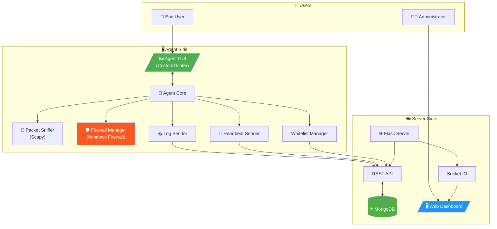

---

## 2. Agent Startup Flow

```mermaid
flowchart TD
    START([Agent Start]) --> LOAD_CONFIG["📄 Load Configuration<br/>(agent_config.json)"]
    
    LOAD_CONFIG --> VALIDATE["Validate Configuration"]
    VALIDATE --> |Invalid| ERROR_CONFIG["Log Error & Exit"]
    VALIDATE --> |Valid| CHECK_ADMIN{"🔐 Check Admin<br/>Privileges?"}
    
    CHECK_ADMIN --> |No Admin| WARN_ADMIN["⚠️ Warning: Limited Mode"]
    CHECK_ADMIN --> |Has Admin| INIT_COMPONENTS["🔧 Initialize Components"]
    WARN_ADMIN --> INIT_COMPONENTS
    
    subgraph "🔧 Component Initialization"
        INIT_COMPONENTS --> INIT_TOKEN["🔑 Init Token Manager"]
        INIT_TOKEN --> INIT_WHITELIST["Init Whitelist Manager"]
        INIT_WHITELIST --> INIT_FIREWALL{"🛡 Firewall Enabled?"}
        
        INIT_FIREWALL --> |Yes| SETUP_FW["Setup Firewall Rules"]
        INIT_FIREWALL --> |No| SKIP_FW["Skip Firewall Setup"]
        
        SETUP_FW --> INIT_SNIFFER
        SKIP_FW --> INIT_SNIFFER["📡 Init Packet Sniffer"]
        
        INIT_SNIFFER --> INIT_LOGSENDER["📤 Init Log Sender"]
        INIT_LOGSENDER --> INIT_HEARTBEAT["💓 Init Heartbeat Sender"]
    end
    
    INIT_HEARTBEAT --> REGISTER["Register with Server"]
    
    REGISTER --> |Success| SYNC_WL["Sync Whitelist"]
    REGISTER --> |Fail| RETRY_REG{"🔁 Retry?"}
    
    RETRY_REG --> |Yes| REGISTER
    RETRY_REG --> |Max Retries| OFFLINE_MODE["📴 Offline Mode"]
    
    SYNC_WL --> START_SERVICES["▶️ Start All Services"]
    OFFLINE_MODE --> START_SERVICES
    
    subgraph "▶️ Start Services"
        START_SERVICES --> SVC_SNIFFER["Start Sniffer Thread"]
        SVC_SNIFFER --> SVC_LOGSENDER["Start Log Sender Thread"]
        SVC_LOGSENDER --> SVC_HEARTBEAT["Start Heartbeat Thread"]
        SVC_HEARTBEAT --> SVC_WHITELIST["Start Whitelist Sync Thread"]
    end
    
    SVC_WHITELIST --> SEND_STARTUP["📤 Send Startup Log"]
    SEND_STARTUP --> RUNNING([🟢 Agent Running])
    
    style START fill:#4CAF50,color:#fff
    style RUNNING fill:#4CAF50,color:#fff
    style ERROR_CONFIG fill:#f44336,color:#fff
    style OFFLINE_MODE fill:#FF9800,color:#fff
```

---

## 3. Agent Main Loop

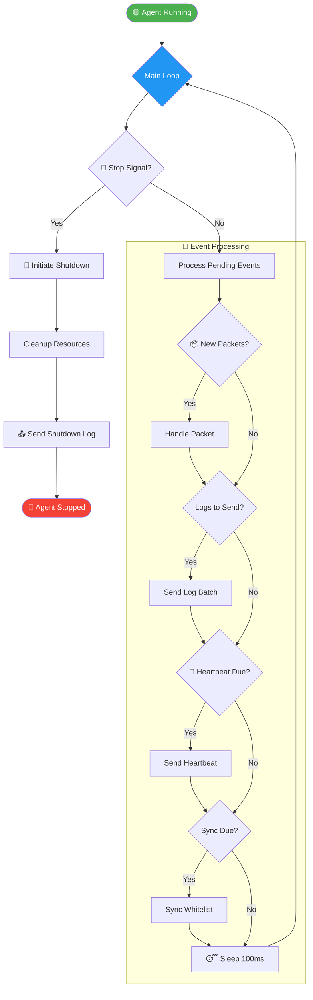

---

## 4. Packet Detection & Processing

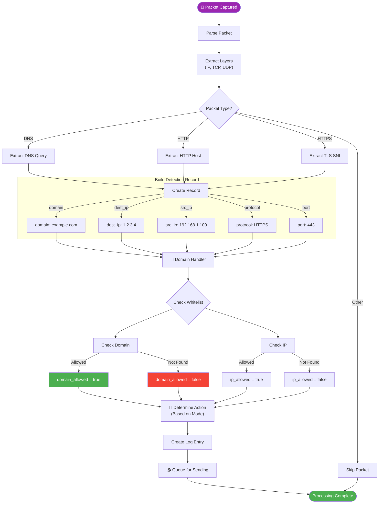

---

## 5. Firewall Mode Decision Logic

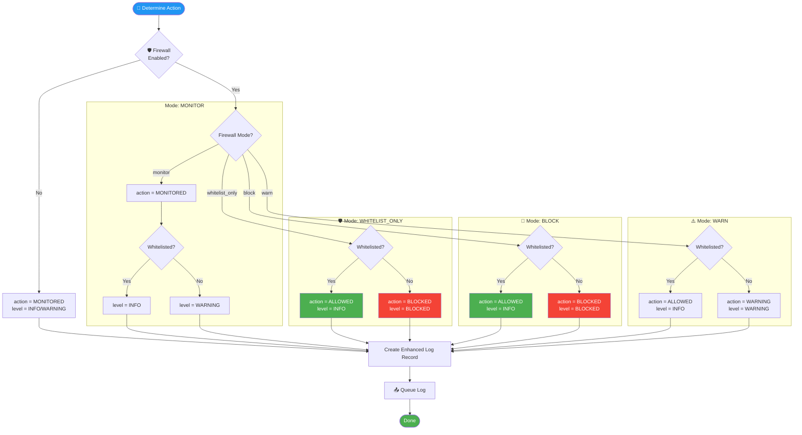

---

## 6. Whitelist Synchronization

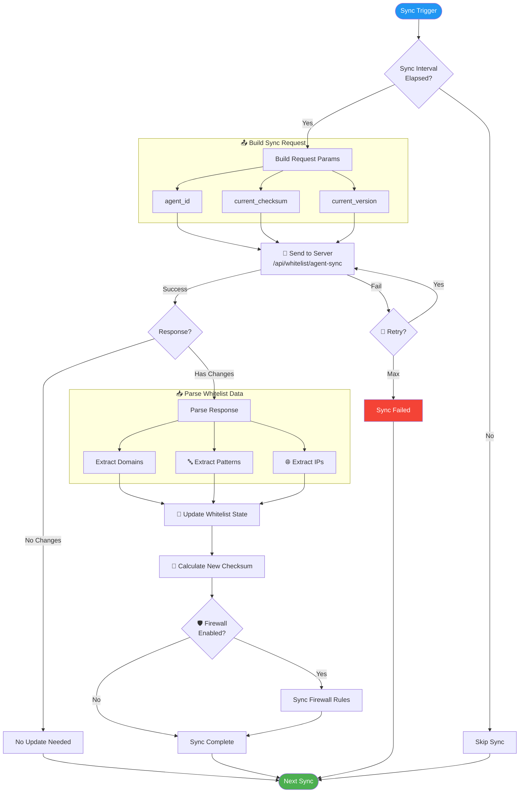

---

## 7. Server API Flow

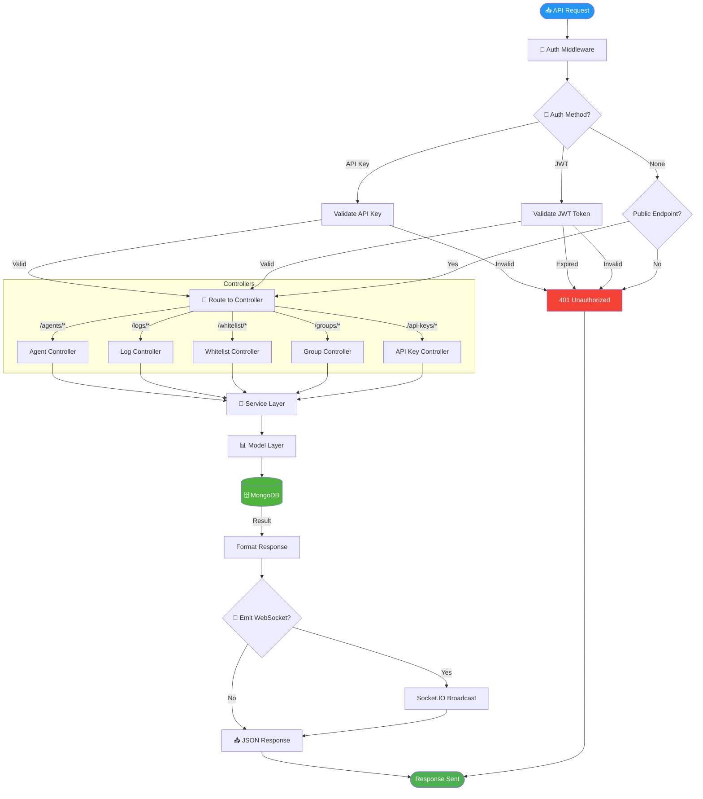

---

## 8. Authentication Flow

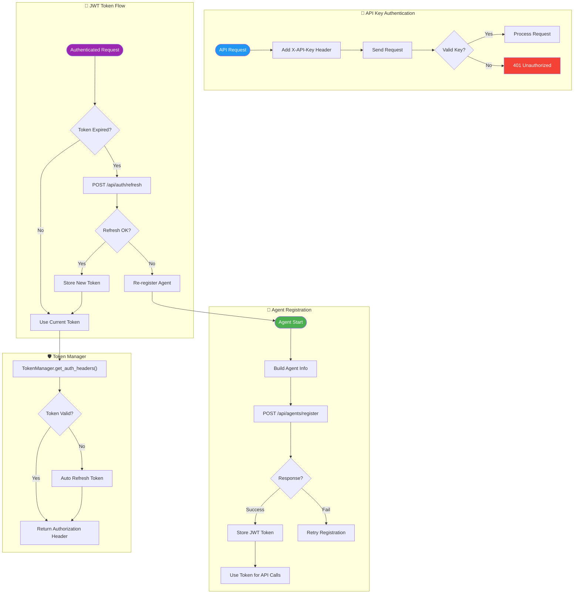

---

## 9. Heartbeat & Status Flow

```mermaid
flowchart TD
    subgraph "💓 Agent Heartbeat"
        HB_TRIGGER([Heartbeat Timer]) --> COLLECT_METRICS
        
        COLLECT_METRICS["📊 Collect Metrics"]
        COLLECT_METRICS --> CPU["CPU Usage"]
        COLLECT_METRICS --> MEM["Memory Usage"]
        COLLECT_METRICS --> UPTIME["Agent Uptime"]
        COLLECT_METRICS --> STATS["Packet Stats"]
        
        CPU --> BUILD_HB
        MEM --> BUILD_HB
        UPTIME --> BUILD_HB
        STATS --> BUILD_HB
        
        BUILD_HB["🔨 Build Heartbeat Payload"]
        BUILD_HB --> SEND_HB["📤 POST /api/agents/heartbeat"]
        
        SEND_HB --> HB_RESP{"Response?"}
        HB_RESP --> |Success| UPDATE_LAST["Update Last Heartbeat"]
        HB_RESP --> |Fail| INCREMENT_FAIL["Increment Failure Count"]
        
        INCREMENT_FAIL --> CHECK_MAX{"Max Failures?"}
        CHECK_MAX --> |No| WAIT_RETRY["Wait & Retry"]
        CHECK_MAX --> |Yes| RECONNECT["⚠️ Attempt Reconnect"]
    end
    
    subgraph "📊 Server Status Tracking"
        RECV_HB([📥 Receive Heartbeat]) --> PARSE_HB["Parse Heartbeat"]
        PARSE_HB --> UPDATE_DB["Update Agent in DB"]
        UPDATE_DB --> CALC_STATUS["Calculate Status"]
        
        CALC_STATUS --> TIME_DIFF["Calculate Time Difference"]
        TIME_DIFF --> STATUS_CHECK{"Time Since<br/>Last Heartbeat?"}
        
        STATUS_CHECK --> |≤ 5 min| ACTIVE["🟢 ACTIVE"]
        STATUS_CHECK --> |≤ 30 min| INACTIVE["🟡 INACTIVE"]
        STATUS_CHECK --> |> 30 min| OFFLINE["🔴 OFFLINE"]
        
        ACTIVE --> EMIT_STATUS
        INACTIVE --> EMIT_STATUS
        OFFLINE --> EMIT_STATUS
        
        EMIT_STATUS["Emit Status Update"]
        EMIT_STATUS --> WEBUI["📺 Update Web Dashboard"]
    end
    
    style HB_TRIGGER fill:#E91E63,color:#fff
    style RECV_HB fill:#2196F3,color:#fff
    style ACTIVE fill:#4CAF50,color:#fff
    style INACTIVE fill:#FF9800,color:#fff
    style OFFLINE fill:#f44336,color:#fff
```

---

## 10. Agent Shutdown Flow

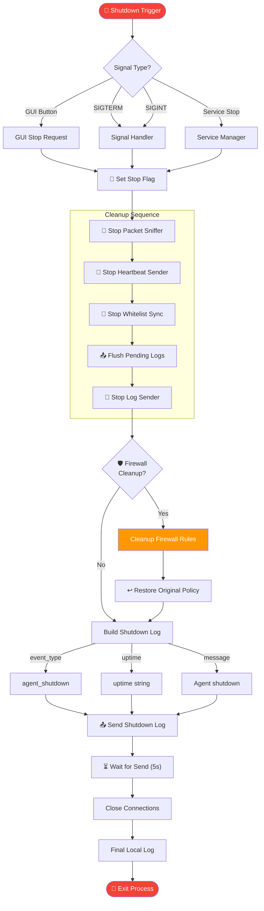

---

## 11. GUI Event Flow

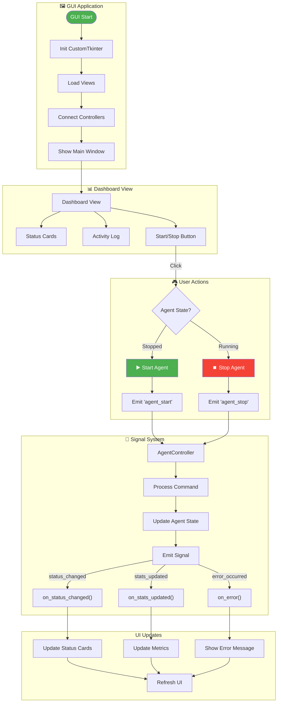

---

## 12. Complete System Interaction

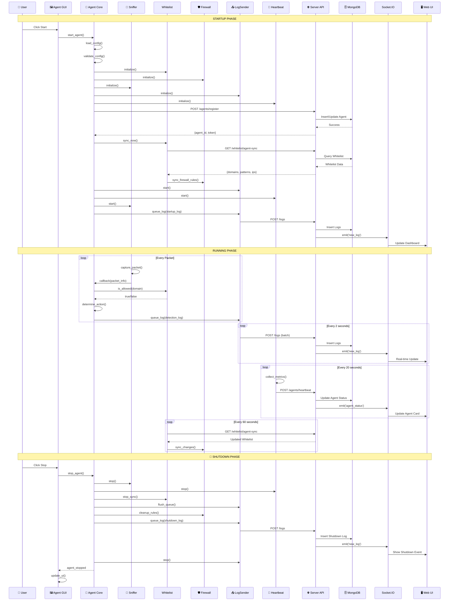

---

## 📊 Mode Comparison Table

| Mode | Icon | Action on Whitelist | Action on Non-Whitelist | Real Blocking | Use Case |
|------|------|--------------------|-----------------------|---------------|----------|
| `monitor` | 👁️ | MONITORED | MONITORED (WARNING) | No | Testing, Learning |
| `whitelist_only` | 🛡 | ALLOWED | BLOCKED | Yes | Production |
| `block` | 🚫 | ALLOWED | BLOCKED | Yes | Strict Security |
| `warn` | ⚠️ | ALLOWED | WARNING | No | Soft Enforcement |

---

## 🔧 Component Dependencies

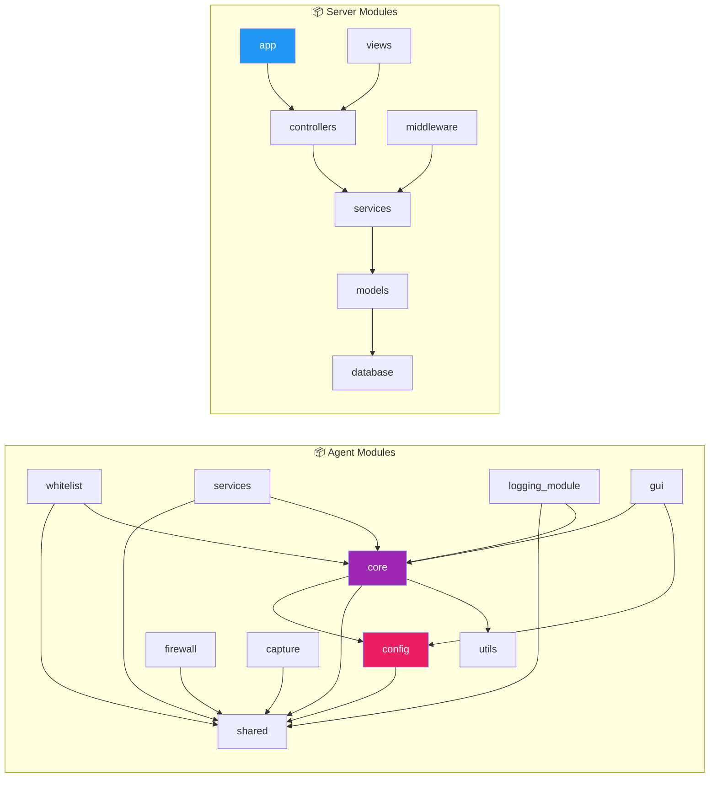

---

*Generated: December 1, 2025*
*Firewall Controller v2.2 - Modular Architecture*
