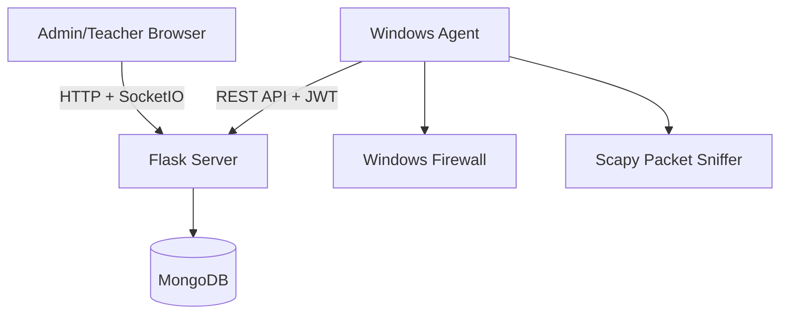

# Tổng quan dự án SAINT

## Mục tiêu hệ thống

SAINT là hệ thống quản lý truy cập mạng tập trung cho phòng máy/lab giáo dục. Hệ thống gồm Server trung tâm, Web Dashboard cho Admin/Teacher và Agent chạy trên máy Windows của học sinh/sinh viên. Mục tiêu chính là cho phép quản lý whitelist domain/IP theo nhóm, giám sát truy cập mạng, ghi log và phân quyền theo vai trò.

## Thành phần chính

| Thành phần | Vai trò | Source chính |
| --- | --- | --- |
| Server Flask | REST API, Web Dashboard, SocketIO realtime, auth/RBAC | `server/app.py`, `server/bootstrap/`, `server/routes/`, `server/controllers/`, `server/services/` |
| MongoDB | Lưu agents, users, groups, whitelist, logs, sessions, audit | `server/models/` |
| Agent Core | Đăng ký Agent, heartbeat, token, lifecycle | `agent/core/`, `agent/services/` |
| Agent Enforcement | Whitelist sync, DNS resolve, Windows Firewall rules | `agent/whitelist/`, `agent/network/`, `agent/firewall/` |
| Agent Monitoring | Scapy sniffer, domain extraction, log sender | `agent/capture/`, `agent/logging_module/` |
| Agent GUI | PySide6 (Qt) dashboard / settings / logs / firewall / whitelist views | `agent/gui_qt/` + `agent/controllers/` |

## Sơ đồ tổng thể

## Khác biệt cần lưu ý so với tài liệu cũ

- Source hiện tại có Dockerfile/docker-compose cho Server.
- Server dùng Flask app factory trong `server/bootstrap/app_factory.py`; `server/app.py` chỉ còn là entrypoint mỏng để import `create_app` và chạy SocketIO.
- Controller/service/model đã tách lớp rõ hơn; truy cập Mongo `.collection` trực tiếp ngoài `server/models` đã được dọn khỏi `server/controllers` và `server/services`.
- Agent requirements có `Scapy`, `pywin32`, `netifaces`, `PySide6`, `cryptography`, `dnspython/aiodns`; enforcement chính trong source là Windows Firewall whitelist-only.
- RBAC chỉ có 2 role chính: `admin` và `teacher`; Teacher bị filter theo group ownership.
- Agent không expose HTTP API nội bộ; Agent là client gọi Server API.

