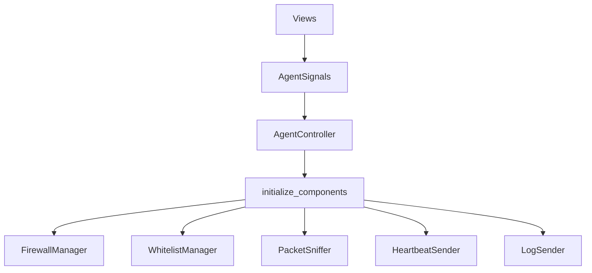

# Kiến trúc Agent

## Tổng quan

Agent là ứng dụng Windows desktop dùng **PySide6 (Qt for Python)**, có controller trung tâm `AgentController`, event queue `AgentSignals`, và các worker component chạy nền. Agent chịu trách nhiệm đăng ký với Server, duy trì token, đồng bộ whitelist, bật policy Windows Firewall, bắt gói tin bằng Scapy và gửi log về Server.

GUI hoạt động theo mô hình **signal-driven, không polling**: worker thread chỉ
`emit()` event lên queue; GUI thread drain queue mỗi 50ms và update widget — với
diff-skip ở cả lớp emit (chỉ emit khi stats thay đổi) lẫn lớp render (skip
`set_value()` khi giá trị không đổi). Xem `06_LUONG_HOAT_DONG_CHINH_AGENT.md`
mục "Rendering GUI & hiệu năng" để chi tiết.

## Mô hình MVP + Signals

## Các lớp kiến trúc

| Lớp | Module | Trách nhiệm |
| --- | --- | --- |
| GUI (Qt) | `agent/gui_qt/views/` | Hiển thị Dashboard, Firewall Rules, IP Whitelist, Logs, Settings (PySide6 widgets). |
| Signal bridge | `agent/gui_qt/signal_bridge.py` | Drain `AgentSignals` queue trên Qt main thread (QTimer 50ms), re-emit thành typed Qt signals (status_changed, stats_updated, packet_captured, …). |
| Controller | `agent/controllers/agent_controller.py` | Framework-agnostic; quản lý start/stop Agent, worker thread, stats, queue signal. |
| Core lifecycle | `agent/core/lifecycle.py` | Khởi tạo và cleanup các component runtime. |
| Network policy | `agent/firewall/`, `agent/whitelist/` | Sync whitelist, resolve DNS, cập nhật Windows Firewall. |
| Monitoring | `agent/capture/`, `agent/logging_module/` | Bắt packet, trích domain, queue và gửi log. |
| Config/security | `agent/config/`, `agent/core/token_manager.py` | Load/validate/mã hóa config, quản lý token. |

## Điểm rủi ro kiến trúc

Agent có khả năng bật Default Deny firewall trong `whitelist_only`. Code có các cơ chế giảm rủi ro như self-allow rule cho chương trình Agent, allow IP Server/DNS, snapshot/restore policy và cleanup rules; tuy nhiên vẫn không nên chạy Agent khi chưa chuẩn bị môi trường test.

