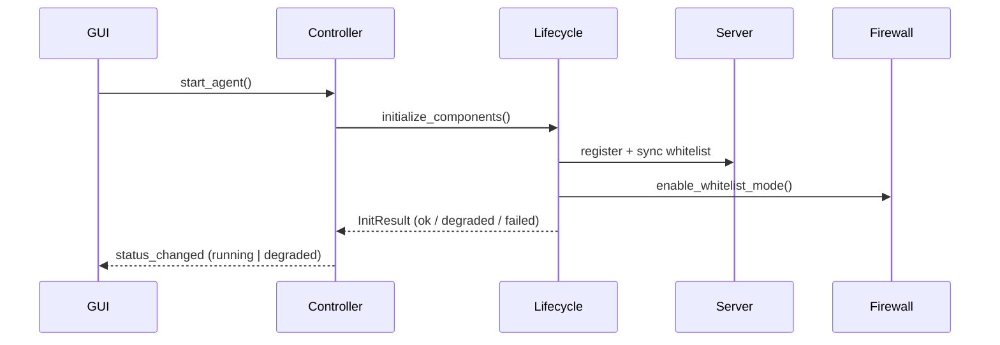
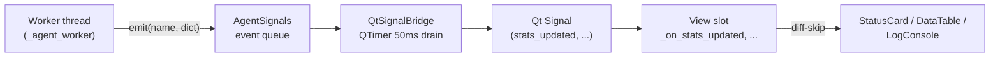

# Luồng hoạt động chính của Agent

## Khởi động Agent



`initialize_components()` trả về `InitResult` - một bản ghi cho mỗi component với
status `ok | skipped | degraded | failed`. Cuối hàm in summary thật theo trạng
thái từng phần thay vì luôn luôn báo "ALL COMPONENTS INITIALIZED SUCCESSFULLY":

Cap nhat 2026-05-27: lifecycle da duoc boc bang `AgentComponent.start/stop/health`.
`initialize_components()` tao `LifecycleContext` va goi `start_components(...)`;
`cleanup()` goi `stop_components(...)` theo thu tu nguoc. Test fake component nam o
`agent/tests/test_lifecycle_components.py`. Reference chi tiet:
`docs/reference/agent/lifecycle_components.md`.

```
============================================================
AGENT INITIALIZED (DEGRADED) - 3 issue(s)
  [-] registration       skipped - no server URL configured
  [+] token_manager      ok
  [+] whitelist_manager  ok
  [!] whitelist_sync     degraded - sync failed (auth or server unreachable)
  [+] firewall           ok - whitelist_only mode
  [!] log_sender         degraded - missing config: server_url, agent_id
  [!] heartbeat_sender   degraded - missing config: server_url, agent_id
  [+] packet_sniffer     ok
============================================================
```

### Các trạng thái tổng hợp

| `InitResult.overall` | Khi nào | Hành vi Controller |
| --- | --- | --- |
| `ok` | Mọi component đều `ok` | `AgentStatus.RUNNING`, emit `status_changed { status: 'running' }` |
| `degraded` | Có component `skipped`/`degraded` (offline / thiếu cấu hình / không có admin) | `AgentStatus.DEGRADED`, emit `status_changed { status: 'degraded', issues: [...] }` |
| `failed` | Component thuộc nhóm critical (`whitelist_manager`, `firewall`) lỗi | Controller raise `RuntimeError`, chuyển sang `AgentStatus.ERROR` |

GUI Dashboard render thêm nhánh `degraded` (icon vàng, list issues trong log
panel) để người dùng biết cần mở Settings → cấu hình Server.

## Đồng bộ whitelist

- `WhitelistManager` chạy sync loop và DNS refresh loop.
- `WhitelistSyncer` gọi Server với `agent_id`, `since`, version hiện tại.
- `WhitelistState` parse entries, tách domain/IP/pattern và tính checksum.
- `OptimizedDNSResolver` resolve domain song song.
- `FirewallManager.update_whitelist()` cập nhật allow rules.

## Giám sát truy cập mạng

- `PacketSniffer` bắt packet TCP/UDP liên quan.
- `DomainExtractor` thử DNS Query, HTTP Host, TLS SNI.
- `handle_domain_detection()` kiểm tra whitelist theo domain/IP.
- `LogSender.queue_log()` đưa log vào queue; `_send_batch()` gửi về `/api/logs`.

## Rendering GUI & hiệu năng

GUI là PySide6 (Qt). Mô hình **signal-driven, không polling**: worker thread
không bao giờ chạm vào widget; mọi event đẩy qua `AgentSignals.emit()` (queue
framework-agnostic), `QtSignalBridge` drain queue trên GUI thread bằng QTimer
50ms rồi re-emit thành typed Qt signals; view connect signals.



### Quy ước perf cho mỗi tầng

| Tầng | Quy ước |
| --- | --- |
| `QtSignalBridge._drain` | QTimer tick 50ms. Tối đa 100 event/tick; nếu chạm cap thì `QTimer.singleShot(0, _drain)` để xả tiếp ngay, không chờ tick sau. |
| Worker emit `stats_updated` | Mỗi 1s, **chỉ khi snapshot khác lần trước** (`!=` so sánh dict). Payload bundle `is_registered` + `firewall_enabled` để dashboard không cần pull. |
| `DashboardView` cards | Cache `_last_card_values` - skip `set_value()` / `set_color()` nếu giá trị giống lần trước. Tránh re-paint widget không cần thiết. |
| `DataTable` (Qt) | `QTableView` + `DictTableModel(QAbstractTableModel)` - **virtualized natively**: Qt chỉ paint row đang scroll vào viewport. 5k+ rows render <50ms không cần chunked render thủ công. `set_rows()` dùng `beginResetModel/endResetModel`. |
| `WhitelistView._on_search` | Debounce 200ms qua `QTimer.singleShot(True)`. In-memory filter qua cache `_last_loaded_data`, không gọi controller mỗi keystroke. |
| `FirewallView` refresh | `showEvent`/`hideEvent` start/stop `_refresh_timer` (5s) - Qt API gọn, view ẩn = timer dừng; fallback read đi qua `FirewallProvider`, không parse netsh trong view. |
| `LogConsole` (Logs view) | `QPlainTextEdit.setMaximumBlockCount(2000)` - auto-trim O(1) per insert. Thread-safe append qua `Signal` với `QueuedConnection` để `GUILogHandler.emit()` (thread bất kỳ) deliver lên GUI thread. |
| Dashboard activity log | `setMaximumBlockCount(500)`. HTML badge cho mỗi tag (INFO/STATUS/SYNC/WARN/ERROR/BLOCK/ALLOW). |
| `DashboardView._on_packet_captured` | Token bucket 20 lines/giây từ packet events (`PACKET_LOG_MAX_PER_WINDOW`). `BLOCKED` không drop. Khi bị drop, đầu window kế tiếp emit dòng tổng kết. |

### Bài học từ GUI legacy

Phiên bản GUI đầu dùng stack Tk-based. Mỗi cell của bảng wrap nhiều widget
phụ để vẽ rounded corner, nên 1 row có thể tạo 4-6 widget internal trên mỗi
cột. Với 200 row là khoảng 1600 widget cần construct trong một nhịp main
thread, gây freeze 1-2s. Các workaround đã thử đều chỉ giảm triệu chứng:

1. **Diff-skip stats emit + render** - giảm noise nhưng không giải quyết
   render đầu (vẫn N widget mới)
2. **Fingerprint + skip rebuild** - chỉ giúp khi data trùng lần trước
3. **Chunked render 50 row/tick** - UI mượt hơn nhưng vẫn nhiều widget
4. **Đổi widget label nhẹ hơn** - ~5x nhanh hơn nhưng vẫn ~800 widget cho
   200 row

Cuối cùng port toàn bộ sang **PySide6**: `QTableView` virtualized natively
(chỉ paint visible rows), bỏ hoàn toàn stack GUI legacy. 5000 rows giờ render
<50ms không cần chunked / fingerprint / cheap widget tricks gì cả.

## Dừng Agent

`cleanup()` dùng component stack đã lưu trên runtime và stop ngược thứ tự start. Nếu runtime cũ không có stack, cleanup fallback sang default component list để giữ backward compatibility.
