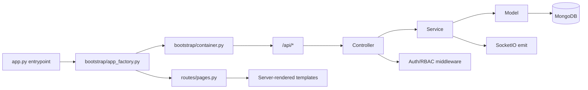

# Kiến trúc Server

## Tổng quan

Server là Flask application có app factory `create_app()` trong `server/bootstrap/app_factory.py`. `server/app.py` chỉ còn là entrypoint mỏng: patch gevent ở đầu file, export `create_app` để giữ import cũ, và chạy SocketIO khi gọi trực tiếp. Blueprint controller được đăng ký dưới prefix `/api`, MongoDB đi qua model layer, service layer giữ nghiệp vụ, middleware xử lý API Key/JWT/RBAC và SocketIO phục vụ realtime dashboard.

## Luồng xử lý request

1. `server/app.py` import `create_app`; app factory tạo Flask app, CORS, SocketIO, DB connection và register route/error/socketio modules.
2. `server/bootstrap/container.py` tạo model/service/controller, init auth/RBAC middleware, seed default admin/API key và đăng ký controller blueprint.
3. Flask nhận request qua page route hoặc API blueprint.
4. Middleware kiểm tra API Key/JWT/login/permission.
5. Controller validate request và gọi service.
6. Service xử lý nghiệp vụ, RBAC query filter, SocketIO notification.
7. Model thao tác MongoDB collection; controller/service không truy cập `.collection` trực tiếp.
8. Controller trả JSON hoặc page route render template.

Client IP được chuẩn hóa bằng `utils.request_ip.get_client_ip()`. Helper này ưu tiên `X-Forwarded-For`, sau đó `X-Real-IP`, cuối cùng mới dùng `request.remote_addr`; nhờ đó audit log, auth log, Agent register/heartbeat và log receiver không bị cố định thành `127.0.0.1` khi Server chạy sau proxy nội bộ.

## Điểm thiết kế chính

- API Agent dùng API Key/JWT, không phụ thuộc web session.
- API Web Dashboard dùng login + RBAC; Teacher bị giới hạn theo group được gán.
- SocketIO đẩy sự kiện realtime như agent heartbeat, new log, whitelist updated.
- CORS cho `/api/*` cho phép các header đang dùng trong source: `Content-Type`, `Authorization`, `X-API-Key`, `X-Agent-ID`, `X-Access-Token`.
- Audit/auth ghi `ip_address` theo IP client đã chuẩn hóa, không render lại ở frontend.
- Web UI hiện tại là Flask templates + JS/CSS static, không phải SPA.
