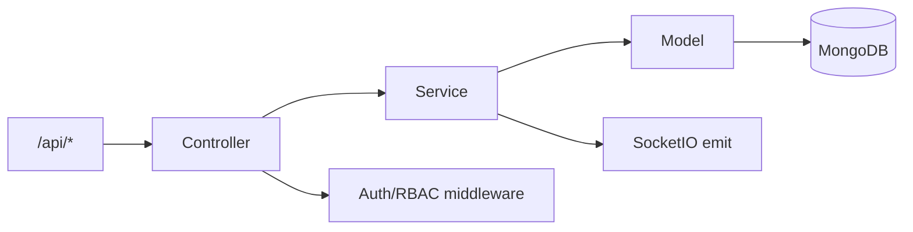

# Kiến trúc Server

## Tổng quan

Server là Flask application có app factory `create_app()`, đăng ký blueprint controller dưới prefix `/api`, dùng MongoDB qua PyMongo model layer, service layer cho nghiệp vụ, middleware cho API Key/JWT/RBAC và SocketIO cho realtime dashboard.

## Luồng xử lý request

1. Flask nhận request qua route hoặc blueprint.
2. Middleware kiểm tra API Key/JWT/login/permission.
3. Controller validate request và gọi service.
4. Service xử lý nghiệp vụ, RBAC query filter, SocketIO notification.
5. Model thao tác MongoDB collection.
6. Controller trả JSON hoặc render template.

## Điểm thiết kế chính

- API Agent dùng API Key/JWT, không phụ thuộc web session.
- API Web Dashboard dùng login + RBAC; Teacher bị giới hạn theo group được gán.
- SocketIO đẩy sự kiện realtime như agent heartbeat, new log, whitelist updated.
- Web UI hiện tại là Flask templates + JS/CSS static, không phải SPA.
